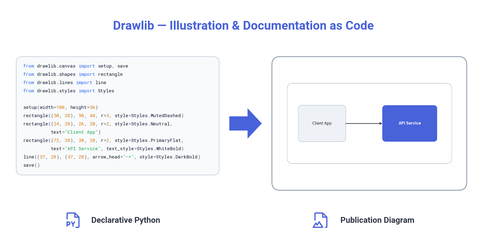
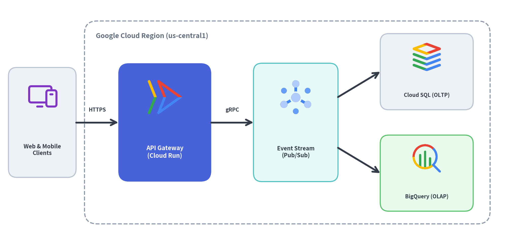
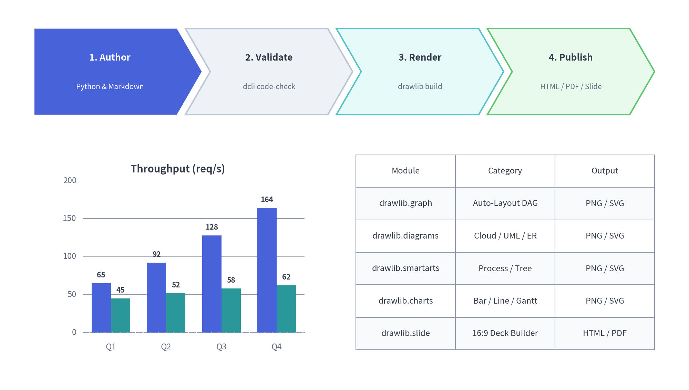
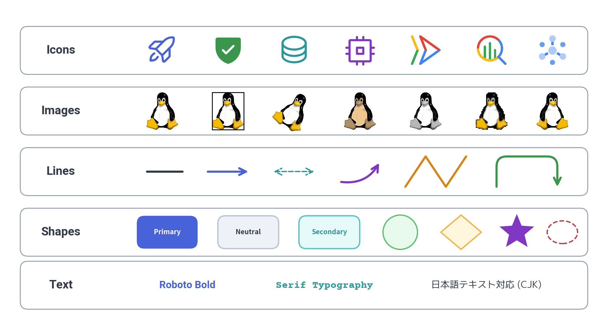
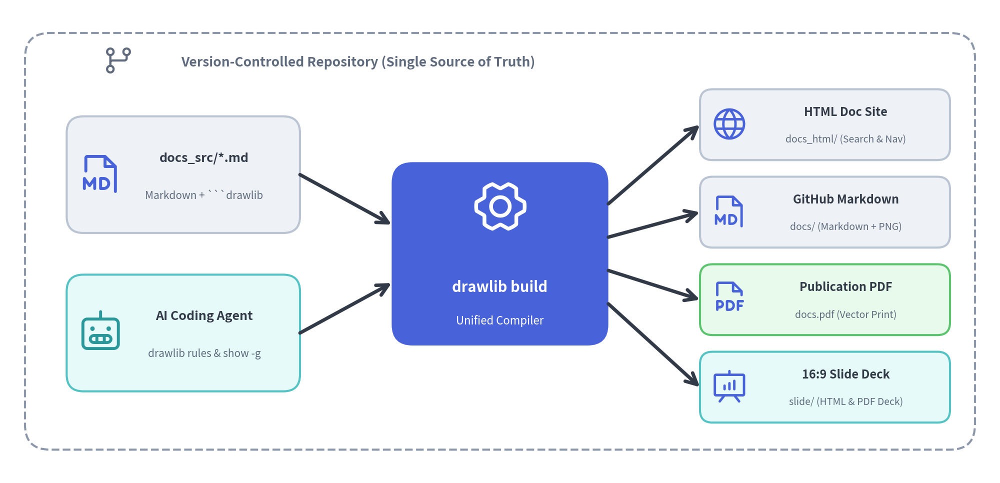
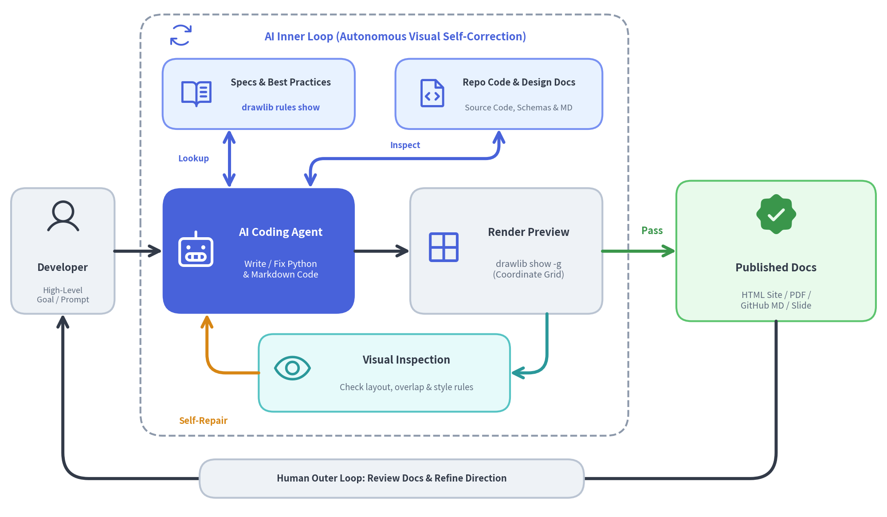

# Drawlib

**Pure-Python Library for "Illustration as Code" & "Illustrated Documentation as Code"**

Drawlib is a declarative Python drawing library and integrated documentation compiler designed for software engineers and **autonomous AI coding agents**. Instead of maintaining brittle diagrams in external GUI tools (draw.io, Visio, PowerPoint) and manually pasting exported images into wikis, Drawlib lets you author, version-control, and build architectural diagrams, data charts, technical documents, and presentation slide decks entirely from code in Git.



- **Official Website & Documentation**: [https://www.drawlib.com/](https://www.drawlib.com/)
- **Repository Guides & Whitepapers**:
  - [Quickstart Guide (PDF)](docs/quickstart.pdf)
  - [16:9 Presentation Slide Deck (PDF)](docs/slide_about_drawlib.pdf)
  - [Dogfooding Whitepaper — English (PDF)](docs/drawlib-dogfooding-en.pdf) | [日本語版 (PDF)](docs/drawlib-dogfooding.pdf)

---

## Why Drawlib v0.3?

### 1. Cloud & Software Engineering Diagrams
Stop assembling complex architectures out of raw coordinates. Drawlib provides high-level diagramming engines (`drawlib.diagrams`, `drawlib.graph`) and standardized icon sets (`drawlib.icons.gcp`, `phosphor`, `fontawesome`):



- **Auto-Layout Graphs (`drawlib.graph`)**: Declarative graph layout solvers (`ArchitectureGraph`, `LayerGraph`, `TreeGraph`, `RadialGraph`, `GridGraph`) with nested clusters, `offset()` fine-tuning, and standalone code export (`export_code()`).
- **Technical Diagrams (`drawlib.diagrams`)**:
  - **Cloud Architecture (`ArchitectureDiagram`)**: VPC boundaries, subnets, tiers, and official cloud service icons.
  - **Flowcharts (`FlowDiagram`)**: Process stages, decision branches, and orthogonal connectors.
  - **Sequence Diagrams (`SequenceDiagram`)**: Client/server lifelines, synchronous/asynchronous messages, and activation bars.
  - **UML Class, ER & State Diagrams (`ClassDiagram`, `ERDiagram`, `StateDiagram`)**: Object-oriented models, database schemas, and state machines.

---

### 2. Quantitative Charts & SmartArt Infographics
Compose presentation-ready infographics (`drawlib.smartarts`) and quantitative data plots (`drawlib.charts`) side by side on the same canvas:



- **SmartArts (`drawlib.smartarts`)**: `ChevronProcess`, `Cycle`, `Table`, `TreeNode`, `MindMapNode`, `Pyramid`, `BoxList`, `BulletPoints`, `GridLayout`, and syntax-highlighted `SourceCode`.
- **Charts (`drawlib.charts`)**: Pure-Python `BarChart`, `LineChart`, `AreaChart`, `PieChart`, `RadarChart`, `ScatterChart`, and `GanttChart` styled with the same design tokens as your diagrams.

---

### 3. Rich Primitives & Semantic Design System
At its foundation, Drawlib separates **Content** (geometry, coordinates, structure) from **Style** (colors, typography, borders, themes)—just like HTML and CSS:



- **5 Core Primitive Categories**:
  - **Icons (`drawlib.icons`)**: 1,500+ Phosphor icons (5 weights), FontAwesome, and official Google Cloud (GCP) icons.
  - **Images (`drawlib.images`)**: Non-destructive `Dimage` processing pipeline (`sepia()`, `grayscale()`, `mosaic()`, `mirror()`, `crop()`, borders, rotation).
  - **Lines (`drawlib.lines`)**: Straight, curved (`bend`), quadratic/cubic Bezier, and rounded multi-point polylines with customizable arrowheads (`"->"`, `"<-"`, `"<->"`).
  - **Shapes (`drawlib.shapes`)**: 23 geometric primitives (`rectangle`, `circle`, `ellipse`, `rhombus`, `star`, `arrow`, `chevron`, `bubblespeech`, `polygon`, etc.).
  - **Text (`drawlib.text`, `drawlib.fonts`)**: Multilingual typography with automatic on-demand font caching (`FontRoboto`, `FontSansSerif`, `FontSerif`, `FontSourceCode`, `FontJapanese`, `FontChinese`, `FontKorean`, `FontArabic`, etc.).
- **7-Role Semantic Style System (`drawlib.styles`)**:
  - Built-in presets (`default`, `google`, `essentials`, `monochrome`, ` warm`, `cold`) accessed via `Styles.<Token>` (`Styles.PrimaryFlat`, `Styles.Neutral`, `Styles.SecondaryNeutral`, `Styles.MutedDashed`, `Styles.SuccessNeutral`, `Styles.WarningNeutral`, `Styles.DangerNeutral`).

---

### 4. Illustrated Documentation & Slide as Code
Write Markdown files with embedded ```` ```drawlib ```` code blocks. A single `drawlib build` command compiles your repository into multiple publication formats:



- **4 Project Scaffolds (`drawlib init <type>`)**:
  - `drawlib init site`: Multi-page documentation website (`docs_html/`), GitHub Markdown (`docs/`), and PDF.
  - `drawlib init doc`: Linear technical specification / whitepaper (`*_html/`, `*_markdown/`, `*.pdf`).
  - `drawlib init slide`: 16:9 presentation slide deck with native SVG text and keyboard navigation (`slide_html/`, `slide.pdf`).
  - `drawlib init images`: Standalone batch Python illustration scripts (`images_src/` -> `images/`).

---

### 5. AI Inner Loop & Human Outer Loop
Drawlib is engineered from the ground up for **AI-native documentation and diagram engineering** (Claude Code, Cursor, Gemini, Codex), separating high-frequency visual self-correction from high-level human review:



- **AI Inner Loop (Autonomous Visual Self-Correction)**:
  1. **On-Demand Spec & Codebase Lookup**: The AI agent autonomously queries **`drawlib rules show <topic>`** for detailed API specifications and design best practices, while directly inspecting **repository source code, schemas, and design docs** as the single source of truth.
  2. **Code Synthesis & Grid Preview (`drawlib show -g`)**: The agent writes Python drawing blocks and Markdown prose, then renders a headless preview with a coordinate grid overlay.
  3. **Multimodal Inspection & Self-Repair**: The agent visually inspects the rendered PNG for text clipping, overlapping labels, or style imbalances, repairing coordinates and styles autonomously until the diagram passes inspection.
- **Human Outer Loop (Intent & Review)**:
  - The developer stays focused on high-level architecture and intent—providing initial goals, reviewing the compiled **Published Docs** (HTML / PDF / GitHub MD / Slide), and iterating on direction without ever nudging pixels in a GUI tool.

---

## Installation

Install `drawlib` from PyPI using `pip` or `uv`:

```bash
pip install drawlib
```

To enable headless PDF export for documentation sites, linear documents, and slide decks, install the `[pdf]` extra and Chromium:

```bash
pip install "drawlib[pdf]"
playwright install chromium
```

Verify the installation:

```bash
drawlib --version
```

---

## Quick Start

### 1. Standalone Python Script

Create a file named `architecture.py`:

```python
from drawlib.canvas import save, setup
from drawlib.lines import line
from drawlib.shapes import rectangle
from drawlib.styles import Styles
from drawlib.text import text

setup(width=120, height=50)

# 1. Structural Boundary (Muted)
rectangle((60, 25), width=112, height=42, r=3, style=Styles.MutedDashed)
text((22, 42.5), "Production VPC", style=Styles.MutedBold.patch(text_size=9))

# 2. Entrypoint & Hero Service
rectangle((22, 24), width=24, height=16, r=2, style=Styles.Neutral, text="Client App")
rectangle(
    (58, 24),
    width=26,
    height=16,
    r=2,
    style=Styles.PrimaryFlat,
    text="API Gateway",
    text_style=Styles.WhiteBold,
)

# 3. Downstream Services (Tinted Neutral Cards)
rectangle((96, 33), width=24, height=12, r=2, style=Styles.SecondaryNeutral, text="Auth Service")
rectangle((96, 15), width=24, height=12, r=2, style=Styles.SuccessNeutral, text="Audit Log DB")

# 4. Directional Connectors
line((34, 24), (45, 24), arrow_head="->", style=Styles.DarkBold)
line((71, 28), (84, 33), arrow_head="->", style=Styles.DarkBold)
line((71, 20), (84, 15), arrow_head="->", style=Styles.DarkBold)

save()
```

Run the script with Python or `drawlib` to generate `architecture.png`:

```bash
python architecture.py
```

#### Core Principles at a Glance
- **Bottom-Left Origin `(0, 0)`**: `setup(width=120, height=50)` defines a Cartesian coordinate canvas where `x` spans `0..120` (left to right) and `y` spans `0..50` (bottom to top).
- **Center Alignment by Default**: Shapes (`rectangle`, `circle`, `icon`, `image`, `text`) are positioned by their center `(x, y)`, making horizontal and vertical alignment effortless.
- **50%+ Neutral Baseline**: Ground supporting nodes in calm neutral styles (`Styles.Neutral`, `Styles.SecondaryNeutral`, `Styles.SuccessNeutral`) and reserve saturated fills (`Styles.PrimaryFlat`) for primary focal points.
- **Style Patching (`.patch()`)**: Customize any preset token non-destructively via `Styles.MutedBold.patch(text_size=9)` or `Styles.Primary.patch(shape_line_width=2)`.

---

### 2. Illustrated Documentation & Slide Deck Workflow

Scaffold a new documentation website, technical spec, or 16:9 slide deck in seconds:

```bash
# Initialize a multi-page documentation site in docs_src/
drawlib init site

# Or initialize a 16:9 presentation slide deck in slide_src/
drawlib init slide
```

Inside your Markdown files (`docs_src/index.md`), embed Python drawing blocks using the ```` ```drawlib ```` fence:

````markdown
# System Architecture

Below is our core request routing pipeline:

```drawlib 600px center file:service_routing.png caption:"Service Routing Pipeline"
from drawlib.canvas import setup
from drawlib.shapes import rectangle
from drawlib.lines import line
from drawlib.styles import Styles

setup(width=100, height=40)
rectangle((25, 20), width=30, height=16, r=2, style=Styles.Neutral, text="Ingress")
rectangle((75, 20), width=30, height=16, r=2, style=Styles.PrimaryFlat, text="Core API", text_style=Styles.WhiteBold)
line((40, 20), (60, 20), arrow_head="->", style=Styles.DarkBold)
```
````

Compile or preview with the `drawlib` CLI:

```bash
# Build HTML site, GitHub Markdown, or PDF
./docs_src/build.sh

# Launch local HTTP server with broken-link check at http://localhost:8000
drawlib serve docs_html/

# Render a single diagram with coordinate grid (-g) for layout inspection
drawlib show docs_src/index.md service_routing.png -g -o preview_grid.png
```

---

### 3. CLI Reference Summary

| Command | Description |
| :--- | :--- |
| `drawlib init <site\|doc\|slide\|images>` | Scaffold a new documentation, slide deck, or image project |
| `drawlib build <html\|markdown\|pdf\|image>` | Compile source files into HTML, Markdown, PDF, or PNG/WebP images |
| `drawlib serve <html_dir> [--check]` | Start a local HTTP server for built HTML docs/slides with pre-flight link checks |
| `drawlib show <file> [target] [-g]` | Render and inspect a single script or embedded Markdown diagram (with optional grid) |
| `drawlib rules show [topic]` | On-demand CLI reference for AI agents to look up detailed API specs & best practices (`overview`, `style-guide`, `api`, `lib-*`) |
| `drawlib cache <list\|download\|clear>` | Manage local font and icon asset caches (supports offline pre-caching via `--all`) |

---

## Links & Resources

- **Official Website**: [https://www.drawlib.com/](https://www.drawlib.com/)
- **Documentation**: [https://www.drawlib.com/docs/](https://www.drawlib.com/docs/)
- **PyPI Package**: [https://pypi.org/project/drawlib/](https://pypi.org/project/drawlib/)
- **GitHub Repository**: [https://github.com/yuichi110/drawlib](https://github.com/yuichi110/drawlib)
- **License**: Apache License 2.0