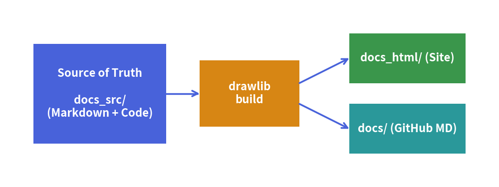

# Documentation Project & Build Overview

Drawlib is not only a drawing library—it is a **complete documentation compiler** that bridges executable Python illustrations and version-controlled technical documentation.

---

## The Documentation-as-Code Workflow

Instead of writing documentation in static wikis and manually copying and pasting PNG screenshots, Drawlib establishes a clean, repeatable build pipeline:


<figure class="drawlib-image" style="text-align: center;">
  
  <figcaption class="drawlib-caption">Drawlib Documentation Build Pipeline</figcaption>
</figure>


### The Golden Rule: `<name>_src/` is the Single Source of Truth
- Always edit Markdown files and Python code inside the source directory (e.g. `docs_src/`).
- Never edit the output directories (`docs/`, `docs_html/`, `docs.pdf`) directly; they are build artifacts completely overwritten during compilation.

---

## 1. Project Scaffolding (`drawlib init`)

Scaffold a complete project template with a single command:

```bash
# Initialize a multi-page documentation website
$ uv run drawlib init site

# Or scaffold into a custom output name (e.g., mybook_src/ -> mybook/):
$ uv run drawlib init site -o mybook
```

Drawlib supports four starter project types:
- **`doc`**: Linear technical document / spec / RFC / report compiled to HTML (`doc_html/`), PDF (`doc.pdf`), Markdown (`doc_markdown/`), and diagrams (`doc_images/`).
- **`site`**: Multi-page documentation website (`docs_html/`), Markdown site (`docs_markdown/` or `docs/`), and diagrams (`docs_images/`).
- **`slide`**: 16:9 presentation slide deck compiled to web deck (`slide_html/`), vector PDF (`slide.pdf`), and diagrams (`slide_images/`).
- **`image`**: Standalone Python illustration scripts (`image_src/*.py`) batch-compiled to image files (`image_images/*.png`).

---

## 2. One-Command Compilation

Once initialized, compile your documentation using the generated `build.sh` script or the `drawlib build` CLI:

```bash
# Run the project build script
$ ./build.sh

# Or compile using the CLI directly:
$ uv run drawlib build html docs_src/ -o docs_html/
$ uv run drawlib build markdown docs_src/ -o docs/
$ uv run drawlib build image docs_src/ -o docs_images/
```

During the build process:
1. Drawlib detects all ````drawlib```` code blocks across your Markdown documents.
2. The code blocks are executed in isolated memory spaces to render vector diagrams.
3. Images are cached intelligently (only modified code blocks re-render).
4. The final HTML website or rendered Markdown documents are generated with perfect image links.

---

## 3. Local Live Preview (`drawlib serve`)

Preview your compiled HTML site locally with automatic live inspection:

```bash
$ uv run drawlib serve docs_html/
```

Open `http://localhost:8000` in your browser to inspect the full documentation site, search index, and responsive styling.

---

> [!NOTE]
> For in-depth guides on code block attributes (`show-code`, `fold-code`, `caption:`), custom HTML templates, CSS theming, and Chromium PDF exports, see **[Chapter 6: Document Builder & CLI](../06_doc_builder_and_cli/overview.md)**.
