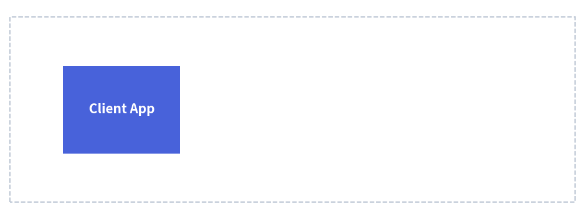

# APNG Animations

Drawlib provides native support for generating **Animated Portable Network Graphics (APNG)**.  
APNG empowers developers and AI coding agents to create clean, high-framerate, multi-step architectural illustrations and animated technical visualizations using declarative Python code.

---

## 1. Why APNG in Technical Documentation?

Unlike legacy GIF animations (which are constrained to 256 indexed colors and binary transparency), APNG features:

* **24-bit RGB and 32-bit RGBA Full Color**: Gradients, soft drop shadows, and subtle fills remain crisp and uncompressed.
* **Alpha Channel Transparency**: Transparent backgrounds blend seamlessly into light and dark documentation themes.
* **Zero Extra Dependencies**: Relies on native Pillow (`save_all=True`), requiring no external binary packages like `ffmpeg`.
* **Universal Browser Support**: Supported natively by all modern web browsers (Chrome, Firefox, Safari, Edge) and GitHub Markdown previews.
* **Safe Static Fallback**: Standard PNG decoders (and PDF compilers) automatically display the 1st frame as a clean static image.


<figure class="drawlib-image" style="text-align: center;">
  
  <figcaption class="drawlib-caption">Step-by-Step Architecture Reveal</figcaption>
</figure>


---

## 2. Imports & Canvas Lifecycle

All animation classes are exported from `drawlib.apng`:

```python
from drawlib.apng import Apng
from drawlib.canvas import save, setup
from drawlib.shapes import rectangle, circle
from drawlib.styles import Styles
```

### Automatic Canvas Coordination
When an `Apng` instance is initialized, it automatically registers itself with the active Drawlib canvas (`canvas._active_animation`). You do not need to call a separate animation export method; calling standard `save()` captures all accumulated frames into an animated APNG file:

```python
anim = Apng(fps=10.0)

# Define frames...
with anim.frame():
    circle((50, 50), radius=10, style=Styles.Primary)

# Save unified under standard drawlib save()
save("animation.png")
```

---

## 3. The `Apng` Class API

### 3.1. Initialization

```python
anim = Apng(
    fps: float | None = None,
    frame_rate: float | None = None,
    loop: int = 0,
)
```

| Parameter | Type | Default | Description |
| :--- | :--- | :--- | :--- |
| `fps` | `float \| None` | `10.0` | Target playback frame rate in frames per second (e.g. `10.0` means 10 fps). |
| `frame_rate` | `float \| None` | `10.0` | Alias for `fps`. If both are specified, `fps` takes precedence. |
| `loop` | `int` | `0` | Number of animation loops. `0` means continuous infinite looping. |

---

## 4. Defining Frames

### 4.1. Context Manager: `with anim.frame()` (Recommended)

The `with anim.frame()` context manager captures the canvas state at the end of the block.

```python
with anim.frame(
    duration: float | None = None,
    clear: bool = True,
):
    # Standard Drawlib drawing calls
    circle((50, 50), radius=10, style=Styles.Primary)
```

| Parameter | Type | Default | Description |
| :--- | :--- | :--- | :--- |
| `duration` | `float \| None` | `None` | Display duration for this frame in **seconds** (e.g. `1.5` for 1.5 seconds). If `None`, defaults to `1 / fps` (e.g. 0.1s for 10fps). |
| `clear` | `bool` | `True` | Whether to clear existing canvas shapes before drawing this frame. |

### 4.2. Imperative Method: `anim.add_frame()`

For procedural code or loops where context managers are less convenient:

```python
circle((x, y), radius=5, style=Styles.Primary)
anim.add_frame(duration=0.5, clear=True)
```

---

## 5. Animation Modes

Drawlib supports two fundamental animation paradigms:

### 5.1. Independent Frame Mode (`clear=True`, Default)
Each frame starts with an empty canvas. This mode is ideal for moving objects, rotating elements, or physics simulations:

```python
anim = Apng(fps=10.0)

for x in range(10, 90, 10):
    with anim.frame():
        circle((x, 50), radius=5, style=Styles.Primary)
```

### 5.2. Cumulative / Step-by-Step Mode (`clear=False`)
Setting `clear=False` keeps shapes from preceding frames on the canvas. This mode is exceptionally effective for architectural explanations that reveal components stage by stage:

```python
anim = Apng(fps=1.0)

# Stage 1: Ingress
with anim.frame(clear=True):
    rectangle((20, 50), width=20, height=15, style=Styles.PrimaryFlat, text="Client")

# Stage 2: Gateway appears (Client remains)
with anim.frame(clear=False):
    rectangle((50, 50), width=20, height=15, style=Styles.SecondaryFlat, text="Gateway")

# Stage 3: Database appears (Client and Gateway remain)
with anim.frame(clear=False, duration=3.0):  # Hold final state for 3 seconds
    rectangle((80, 50), width=20, height=15, style=Styles.AccentFlat, text="Database")
```

---

## 6. Timing & Duration Control

### Frame Duration in Seconds
Frame timing is configured directly in **seconds** (e.g. `duration=0.25` for a quarter of a second, `duration=2.0` for two seconds).

### Holding the Final Frame
To give readers sufficient time to inspect a completed diagram before the animation loops, specify an extended `duration` on the final frame:

```python
anim = Apng(fps=5.0)  # Standard frames display for 0.2s

for i in range(10):
    with anim.frame():
        draw_stage(i)

# Hold final completed architecture for 3.0 seconds
with anim.frame(duration=3.0):
    draw_stage(10)
    rectangle((50, 10), width=40, height=6, style=Styles.SuccessFlat, text="Deployment Complete")
```

---

## 7. Embedded Markdown Code Blocks

You can embed APNG animations directly inside Markdown documents using the ````drawlib```` code fence. The document compiler automatically compiles the code block into an animated APNG file:

````markdown
# Live Event Pipeline

```drawlib 600px center file:live_pipeline.png caption:"Event Progression"
from drawlib.apng import Apng
from drawlib.canvas import setup
from drawlib.lines import line
from drawlib.shapes import circle, rectangle
from drawlib.styles import Styles

setup(width=100, height=40)
anim = Apng(fps=10.0)

for x in range(30, 75, 5):
    with anim.frame():
        rectangle((20, 20), width=18, height=16, style=Styles.PrimaryFlat, text="App")
        rectangle((80, 20), width=18, height=16, style=Styles.AccentFlat, text="Queue")
        line((29, 20), (71, 20), style=Styles.MutedDashed)
        circle((x, 20), radius=3, style=Styles.Secondary)
```
````

When compiled with `drawlib build html` or `drawlib build markdown`, `live_pipeline.png` is generated in the document's companion image folder and rendered natively in the browser.

---

## 8. Built-in Lossless Compression & Performance

Drawlib automatically applies multi-tier lossless optimization when saving APNG files:

1. **Sub-frame Bounding Box Cropping**: Only the changed pixels (`delta.getbbox()`) between consecutive frames are encoded, drastically reducing raw image data.
2. **Maximum Zlib Compression (`compress_level=9`)**: Applied automatically to all frame image chunks.
3. **Huffman Tree Optimization (`optimize=True`)**: Generates optimized compression tables.

### Best Practice for Animation Performance
* **Frame Rate (`fps`)**: For technical diagrams, a frame rate of **5 to 10 FPS** provides fluid motion while maintaining compact file sizes (typically under 100 KB) and fast build times.
