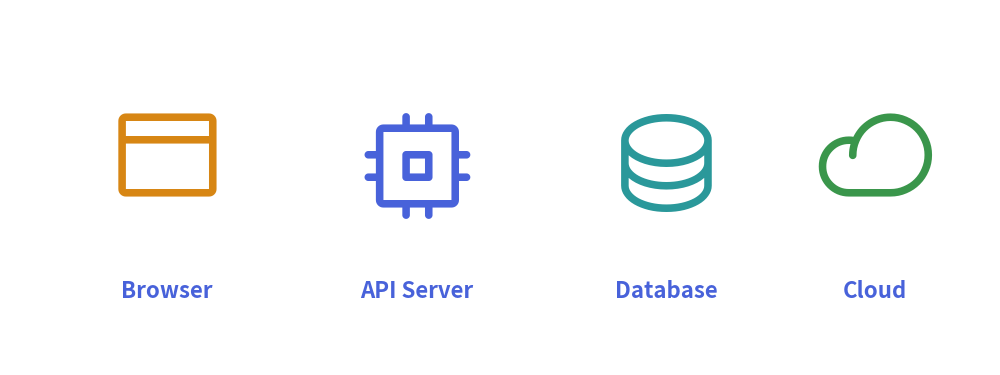
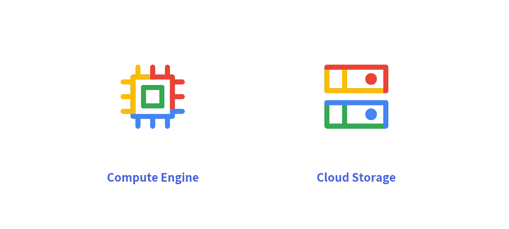

# Standardized Icons

Icons serve as immediate visual anchors in technical diagrams. A cloud architecture schema or system diagram with crisp, standardized icons communicates topology, data flow, and technology stacks at a glance.

Drawlib bundles two production-grade icon libraries via `drawlib.icons`:
1. **Phosphor Vector Icons (`phosphor`)**: Over 1,500 razor-sharp vector glyphs across 5 typographic weights.
2. **Google Cloud Architecture Icons (`gcp`)**: Over 260 official multi-color GCP cloud infrastructure icons.

---

## 1. Overview of Icons


<figure class="drawlib-image" style="text-align: center;">
  
  <figcaption class="drawlib-caption">Phosphor Vector Icons with Semantic Themes</figcaption>
</figure>


---

## 2. Phosphor Vector Icons (`drawlib.icons.phosphor`)

Phosphor (<https://phosphoricons.com>) provides an extensive set of clean, consistent vector icons.

### Function Signature
Every icon is exposed as a function named after the icon:
```python
phosphor.<icon_name>(
    xy: tuple[float, float],
    width: float,
    angle: float = 0.0,
    style: Style | str | None = None,
)
```

- **`xy`**: Center coordinate anchor point.
- **`width`**: Width in virtual coordinate units (height scales proportionally to maintain a 1:1 aspect ratio).
- **`angle`**: Counter-clockwise rotation angle.
- **`style`**: Tint color and visual style.

### The Five Typographic Weights
Phosphor icons support 5 distinct weights controlled via `Style(icon_style="...")`:
- `"thin"` *(default)*: Ultra-fine stroke for subtle indicators.
- `"light"`: Clean, delicate line for dense diagrams.
- `"regular"`: Balanced standard stroke.
- `"bold"`: Prominent heavy stroke for primary entities.
- `"fill"`: Solid filled silhouette for active states or alert badges.


```python
from drawlib.canvas import save, setup
from drawlib.icons import phosphor
from drawlib.styles import Styles
from drawlib.text import text

setup(width=60, height=50)

# Solid filled bell icon
phosphor.bell((30, 28), width=14, style=Styles.Accent.patch(icon_style="fill"))
text((30, 12), "Alert Badge", style=Styles.AccentBold)

save()
```

<figure class="drawlib-image" style="text-align: center;">
  
  <figcaption class="drawlib-caption">Phosphor Icon with Solid Fill Weight</figcaption>
</figure>


---

## 3. Google Cloud Architecture Icons (`drawlib.icons.gcp`)

For cloud topology illustrations, Drawlib provides official Google Cloud graphics:


```python
from drawlib.canvas import save, setup
from drawlib.icons import gcp
from drawlib.styles import Styles
from drawlib.text import text

setup(width=100, height=45)

gcp.compute_engine((30, 26), width=14, style=Styles.Primary)
text((30, 10), "Compute Engine", style=Styles.PrimaryBold)

gcp.cloud_storage((70, 26), width=14, style=Styles.Primary)
text((70, 10), "Cloud Storage", style=Styles.PrimaryBold)

save()
```

<figure class="drawlib-image" style="text-align: center;">
  
  <figcaption class="drawlib-caption">Official Google Cloud Architecture Icons</figcaption>
</figure>


Key features:
- **Official Multicolor Graphics**: Renders authentic Google Cloud service colors out of the box.
- **On-Demand Caching**: High-resolution PNG assets are downloaded on demand from GitHub Releases upon first use, keeping the initial package footprint minimal.

---

## 4. Universal Font Icons (`font_icon`)

For custom or third-party vector icon sets (such as FontAwesome):

```python
from drawlib.icons import font_icon
from drawlib.styles import Styles

font_icon(
    xy=(50, 50),
    icon="fa-brands fa-github",
    width=12,
    style=Styles.PrimaryBold,
)
```

> [!TIP]
> In architectural system diagrams, use high-level **[Architecture Diagrams](../05_diagrams/architecture.md)** to connect icons automatically with aligned labels and wire routing.
