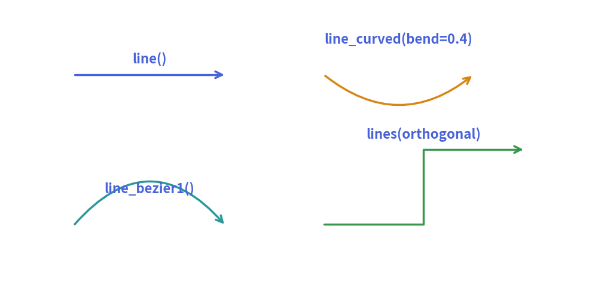

# Lines & Connectors

Connectors establish communication pathways, data flow directions, and structural relationships between diagram entities. 
The `drawlib.lines` module provides straight lines, smooth circular arcs, Bézier curves, and multi-point orthogonal Manhattan routings.

---

## 1. Overview of Line Primitives


<figure class="drawlib-image" style="text-align: center;">
  
  <figcaption class="drawlib-caption">Overview of Drawlib Line Connectors</figcaption>
</figure>


---

## 2. Terminal Arrowhead Markers

All line functions accept the `arrowhead` keyword argument:

| Value | Appearance | Description |
| :---: | :---: | :--- |
| `""` or `"-"` | `────────` | Plain line without terminal markers. |
| `"->"` | `───────►` | Forward directed arrowhead at the destination point (`xy2`). |
| `"<-"` | `◄───────` | Reverse directed arrowhead at the source point (`xy1`). |
| `"<->"` | `◄──────►` | Bidirectional arrowheads at both ends. |

---

## 3. Function Reference

### 3.1. Straight Line (`line`)
Connects two coordinates `xy1` and `xy2` with a direct straight segment.

```python
line(
    xy1=(20, 30),
    xy2=(80, 30),
    arrowhead="->",
    style=Styles.primary_bold,
)
```

### 3.2. Smooth Arc Curve (`line_curved`)
Draws a single circular arc between `xy1` and `xy2`. 
- **`bend`**: Controls the degree of curvature ($0.0$ = flat line, positive = bend left/upwards, negative = bend right/downwards). Defaults to `0.2`.

```python
line_curved(
    xy1=(30, 20),
    xy2=(70, 20),
    bend=0.35,  # Higher value produces a deeper arc
    arrowhead="->",
    style=Styles.accent_bold,
)
```

### 3.3. Quadratic Bézier Curve (`line_bezier1`)
Connects `xy1` to `xy2` controlled by a single control point `cp` that pulls the curve tangentially:

```python
line_bezier1(
    xy1=(20, 20),
    xy2=(80, 20),
    cp=(50, 45),  # Apex attractor point
    arrowhead="->",
    style=Styles.secondary_bold,
)
```

### 3.4. Cubic Bézier Curve (`line_bezier2`)
Connects `xy1` to `xy2` with two independent control points `cp1` and `cp2`, enabling S-curves and asymmetric waves.

```python
line_bezier2(
    xy1=(20, 20),
    xy2=(80, 40),
    cp1=(40, 50),
    cp2=(60, 10),
    arrowhead="->",
    style=Styles.bold,
)
```

---

## 4. Multi-Point & Orthogonal Routing (`lines`)

The `lines` function connects a sequence of two or more coordinates `[(x0, y0), (x1, y1), ...]`. 
In software architectures and circuit schematics, **orthogonal (Manhattan) routing** is standard:

### L-Routing (Single 90° Turn)
Connects two entities horizontally first, then vertically:
```python
lines([(20, 20), (60, 20), (60, 50)], arrowhead="->", style=Styles.bold)
```

### Z-Routing / Dogleg (Two 90° Turns)
Connects two offset components across a shared mid-channel $x_{\text{mid}}$:
```python
x1, y1 = 20, 20
x2, y2 = 80, 50
x_mid = (x1 + x2) / 2

lines([(x1, y1), (x_mid, y1), (x_mid, y2), (x2, y2)], arrowhead="->", style=Styles.bold)
```

> [!NOTE]
> For automated orthogonal routing with automatic bounding-box clipping and label alignment, consider using high-level **[Architecture Diagrams](../05_diagrams/architecture.md)** or **[Flow Diagrams](../05_diagrams/flow.md)**.
