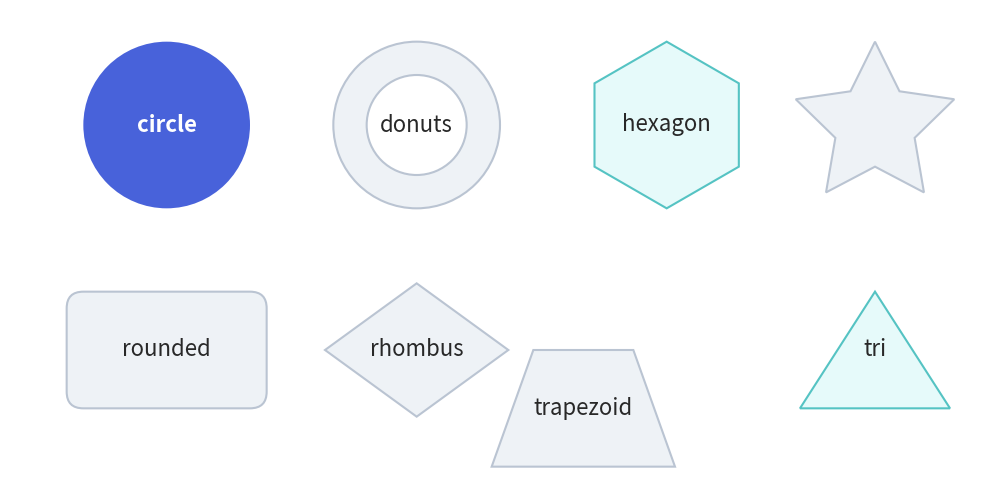
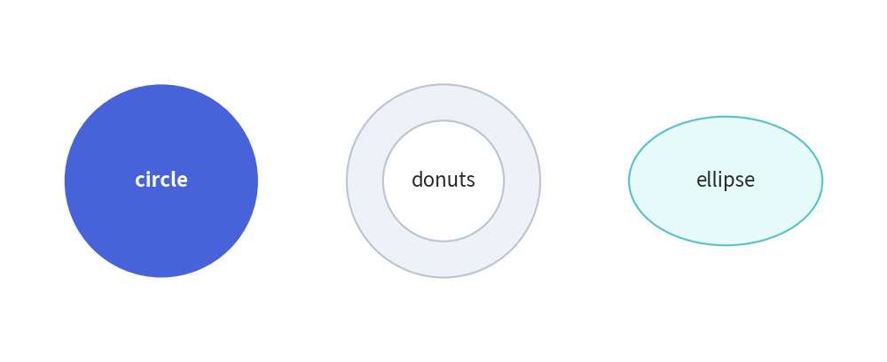
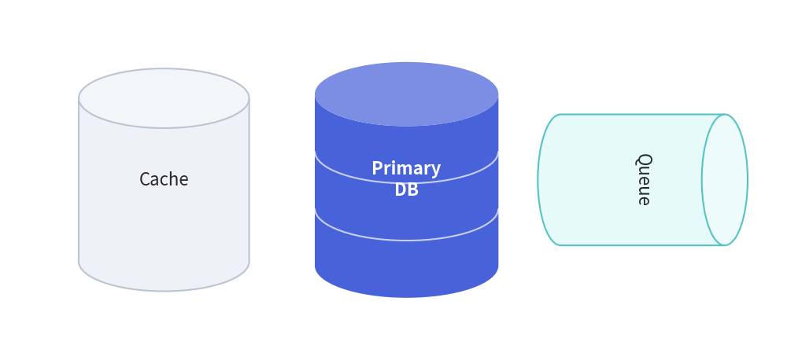
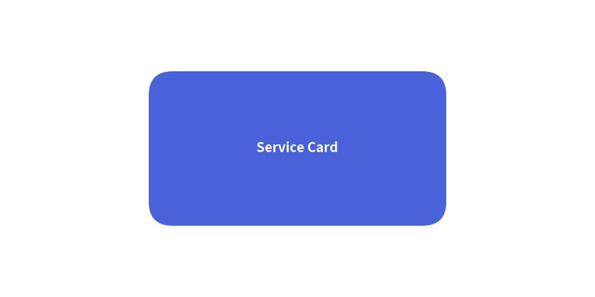
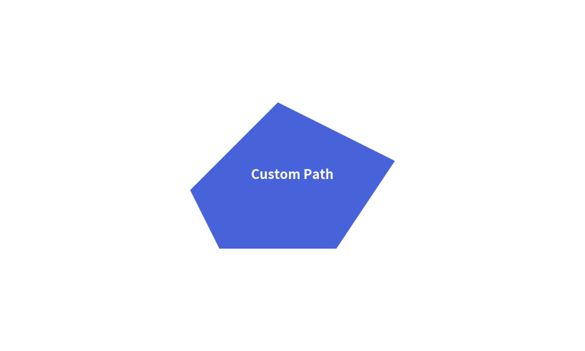
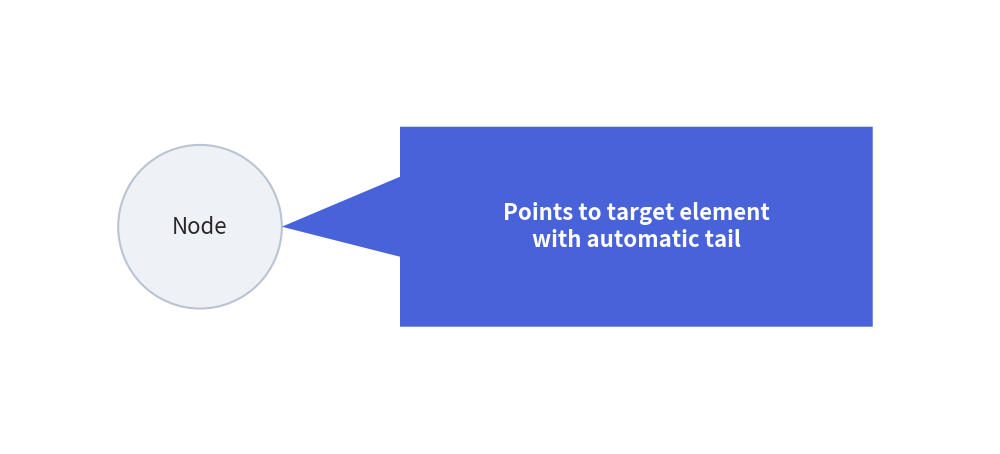

# Vector Shapes

Drawlib provides a rich suite of vector shape primitives designed for technical illustrations. 
Unlike low-level canvas libraries where shapes must be constructed from complex Bézier paths, Drawlib shapes are defined declaratively with intuitive geometric arguments, built-in center labels, and unified styling.

---

## 1. Common Shape Parameters

All shape primitives share consistent keyword arguments:

| Parameter | Type | Default | Description |
| :--- | :--- | :--- | :--- |
| `xy` | `tuple[float, float]` | *Required* | Coordinate anchor point `(x, y)` (geometric center for most shapes). |
| `style` | `Style` | *Required* | Visual style defining fill color, border line style, and border width. |
| `text` | `str` | `""` | Embedded text label centered inside the shape. |
| `text_style` | `Style` | `None` | Text styling (color, font, weight). Defaults to active theme text style. |
| `angle` | `float` | `0.0` | Rotation angle in degrees (counter-clockwise). |

---

## 2. Showcase of Core Primitives


<figure class="drawlib-image" style="text-align: center;">
  
  <figcaption class="drawlib-caption">Overview of Drawlib Core Shape Primitives</figcaption>
</figure>


---

## 3. Circle-like & Radial Shapes

Drawlib provides a suite of radial geometries centered at `xy`:


```python
from drawlib.canvas import save, setup
from drawlib.shapes import circle, donuts, ellipse
from drawlib.styles import Styles

setup(width=110, height=45)

circle((20, 22.5), radius=12, style=Styles.PrimaryFlat, text="circle", text_style=Styles.WhiteBold)
donuts((55, 22.5), radius=12, width=4.5, style=Styles.Neutral, text="donuts")
ellipse((90, 22.5), width=24, height=16, style=Styles.SecondaryNeutral, text="ellipse")

save()
```

<figure class="drawlib-image" style="text-align: center;">
  
  <figcaption class="drawlib-caption">Radial Shapes (Circle, Donuts, Ellipse)</figcaption>
</figure>


- **`circle(xy, radius, ...)`**: Draws a standard circle centered at `xy`.
- **`donuts(xy, radius, width, ...)`**: Draws a concentric ring with an outer `radius` and wall thickness `width`.
- **`ellipse(xy, width, height, angle=0.0, ...)`**: Draws an oval / ellipse with independent dimensions.
- **`fan(xy, radius, angle_start, angle_end, ...)`**: Draws a circular pie sector bounded by angles.
- **`wedge(xy, radius, width, angle_start, angle_end, ...)`**: Draws an angular donut slice.

---

## 4. 3D Cylinders & Database Stacks (`cylinder`)

For databases, message queues, object storage buckets, and disk arrays, `cylinder` renders a 3D cylindrical container with an elliptical top cap and optional multi-disk divider rings:


```python
from drawlib.canvas import save, setup
from drawlib.shapes import cylinder
from drawlib.styles import Styles

setup(width=120, height=55)

# 1. Single cylinder
cylinder((25, 27.5), width=26, height=34, style=Styles.Neutral, text="Cache")

# 2. 3-disk database stack (disks=3)
cylinder((62, 27.5), width=28, height=36, disks=3, style=Styles.PrimaryFlat, text="Primary\nDB", text_style=Styles.WhiteBold)

# 3. Horizontal / rotated cylinder (e.g. message queue)
cylinder((98, 27.5), width=20, height=32, angle=-90, style=Styles.SecondaryNeutral, text="Queue")

save()
```

<figure class="drawlib-image" style="text-align: center;">
  
  <figcaption class="drawlib-caption">3D Cylinders and Multi-Disk Database Stacks</figcaption>
</figure>


- **`cylinder(xy, width, height, *, style, disks=1, angle=0.0, text="", text_style=None)`**:
  - `disks`: Number of stacked disk segments (`1` for a standard cylinder; `2` or `3` adds internal elliptical divider seams).
  - `angle`: Counterclockwise rotation angle in degrees (`-90` or `90` for horizontal pipes/queues).
  - The top elliptical cap is automatically tinted lighter for 3D depth even on flat styles (`Styles.SecondaryFlat`), and embedded `text` is centered on the front body below the top cap.

---

## 5. Rectangular & Planar Polygons

### `rectangle(xy, width, height, r=0.0, angle=0.0, ...)`
Draws a rectangle centered at `xy`. 
- Set `r` to create smooth **rounded corners** (e.g., `r=4.0`).
- Use `angle` to rotate around the geometric center.


```python
from drawlib.canvas import save, setup
from drawlib.shapes import rectangle
from drawlib.styles import Styles

setup(width=100, height=50)

rectangle((50, 25), width=50, height=26, r=4, style=Styles.PrimaryFlat, text="Service Card", text_style=Styles.WhiteBold)

save()
```

<figure class="drawlib-image" style="text-align: center;">
  
  <figcaption class="drawlib-caption">Rounded Rectangle Service Card</figcaption>
</figure>


- **`rhombus(xy, width, height, ...)`**: Symmetric diamond centered at `xy` (common for decision gates).
- **`triangle(xy, width, height, angle=0.0, ...)`**: Isosceles triangle pointing upwards (or rotated).
- **`trapezoid(xy, height, bottomedge_width, topedge_width, ...)`**: Symmetrical or skewed trapezoid.
- **`regularpolygon(xy, radius, num_vertex, angle=0.0, ...)`**: Equilateral polygon ($N$ vertices).
- **`star(xy, num_vertex, radius_ext, radius_int, angle=0.0, ...)`**: Symmetrical multi-pointed star.
- **`polygon(points, ...)`**: Arbitrary closed polygon from coordinate list `[(x1, y1), (x2, y2), ...]`.

---

## 6. Custom Vector Shapes (`shape`)

For irregular geometries that do not match predefined primitives, `shape` allows you to construct custom vector polygons using **local path coordinates**:


```python
from drawlib.canvas import save, setup
from drawlib.shapes import shape
from drawlib.styles import Styles

setup(width=100, height=60)

# Anchor at (50, 30), define local vertices relative to anchor
shape(
    (50, 30),
    path_points=[(0, 0), (20, 0), (30, 15), (10, 25), (-5, 10)],
    style=Styles.PrimaryFlat,
    text="Custom Path",
    text_style=Styles.WhiteBold,
)

save()
```

<figure class="drawlib-image" style="text-align: center;">
  
  <figcaption class="drawlib-caption">Custom Vector Shape via Local Path Points</figcaption>
</figure>


---

## 7. Callout Speech Bubbles (`bubblespeech`)

For callouts, annotations, and explanatory speech bubbles, `bubblespeech` creates a speech bubble with an integrated pointer tail pointing directly at target coordinates:


```python
from drawlib.canvas import save, setup
from drawlib.shapes import circle, bubblespeech
from drawlib.styles import Styles

setup(width=110, height=50)

# Target element
node_xy = (22, 25)
circle(node_xy, radius=9, style=Styles.Neutral, text="Node")

# Callout pointing to the edge of the target element
bubblespeech(
    xy=(44, 14),
    width=52,
    height=22,
    tail_edge="left",
    tail_start_ratio=0.35,
    tail_vertex_xy=(31, 25),
    tail_end_ratio=0.75,
    style=Styles.PrimaryFlat,
    text="Points to target element\nwith automatic tail",
    text_style=Styles.WhiteBold,
)

save()
```

<figure class="drawlib-image" style="text-align: center;">
  
  <figcaption class="drawlib-caption">Callout Speech Bubble</figcaption>
</figure>


- **`bubblespeech(xy, width, height, tail_edge, tail_start_ratio, tail_vertex_xy, tail_end_ratio, style=..., ...)`**: Draws a speech bubble whose tail originates from `tail_edge` and points to `tail_vertex_xy`. See [Speech and Code](../03_smartarts/speech_and_code.md) for detailed callout patterns.

---

> [!TIP]
> For directed arrows (straight, right-angled, U-turn, arc, and chevron arrows), see **[Block Arrows](./arrows.md)**.

