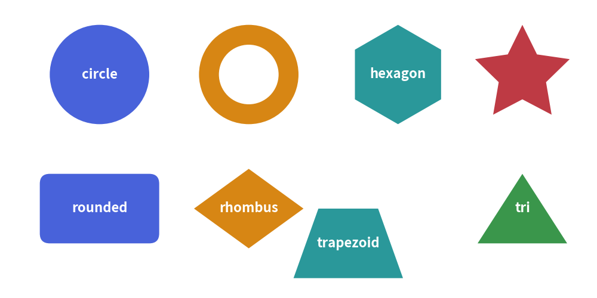

# Vector Shapes

Drawlib provides a rich suite of vector shape primitives designed for technical illustrations. 
Unlike low-level canvas libraries where shapes must be constructed from complex Bézier paths, Drawlib shapes are defined declaratively with intuitive geometric arguments, built-in center labels, and unified styling.

---

## 1. Common Shape Parameters

All shape primitives share consistent keyword arguments:

| Parameter | Type | Default | Description |
| :--- | :--- | :--- | :--- |
| `xy` | `tuple[float, float]` | *Required* | Coordinate anchor point `(x, y)` (geometric center for most shapes). |
| `style` | `Style` | *Required* | Visual style defining fill color, border line style, and border width. |
| `text` | `str` | `""` | Embedded text label centered inside the shape. |
| `textstyle` | `Style` | `None` | Text styling (color, font, weight). Defaults to active theme text style. |
| `textsize` | `float` | `None` | Font size of the embedded label in points. |
| `angle` | `float` | `0.0` | Rotation angle in degrees (counter-clockwise). |

---

## 2. Showcase of Core Primitives


<figure class="drawlib-image" style="text-align: center;">
  
  <figcaption class="drawlib-caption">Overview of Drawlib Core Shape Primitives</figcaption>
</figure>


---

## 3. Circle-like & Radial Shapes

### `circle(xy, radius, ...)`
Draws a standard circle centered at `xy`.
```python
circle((50, 50), radius=15, style=Styles.primary_flat, text="Node A")
```

### `donuts(xy, radius, width, ...)`
Draws a concentric ring with an outer `radius` and wall thickness `width`.
```python
donuts((50, 50), radius=20, width=5, style=Styles.accent_flat)
```

### `ellipse(xy, width, height, angle=0.0, ...)`
Draws an oval / ellipse with independent horizontal and vertical dimensions.
```python
ellipse((50, 50), width=30, height=16, style=Styles.secondary_flat)
```

### `fan(xy, radius, angle_start, angle_end, ...)`
Draws a circular pie sector bounded by angles (e.g. `angle_start=0`, `angle_end=90`).

### `wedge(xy, radius, width, angle_start, angle_end, ...)`
Draws an angular donut slice between `angle_start` and `angle_end`.

---

## 4. Rectangular & Planar Polygons

### `rectangle(xy, width, height, r=0.0, angle=0.0, ...)`
Draws a rectangle centered at `xy`. 
- Set `r` to create smooth **rounded corners** (e.g., `r=2.0`).
- Use `angle` to rotate around the geometric center.
```python
rectangle((60, 30), width=40, height=20, r=3, style=Styles.primary_flat, text="Service Card")
```

### `rhombus(xy, width, height, ...)`
Draws a symmetric diamond / rhombus centered at `xy` (commonly used for decision nodes).

### `triangle(xy, width, height, angle=0.0, ...)`
Draws an isosceles triangle pointing upwards (or rotated via `angle`).

### `trapezoid(xy, height, bottomedge_width, topedge_width, topedge_x=None, ...)`
Draws a symmetric or skewed trapezoid anchored at the bottom-left coordinate `xy`.

### `regularpolygon(xy, radius, num_vertex, angle=0.0, ...)`
Draws an equilateral regular polygon with $N$ vertices (pentagon $N=5$, hexagon $N=6$, octagon $N=8$).

### `star(xy, num_vertex, radius_ext, radius_int, angle=0.0, ...)`
Draws an $N$-pointed symmetric star with outer radius `radius_ext` and inner valley radius `radius_int`.

### `polygon(points, ...)`
Connects an arbitrary sequence of absolute coordinates `[(x1, y1), (x2, y2), ...]` into a closed polygon.

---

## 5. Custom Vector Shapes (`shape`)

For irregular geometries that do not match predefined primitives, `shape` allows you to construct custom vector polygons using **local path coordinates**:

```python
from drawlib.shapes import shape
from drawlib.styles import Styles

# Anchor at (40, 20), define local vertices relative to anchor
shape(
    xy=(40, 20),
    path_points=[(0, 0), (20, 0), (30, 15), (10, 25), (-5, 10)],
    style=Styles.primary_flat,
    text="Custom Path",
)
```

---

> [!TIP]
> For directed arrows (straight, right-angled, U-turn, arc, and chevron arrows), see **[Block Arrows](./arrows.md)**.
