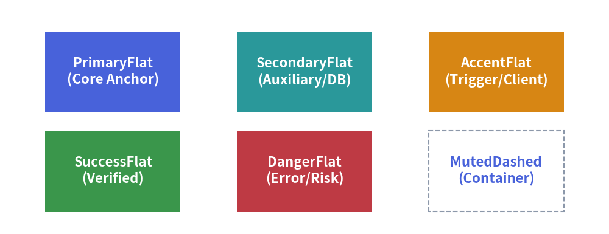

# Styles & Theming

In complex technical diagrams, manually configuring RGB color codes, line widths, and font sizes for every single element leads to inconsistent branding and brittle drawing code. 
Drawlib resolves this with a **systematic design token system** in `drawlib.styles` and `drawlib.preset_styles`.

---

## 1. Overview of Semantic Styles


<figure class="drawlib-image" style="text-align: center;">
  
  <figcaption class="drawlib-caption">Drawlib Semantic Color Roles and Variants</figcaption>
</figure>


---

## 2. Active Design Tokens (`drawlib.styles`)

The active design system is imported from `drawlib.styles`:

```python
from drawlib.styles import Colors, Styles
```

- **`Styles`**: The active catalog of pre-configured `Style` objects (defaults to `DefaultStyles`).
- **`Colors`**: The active palette of color definitions (defaults to `DefaultColors`).

---

## 3. Semantic Role & Variant Matrix

Every style token is composed of a **Semantic Role** (or color name) and an optional **Visual Variant**:

### Semantic Roles:
- **`Primary`**: Main structural components and key architectural blocks.
- **`Secondary`**: Secondary supporting services and auxiliary nodes.
- **`Accent`**: Emphasized focal points and action triggers.
- **`Neutral`**: Calm card surfaces, general services, and worker nodes.
- **`Success`**: Healthy statuses, successful states, and completed steps.
- **`Danger`**: Error conditions, security threats, and terminating gates.
- **`Warning`**: Warnings, deprecations, and pending queues.
- **`Muted`**: Background boundaries, subtle partitions, and inactive states.

### Common Variants:
| Variant Suffix | Example | Visual Appearance |
| :--- | :--- | :--- |
| `Flat` | `Styles.PrimaryFlat` | Solid fill color without border lines. |
| `Bordered` | `Styles.PrimaryBordered` | Standard fill with a contrasting border. |
| `Bold` | `Styles.PrimaryBold` | Heavy stroke for lines and borders. |
| `Thin` | `Styles.PrimaryThin` | Thin stroke with thin font weight. |
| `Outline` | `Styles.PrimaryOutline` | Transparent fill with a colored border line. |
| `Dashed` | `Styles.MutedDashed` | Dashed border stroke (ideal for VPCs and clusters). |
| `Dotted` | `Styles.PrimaryDotted` | Dotted border stroke for ephemeral or preview components. |
| `Neutral` | `Styles.BlueNeutral` | Tinted card with ultra-light fill, soft border, high-contrast text. |
| `NeutralFlat` | `Styles.BlueNeutralFlat` | Borderless tinted card with high-contrast text. |

---

## 4. Typography & Icon Styles

Preset styles are also applied to text labels and icons:

```python
# Use WhiteBold for text inside filled dark containers
rectangle((50, 25), width=30, height=20, style=Styles.PrimaryFlat, text="Server", text_style=Styles.WhiteBold)
line((20, 25), (80, 25), arrow_head="->", style=Styles.DarkBold)
```

---

## 5. Customizing & Deriving Styles (`.patch()`)

To create custom style variations without rebuilding a `Style` from scratch, use `.patch()`:

```python
from drawlib.styles import Styles
from drawlib.preset_colors import CssColors

# Derive a custom card style with a custom border and fill
custom_card = Styles.Primary.patch(
    shape_fill_color=CssColors.AliceBlue,
    shape_line_color=CssColors.DodgerBlue,
    shape_line_width=2.5,
)
```

---

## 6. Official Preset Style Catalogs (`drawlib.preset_styles`)

Drawlib includes three official style catalogs:
1. **`DefaultStyles`**: Clean, balanced modern tech palette.
2. **`GoogleStyles`**: Material Design inspired palette (Blue, Red, Yellow, Green).
3. **`MonochromeStyles`**: Publication-grade grayscale palette for black-and-white academic papers.

Switch the active preset globally via CLI flag:

```bash
$ uv run drawlib build html docs_src/ --styles google
```
