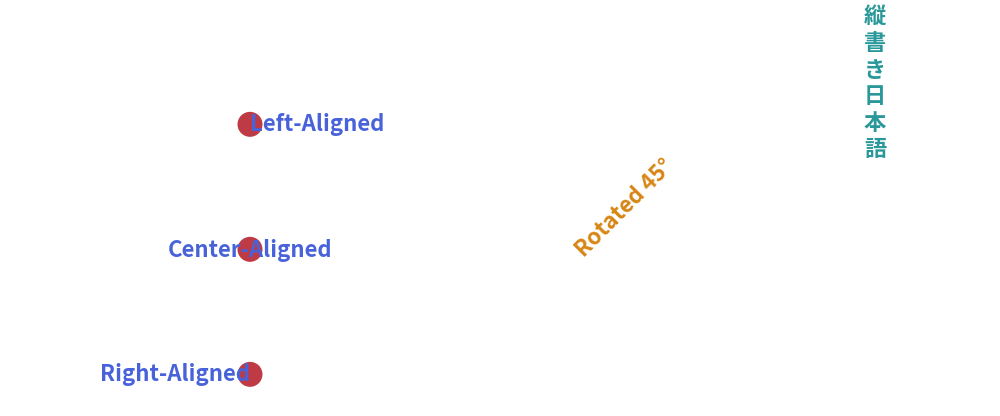

# Text & Typography

Clear typography and precise alignment are essential for readable technical diagrams. 
Drawlib provides horizontal text, vertical CJK text, arbitrary rotation, multiline wrapping, and built-in universal typography.

---

## 1. Overview of Text Rendering


<figure class="drawlib-image" style="text-align: center;">
  
  <figcaption class="drawlib-caption">Text Alignment, Rotation, and Vertical Typography</figcaption>
</figure>


---

## 2. Text Functions

### 2.1. Standard Horizontal Text (`text`)

```python
text(
    xy: tuple[float, float],
    text: str,
    angle: float = 0.0,
    style: Style | str | None = None,
)
```

- **`xy`**: Coordinate anchor point `(x, y)`.
- **`text`**: The string content. Use `\n` to insert line breaks.
- **`angle`**: Counter-clockwise rotation angle around `xy`.
- **`style`**: Text styling (color, font size, weight, alignment).

### 2.2. Vertical CJK Text (`text_vertical`)

Renders East Asian characters (Japanese, Chinese) in traditional top-to-bottom vertical layout:

```python
from drawlib.text import text_vertical
from drawlib.styles import Styles

text_vertical((10, 80), "設計仕様書", style=Styles.primary_bold)
```

---

## 3. Alignment Engines (`halign` & `valign`)

By default, text is centered horizontally and vertically at `xy`. You can alter the alignment using style attributes:

- **`text_halign`**:
  - `"center"` *(default)*: Centered horizontally at `x`.
  - `"left"`: Left edge starts at `x`.
  - `"right"`: Right edge ends at `x`.
- **`text_valign`**:
  - `"center"` *(default)*: Centered vertically at `y`.
  - `"top"`: Top edge touches `y`.
  - `"bottom"`: Baseline touches `y`.

```python
# Align text neatly to the right of an icon or pin
text(
    (55, 30),
    "Aligned Label",
    style=Styles.bold.patch(text_halign="left", text_valign="center"),
)
```

---

## 4. Built-in Font System (`drawlib.fonts`)

Drawlib bundles high-quality, open-source Google Noto and Roboto fonts with universal multilingual CJK fallback:

| Font Class | Family | Ideal Use Case |
| :--- | :--- | :--- |
| `FontRoboto` | Roboto | Standard UI labels, titles, clean sans-serif typography. |
| `FontSourceCode` | Source Code Pro | Monospace code blocks, ASCII schemas, hex values. |
| `FontSansSerif` | Noto Sans | Universal sans-serif with fallback. |
| `FontSerif` | Noto Serif | Formal editorial publications and academic prints. |
| `FontJapanese` | Noto Sans JP | Optimized Japanese typography with Kanji/Kana balance. |
| `FontChinese` | Noto Sans SC | Simplified Chinese typography. |
| `FontKorean` | Noto Sans KR | Hangul typography. |
| `FontFile` | Custom TTF/OTF | Load external brand fonts from arbitrary file paths. |

### Applying Fonts to Styles

```python
from drawlib.fonts import FontSourceCode
from drawlib.text import text
from drawlib.styles import Styles

# Monospace code label
text(
    (50, 20),
    "SELECT * FROM users;",
    style=Styles.bold.patch(text_font=FontSourceCode.SOURCECODEPRO_REGULAR, text_size=14),
)
```
