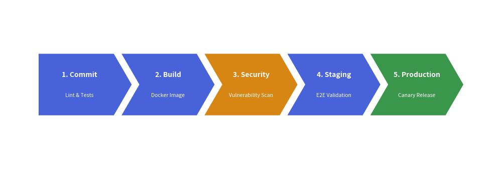

# ChevronProcess Component

The `ChevronProcess` component draws horizontal, sequential process pipelines consisting of interlocking arrowhead blocks (chevrons). 
It is the premier component for CI/CD delivery pipelines, phased development milestones, fulfillment lifecycles, and multi-step workflows.

---

## 1. Quick Example: CI/CD Pipeline


<figure class="drawlib-image" style="text-align: center;">
  
  <figcaption class="drawlib-caption">Continuous Delivery Pipeline with ChevronProcess</figcaption>
</figure>


---

## 2. Geometry & Coordinate Anchor

- **Bottom-Left Anchor `(x, y)`**: The coordinate passed to `draw(xy=...)` represents the **bottom-left corner** of the entire process bounding box.
- **`flat_left_end`**: When set to `True`, the first chevron has a clean vertical left border instead of an indented notch, creating a polished start.
- **`corner_angle`**: Sets the sharpness of the chevron arrowhead tip (typically between `45.0` and `60.0` degrees).
- **`spacing`**: The horizontal gap between adjacent chevrons.

---

## 3. Class API Reference

### Constructor
```python
ChevronProcess(
    *,
    style: Style,
    text_style: Style,
    description_style: Style,
    corner_angle: float = 60.0,
    spacing: float = 1.5,
    flat_left_end: bool = False,
)
```

### Adding Steps
- **`add(text, *, description="", style=None, text_style=None, description_style=None, show=True) -> ChevronItem`**:  
  Adds a new process stage and returns a mutable `ChevronItem` instance. If styles are omitted, constructor defaults are used.

### Drawing
- **`draw(xy, width=90.0, height=12.0, item_width=None, scale=1.0)`**:  
  Renders the pipeline onto the active canvas. If `item_width` is omitted, Drawlib divides `width` equally among all stages.
