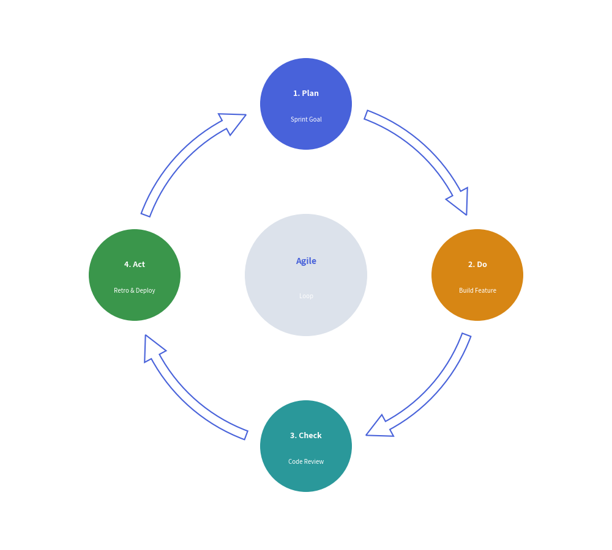

# Cycle Component

The `Cycle` component draws circular, repeating process diagrams and continuous feedback loops. 
It is ideally suited for Agile/Scrum iterations, PDCA DevOps lifecycles, incident response loops, and token refresh mechanisms.

---

## 1. Quick Example: Agile Development Cycle


<figure class="drawlib-image" style="text-align: center;">
  
  <figcaption class="drawlib-caption">Continuous Agile Lifecycle with Cycle</figcaption>
</figure>


---

## 2. Geometry & Coordinate Mechanics

- **Center Anchor `(cx, cy)`**: The coordinate passed to `draw(xy=(cx, cy), radius=R)` specifies the **center hub of the orbit circle**.
- **Equi-Angular Distribution**: Steps are automatically spaced evenly along the orbit circumference:
  $$\theta_i = \text{start\_angle} \mp \left(i \cdot \frac{360^\circ}{N}\right)$$
- **Circular Arc Connectors**: Steps are connected by curved block arrows (`arrow_type="arc"`), direct lines (`"line"`), or no connectors (`"none"`).
- **Arrow Color Mode**:
  - `"match_source"` *(default)*: Each connector arrow adopts the theme color of its originating step.
  - `"match_target"`: Connectors match the destination step color.
  - `"monochrome"`: Connectors use a uniform line style (`default_arrow_style`).

---

## 3. Class API Reference

### Constructor
```python
Cycle(
    clockwise: bool = True,
    start_angle: float = 90.0,
    node_shape: Literal["circle", "rectangle", "none"] = "circle",
    node_radius: float = 8.0,
    node_size: tuple[float, float] = (18.0, 10.0),
    description_placement: Literal["inside", "outside"] = "inside",
    arrow_type: Literal["arc", "line", "none"] = "arc",
    arrow_width: float = 2.0,
    arrow_head_width: float = 4.5,
    arrow_color_mode: Literal["monochrome", "match_source", "match_target"] = "match_source",
    arrow_gap: float = 2.5,
    default_style: str | Style | None = None,
    default_textstyle: str | Style | None = None,
    default_description_style: str | Style | None = None,
    default_arrow_style: str | Style | None = None,
    palette: Sequence[tuple[int, int, int]] | None = None,
)
```

### Adding Steps and Center Hub
- **`append(text, description="", style=None, textstyle=None, description_style=None)`**:  
  Appends a step to the circular perimeter.
- **`set_center(text, description="", radius=None, style=None, textstyle=None)`**:  
  Adds an optional central focal node to create a radial cycle.

### Drawing
- **`draw(xy, radius=28.0)`**:  
  Renders the circular cycle centered at `xy` with orbit radius `radius`.
