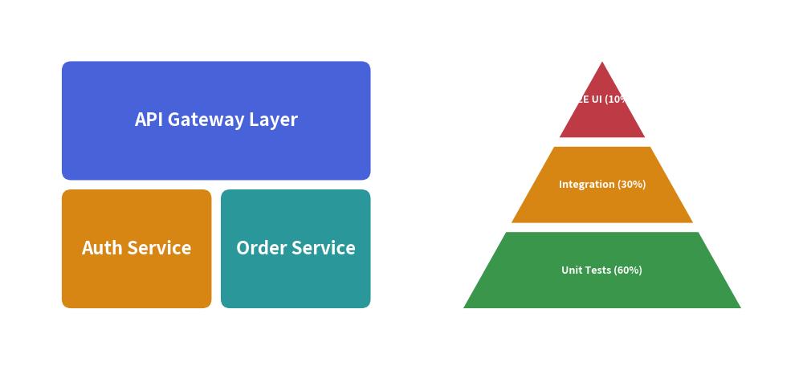

# Lists & Grids

Drawlib includes four specialized layout components for structuring collections of elements:
- **`GridLayout`**: Positions cards across a matrix of rows and columns with cell spanning.
- **`Pyramid`**: Hierarchical trapezoidal stacks (testing pyramids, security tiers).
- **`BoxList`**: Linear card sequences flowing horizontally or vertically.
- **`BulletPoints`**: Formatted bulleted text lists with customizable indentation levels and icons.

---

## 1. Quick Example: Grid Architecture & Pyramid Stacks


<figure class="drawlib-image" style="text-align: center;">
  
  <figcaption class="drawlib-caption">Matrix Grid Layers and Tiered Pyramid Stacks</figcaption>
</figure>


---

## 2. GridLayout (Matrix Architecture)

`GridLayout` organizes cards across a grid of `num_column` columns and `num_row` rows:
- **Anchor**: Bottom-Left `(x, y)`. Row 0 is the bottom row; Column 0 is the left column.
- **Cell Spanning**: A card at `position=(col, row)` can span `width` columns and `height` rows.

```python
grid = GridLayout(num_column=3, num_row=3, default_r=2.0)
grid.add(position=(0, 2), width=3, height=1, text="Top Header Span", style=Styles.primary_flat)
grid.draw(xy=(10, 10), width=90, height=60, margin=1.5)
```

---

## 3. Pyramid (Tiered Stacks)

`Pyramid` renders hierarchical trapezoids crowned by an apex triangle:
- **Anchor**: Bottom-Left `(x, y)`.
- **`order`**:
  - `"vertex_to_base"`: First added item is positioned at the apex; subsequent items widen toward the base.
  - `"base_to_vertex"`: First added item starts at the wide base.
- **`align`**: `"bottom"` (standard upright pyramid), `"top"` (inverted funnel), `"left"`, `"right"`.

---

## 4. BoxList (Linear Card Sequences)

`BoxList` sequences cards along one axis (`align="left"`, `"right"`, `"top"`, or `"bottom"`):

```python
from drawlib.smartarts import BoxList
from drawlib.styles import Styles

bl = BoxList(default_style=Styles.primary_flat, default_textstyle=Styles.white_bold)
bl.add("Step 1")
bl.add("Step 2", style=Styles.accent_flat)  # Highlighted step
bl.add("Step 3")
bl.draw(xy=(20, 25), item_width=25, item_height=14, margin=3.0, align="left")
```

---

## 5. BulletPoints (Formatted Text Lists)

`BulletPoints` renders nested lists starting from a top-left coordinate `(x, y)`:

```python
from drawlib.smartarts import BulletPoints
from drawlib.styles import Styles

bp = BulletPoints(vertical_margin=5.0, indent_width=4.0, default_style=Styles.bold)
bp.set_indent(1)
bp.add("First architectural requirement")
bp.add("Second architectural requirement")
bp.set_indent(2)
bp.add("Nested implementation detail")
bp.draw(xy=(10, 50))
```
