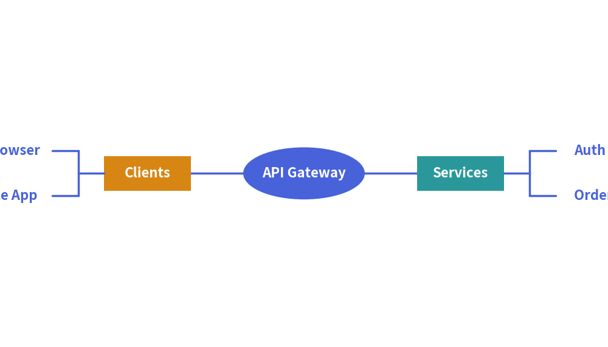

# MindMap Component

The `MindMapNode` component renders multi-directional, radial mindmaps and hierarchical feature maps centered around a central root topic. 
Branches can project to the left, right, top, or bottom, with automatic elbow connector routing.

---

## 1. Quick Example: Architecture Topology Map


<figure class="drawlib-image" style="text-align: center;">
  
  <figcaption class="drawlib-caption">System Architecture Breakdown with MindMap</figcaption>
</figure>


---

## 2. Geometry & Branching Directions

- **Center Anchor `(cx, cy)`**: The coordinate passed to `root.draw(xy=...)` anchors the **exact center** of the central root node.
- **Directional Branching (`branch`)**:
  - `"right"` *(default)*: Sub-branches extend to the right (`+x`).
  - `"left"`: Sub-branches extend to the left (`-x`).
  - `"top"`: Sub-branches extend upward (`+y`).
  - `"bottom"`: Sub-branches extend downward (`-y`).
- **Node Shapes**:
  - `"oval"`: Pill / ellipse container.
  - `"rectangle"`: Rectangular box with optional corner rounding (`r`).
  - `"none"`: Clean text label without border or background fill.

---

## 3. Node Class API

```python
MindMapNode(
    text: str,
    branch: Literal["left", "right", "top", "bottom"] = "right",
    shape: Literal["oval", "rectangle", "none"] = "rectangle",
    size: tuple[float, float] | None = None,
    r: float = 0.0,
    style: Style | str | None = None,
    textstyle: Style | str | None = None,
    default_linestyle: Style | str | None = None,
    default_line_length: float = 10.0,
    default_horizontal_margin: float = 3.0,
    default_vertical_margin: float = 3.0,
    xy_shift: tuple[float, float] = (0.0, 0.0),
    children: list[MindMapNode] | None = None,
)
```
