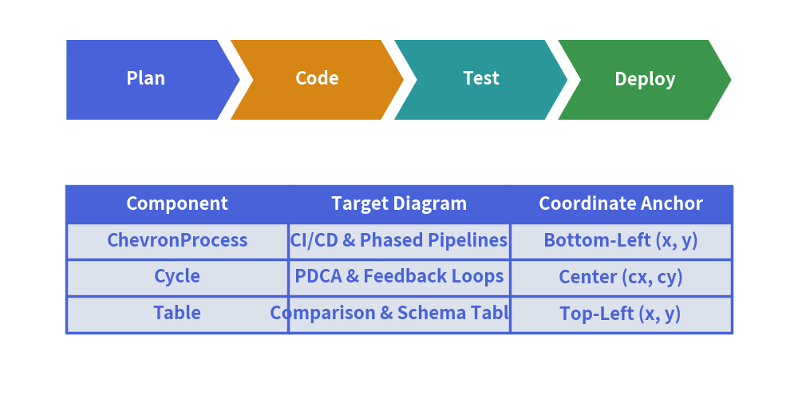

# SmartArts Overview

Drawing structured diagrams (such as process flows, comparison tables, directory trees, or mindmaps) using raw shapes and lines often requires calculating hundreds of manual coordinates. 
The `drawlib.smartarts` module eliminates this boilerplate by providing **high-level, declarative layout components**.

---

## 1. What SmartArts Can Do

<figure class="drawlib-image" style="text-align: center;">
  
  <figcaption class="drawlib-caption">SmartArts High-Level Component Showcase</figcaption>
</figure>

---

## 2. Component Catalog Matrix

| Component | Primary Use Case | Anchor System | Key Methods |
| :--- | :--- | :--- | :--- |
| **`ChevronProcess`** | Phased pipelines, CI/CD stages, migration roadmaps | Bottom-Left `(x, y)` | `append()`, `extend()`, `draw()` |
| **`Cycle`** | PDCA devops loops, circular lifecycles, state loops | Center `(cx, cy)` | `append()`, `set_center()`, `draw()` |
| **`Table`** | Service SLAs, specification matrices, DB schemas | Top-Left `(x, y)` | `draw()`, `set_style_cell_*()` |
| **`TreeNode`** | Directory hierarchies, org charts, taxonomy trees | Top-Left `(x, y)` | `draw()`, `add_child()` |
| **`MindMapNode`** | Brainstorming nodes, radial feature maps | Center `(cx, cy)` | `draw()`, `add_child()` |
| **`GridLayout`** | Layered architectures, dashboard card grids | Bottom-Left `(x, y)` | `add()`, `draw()` |
| **`Pyramid`** | Testing pyramids, tiered memory/cache hierarchies | Bottom-Left `(x, y)` | `add()`, `draw()` |
| **`BulletPoints`** | Architectural takeaways, RFC key points | Top-Left `(x, y)` | `draw()` |
| **`SourceCode`** | Syntax-highlighted code blocks in diagrams | Top-Left `(x, y)` | `draw()` |
| **`bubblespeech`** | Speech bubbles, architecture callouts, warnings | Bottom-Left `(x, y)` | Direct function call |

---

## 3. Coordinate Anchor Conventions

Understanding anchor points is essential when combining SmartArts with other elements:
- **Top-Left Anchored (`Table`, `TreeNode`, `BulletPoints`, `SourceCode`)**:  
  You specify the top-left coordinate `(x, y)`. Content flows horizontally to the right and vertically downward (`y` decreases).
- **Bottom-Left Anchored (`ChevronProcess`, `GridLayout`, `Pyramid`, `bubblespeech`)**:  
  You specify the bottom-left coordinate `(x, y)`. The bounding container extends rightward and upward (`y` increases).
- **Center Anchored (`Cycle`, `MindMapNode`)**:  
  You specify the center coordinate `(cx, cy)`. The diagram expands symmetrically or radially around the center.
