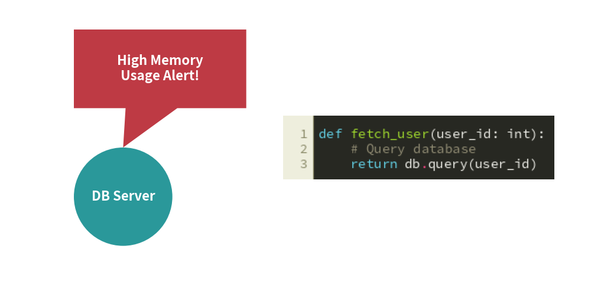

# Speech & Code Blocks

Drawlib provides specialized components for embedding contextual annotations and syntax-highlighted source code:
- **`bubblespeech`**: Creates comic callouts and speech bubbles with precise tail pointers.
- **`SourceCode`**: Embeds syntax-colored code snippets using Pygments and PIL.

---

## 1. Quick Example: Alert Callout & Code Snippet


<figure class="drawlib-image" style="text-align: center;">
  
  <figcaption class="drawlib-caption">Speech Callout and Syntax-Highlighted Code Container</figcaption>
</figure>


---

## 2. Speech Bubbles (`bubblespeech`)

The `bubblespeech` function creates a rectangular speech bubble with a triangular tail pointing toward a specific target coordinate:

```python
bubblespeech(
    xy: tuple[float, float],           # Bottom-left corner of the bubble body
    width: float,                      # Bubble body width
    height: float,                     # Bubble body height
    tail_edge: Literal["bottom", "top", "left", "right"],
    tail_start_ratio: float,          # Float in [0.0, 1.0] along edge
    tail_end_ratio: float,            # Float in [0.0, 1.0] along edge
    tail_vertex_xy: tuple[float, float], # Exact target point coordinate
    style: Style,
    text: str = "",
    textstyle: Style | None = None,
)
```

- **`tail_edge`**: The side of the bubble where the tail originates (`"bottom"`, `"top"`, `"left"`, `"right"`).
- **`tail_vertex_xy`**: The target coordinate where the arrowhead/tip points (e.g. the edge of a server node or bottleneck).

---

## 3. Syntax-Highlighted Code Blocks (`SourceCode`)

`SourceCode` leverages the Pygments syntax engine to render code snippets with professional theme palettes:

### Constructor
```python
SourceCode(
    language: str | None = None,     # "python", "yaml", "json", "sql", "bash", etc.
    style: str = "default",           # "monokai", "github-dark", "xcode", "default"
    show_linenum: bool = False,       # Displays line numbers
    font: FontSourceCode | None = None,
)
```

### Methods
- **`draw(xy, width, code)`**: Renders code image on the canvas centered at `xy`.
- **`get_image(code) -> Dimage`**: Returns the rendered code as an in-memory `Dimage`.
- **`get_text(file)`**: Static helper to read source code from an external file on disk.
