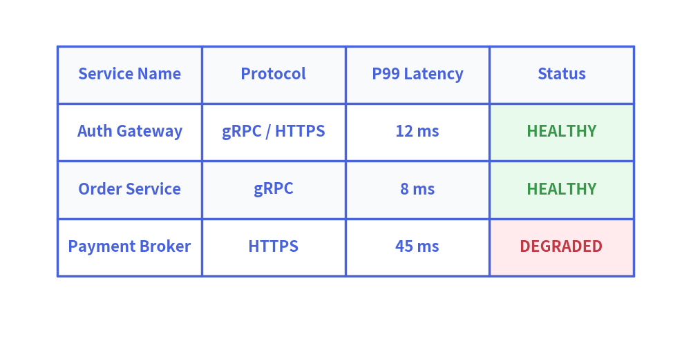

# Table Component

The `Table` component renders 2D tabular data, comparison matrices, and database schemas with fine-grained styling control over borders, headers, alternating even/odd row backgrounds, and specific cell highlights.

---

## 1. Quick Example: Service SLA & Status Matrix

<figure class="drawlib-image" style="text-align: center;">
  
  <figcaption class="drawlib-caption">Service Status Matrix with Table</figcaption>
</figure>

---

## 2. Geometry, Data Matrix & Coordinate Mechanics

- **Top-Left Anchor `(x, y)`**: The coordinate passed to `draw(xy=...)` specifies the **top-left corner** of the first table cell.
- **Downward Flow**: Rows move downward (`y - row_height`), while columns extend to the right (`x + col_width`).
- **2D Data Matrix (`data`)**: Passed as a 2D list (`list[list[Any]]`) to `draw()` or `draw_flexible()`. When `has_header=True` (default), row `0` is styled using `header_cell_style` and `header_text_style`.
- **Sizing & Scaling Modes**:
  - `draw(xy, width, height, data, scale: float = 1.0)`: Distributes `width` and `height` equally across all columns and rows, scaling dimensions and font sizes by `scale`.
  - `draw_flexible(xy, column_widths, row_heights, data, scale: float = 1.0)`: Provides custom widths per column (e.g. `column_widths=[30, 20, 25, 25]`) and custom heights per row.

---

## 3. Styling API Reference

### Cell Styling Methods
- **`set_style_cell_header(background_color, text_style)`**: Applies style exclusively to the header row (row 0).
- **`set_style_cell_rowheader(background_color, text_style)`**: Applies style exclusively to the row header column (column 0).
- **`set_style_cell_evenodd(even_color, even_text_style, odd_color, odd_text_style)`**: Alternating zebra-stripe styles for even and odd data rows.
- **`set_style_cell(background_color, text_style, rows=None, columns=None)`**: Applies styling to specific rows or columns.

### Border Styling Methods
- **`set_style_border(top=None, top2=None, bottom=None, left=None, right=None, between_columns=None, between_rows=None)`**:
  - `top`, `bottom`, `left`, `right`: Outer perimeter border lines.
  - `top2`: Sub-header horizontal divider line beneath row 0.
  - `between_rows`, `between_columns`: Inner grid divider lines.
