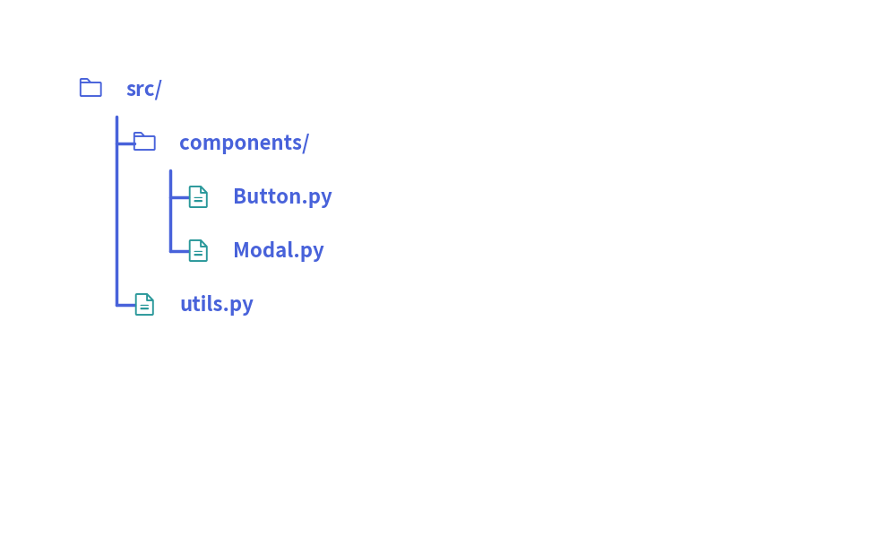

# Tree Component

The `TreeNode` component renders hierarchical tree structures, such as codebase directory trees, organizational hierarchy charts, and taxonomy categorizations. 
It automates vertical branch alignment, indentation levels, and tree connector lines.

---

## 1. Quick Example: Project Directory Hierarchy


<figure class="drawlib-image" style="text-align: center;">
  
  <figcaption class="drawlib-caption">Project File Structure with TreeNode</figcaption>
</figure>


---

## 2. Geometry & Coordinate Mechanics

- **Top-Left Anchor `(x, y)`**: The coordinate passed to `root.draw(xy=...)` represents the **top-left corner** of the root node text.
- **Downward & Rightward Flow**: Sub-directories and files branch downward and indent horizontally to the right.
- **Root Node Margin Requirements**:  
  When instantiating the root `TreeNode`, three layout spacing arguments must be configured:
  - `default_line_horizontal_margin`: Horizontal gap between parent label and vertical connector line.
  - `default_line_horizontal_length`: Length of the horizontal tick connecting to child nodes.
  - `default_line_vertical_margin`: Vertical row spacing between adjacent items.

---

## 3. Registering Icons (`register_drawing_item`)

You can attach vector icons or visual badges to tree items using `register_drawing_item`:

```python
TreeNode.register_drawing_item(
    name="custom_badge",
    location="before",  # "before" or "after" the label text
    padding_width=4.0,
    function=phosphor.file_code,
    style=Styles.accent_flat,
    args={"width": 3.5},
)

# Apply to node
node = TreeNode("config.yaml").set_drawing_item("custom_badge")
```
