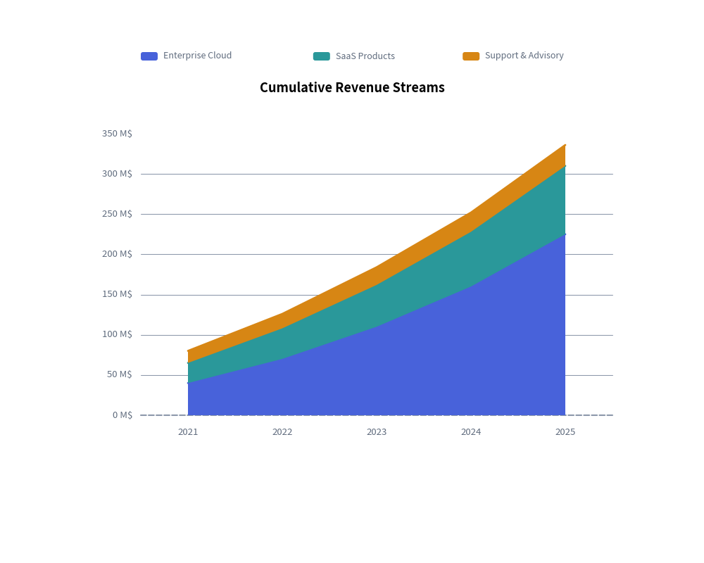
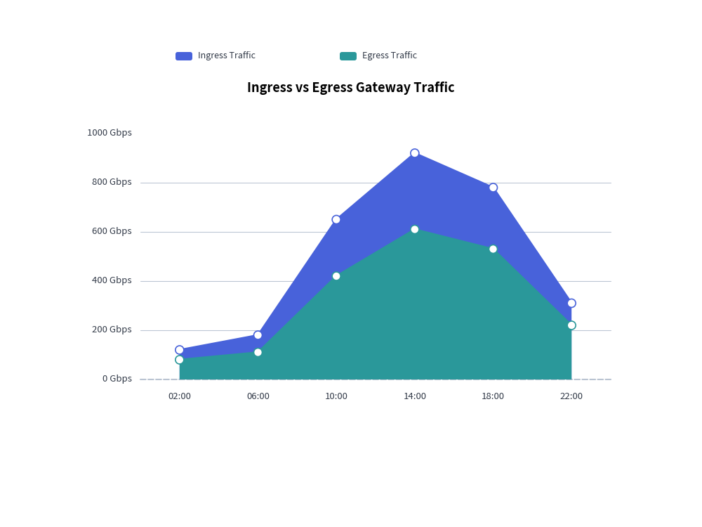

# AreaChart: Overlapping & Stacked Quantitative Volumes

`AreaChart` visualizes cumulative volumes, capacity distributions, and continuous trends over categorical intervals or time periods. By filling the geometric area between data series contours and the baseline ($Y=0$), it highlights both the total volume and individual series contributions.

---

## 1. Overview & Key Modes

Area charts support two core operational modes:
- **`mode="overlap"`**: Each series polygon starts at the baseline ($Y=0$) and overlaps with preceding series. Use a semi-transparent opacity (`fill_alpha=0.3` to `0.5`) to make underlying curves visible.
- **`mode="stack"`**: Each series rests directly on top of the preceding one, showing cumulative totals (e.g., total gross revenue broken down by product line).

```text
       mode="overlap" (Semi-transparent)           mode="stack" (Cumulative Total)
   Y ▲                                         Y ▲
     │        ▲                                  │         ▲ Total
     │       ╱ █╲    ▲                           │        ╱█╲
     │     ▲╱  █ ╲  ╱ ╲                          │      ▲╱███╲ Series B
     │    ╱ █  █  ╲╱   ╲                         │     ╱██████╲ Series A
     └───┴──┴──┴───┴────┴──► X                   └────┴────────┴────► X
```

---

## 2. Constructor & Configuration

```python
from drawlib.charts.area import AreaChart
from drawlib.styles import Styles

chart = AreaChart(
    axis_line_style=Styles.MutedDashed,
    categories=["2021", "2022", "2023", "2024", "2025"],
    axis_text_style=Styles.Muted.patch(text_size=9.5),
    grid_style=Styles.MutedThin,
    width=80.0,
    height=55.0,
    title="Cumulative Revenue Streams",
    title_style=Styles.BlackBold.patch(text_size=13.0),
    mode="stack",               # "stack" or "overlap"
    fill_alpha=0.65,            # Polygon fill opacity (0.0 to 1.0)
    smooth=False,               # Smooth spline curve or straight lines
    show_points=False,          # Draw vertex markers
)
```

---

## 3. Cumulative Stacked Area Chart

Stacked area charts are ideal for displaying total aggregate metrics and showing the proportional contribution of each stream over time.


<figure class="drawlib-image" style="text-align: center;">
  
  <figcaption class="drawlib-caption">Cumulative Stacked Revenue Streams</figcaption>
</figure>


---

## 4. Overlapping Area Chart with Custom Markers

When comparing independent metrics that share the same scale (such as network ingress and egress traffic), use `mode="overlap"` with a lighter alpha and vertex markers:


<figure class="drawlib-image" style="text-align: center;">
  
  <figcaption class="drawlib-caption">Gateway Ingress vs Egress Traffic</figcaption>
</figure>


