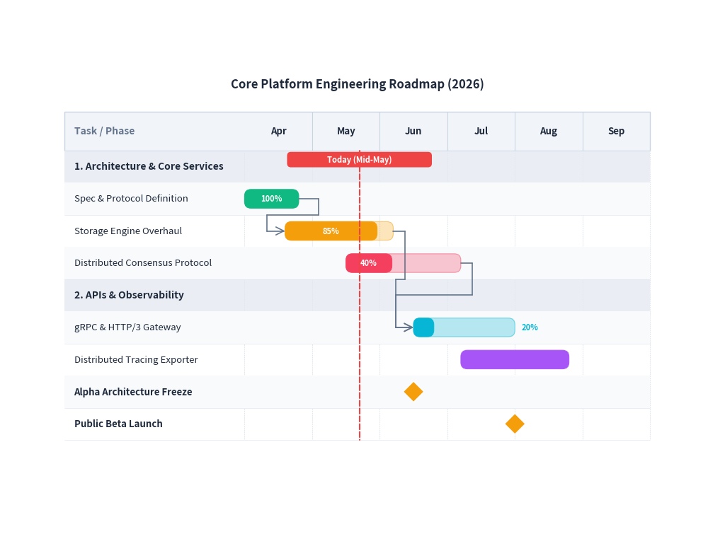
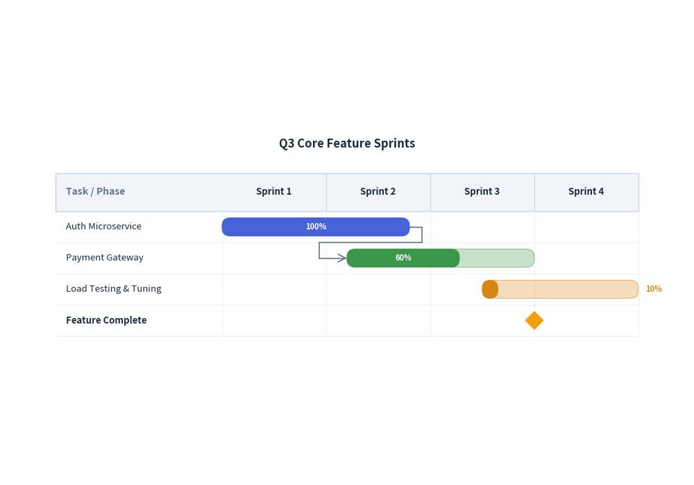

# GanttChart: Project Roadmaps, Milestones & Dependencies

`GanttChart` provides declarative, vector-grade project roadmaps, sprint schedules, and milestone timelines. Drawing inspiration from sequence diagrams, timeline intervals are structured horizontally along the X-axis while task rows, section divider banners, and milestones stack sequentially downwards.

---

## 1. Overview & Structural Hierarchy

```text
  Task / Milestone         Sprint 1       Sprint 2       Sprint 3       Sprint 4
 ┌──────────────────────┬──────────────┬──────────────┬──────────────┬──────────────┐
 │ ▼ Core Engine        │              │              │              │              │
 │ Database Migration   │ [██████████] │              │              │              │
 │ API Gateway V2       │       └──────┼───────────►[████████]       │              │
 │ ◆ Beta Code Freeze   │              │              │       ◆      │              │
 └──────────────────────┴──────────────┴──────────────┴──────────────┴──────────────┘
                                                       │
                                                 Today's Marker
```

- **Section Dividers (`add_section`)**: Categorize tasks into functional domains (e.g. "Core Engine", "Observability").
- **Task Bars (`add_task`)**: Represent working durations with optional percentage completion progress bars (`progress=0.85`).
- **Milestones (`add_milestone`)**: Diamond marker indicators representing key delivery dates or code freezes.
- **Vertical Time Markers (`add_marker`)**: Full-height vertical indicators highlighting the current date or sprint boundaries.
- **Dependency Connectors (`add_dependency`)**: Orthogonal routing arrows linking prerequisite tasks to downstream deliverables.

---

## 2. Constructor & Configuration

```python
from drawlib.charts.gantt import GanttChart

chart = GanttChart(
    columns=["Apr", "May", "Jun", "Jul", "Aug", "Sep"],
    width=95.0,                 # Total chart bounding width
    label_width=28.0,           # Width reserved for task label column
    header_height=6.0,          # Height of the top timeline header band
    row_height=5.0,             # Height allocated per task/milestone row
    title="Engineering Roadmap (2026)",
    bar_radius=1.0,             # Rounded corners for task duration bars
    show_vertical_grid=True,    # Vertical divider gridlines
    show_zebra=True,            # Alternating background row colors
)
```

### Parameter Reference

| Parameter | Type | Default | Description |
|---|---|---|---|
| `columns` | `list[str]` | Required | Ordered timeline interval labels along horizontal header band. |
| `width` | `float` | `90.0` | Overall chart bounding width. |
| `height` | `float \| None` | `None` | Overall height. If `None`, calculated dynamically from total row count. |
| `row_height` | `float` | `4.5` | Height per task, milestone, or section row. |
| `header_height` | `float` | `5.5` | Height of the top column header band. |
| `label_width` | `float` | `24.0` | Width allocated for the left task name column. |
| `title` | `str` | `""` | Chart title displayed at the top. |
| `show_vertical_grid` | `bool` | `True` | Whether to draw vertical divider gridlines between columns. |
| `show_zebra` | `bool` | `True` | Whether to alternate row background colors. |
| `bar_radius` | `float` | `0.8` | Corner rounding radius for task bars. |

---

## 3. Engineering Release Roadmap with Dependencies

The following complete example demonstrates sections, tasks with progress indicators, milestones, dependency arrows, and a "Today" marker:


<figure class="drawlib-image" style="text-align: center;">
  
  <figcaption class="drawlib-caption">Engineering Release Roadmap with Dependencies</figcaption>
</figure>


---

## 4. Time Coordinate Indexing

In `GanttChart`, time coordinates can be passed as:
1. **Column Name String**: Matches the exact string in `columns` (e.g., `start="Apr"` aligns with the beginning of the "Apr" column).
2. **Floating-point Offset**: `0.0` represents the left edge of the first column, `1.0` is the start of the second column, `1.5` is halfway through the second column, etc.

```python
# Task starts at column index 0 ("Apr") and runs until 80% through "Apr"
t1 = chart.add_task("Quick Task", start="Apr", end=0.8)

# Task starts halfway through month 2 and ends at month 4
t2 = chart.add_task("Longer Task", start=1.5, end=4.0)
```

---

## 5. Agile Sprint Schedule with Custom Palette

Tasks can also accept explicit colors to designate project phases, teams, or status:


<figure class="drawlib-image" style="text-align: center;">
  
  <figcaption class="drawlib-caption">Agile Sprint Schedule with Status Theming</figcaption>
</figure>


---

## 6. Best Practices & Guidelines

1. **Dynamic Height Calculation**: Leave `height=None` so `GanttChart` automatically sizes its height based on the number of tasks, sections, and milestones added.
2. **Label Width Budget**: Set `label_width` large enough (usually 24–30 coordinate units) to prevent long task names from being truncated.
3. **Canvas Margin**: Gantt titles and headers require headroom; ensure the bottom-left coordinate `(x, y)` and canvas dimensions provide at least 10–15 units of vertical space.
