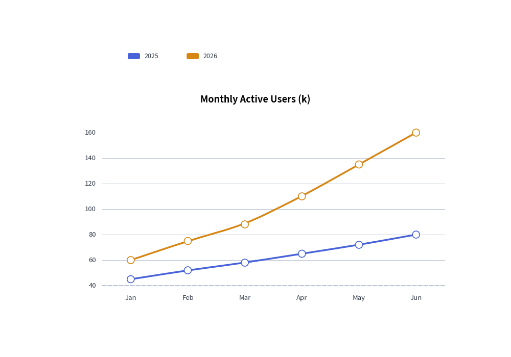

# Line Chart

The `LineChart` component visualizes numerical trends over ordered categories or continuous time points. 
It supports straight line segments, smoothed spline curves, custom point marker shapes, configurable line styles, and decoupled legend rendering.

---

## 1. Quick Example: User Growth Trends


<figure class="drawlib-image" style="text-align: center;">
  
  <figcaption class="drawlib-caption">User Growth Trends with LineChart</figcaption>
</figure>


---

## 2. Key Features

- **Smooth Spline Interpolation (`smooth=True`)**: Renders organic, flowing curves through data points rather than sharp zigzag angles.
- **Data Point Markers (`show_points=True`)**:
  - `point_shape`: Marker symbol (`"circle"`, `"square"`, `"none"`).
  - `point_size`: Radius / dimensions of markers.
- **Stroke Styles (`line_style`)**: Supports `"solid"`, `"dashed"`, and `"dotted"` strokes to differentiate targets from actuals.
- **Decoupled Legend (`draw_legend`)**: Allows rendering the series legend at any coordinate on the canvas.

---

## 3. Class API Reference

### Constructor
```python
LineChart(
    axis_line_style: Style,
    categories: list[str] | None = None,
    axis_text_style: Style | None = None,
    grid_style: Style | None = None,
    value_text_style: Style | None = None,
    background_style: Style | None = None,
    title: str = "",
    title_style: Style | None = None,
    width: float = 80.0,
    height: float = 50.0,
    smooth: bool = False,
    show_points: bool = True,
    point_shape: Literal["circle", "square", "none"] = "circle",
    point_size: float = 0.7,
)
```

### Adding Series & Rendering
```python
chart.add_series(
    name: str,
    values: list[float],
    style: Style,
    line_width: float = 2.0,
    line_style: LineStyle = "solid",
    point_shape: PointShape | None = None,
    point_size: float | None = None,
    legend_text_style: Style | None = None,
)
chart.draw(xy=(0.0, 0.0))
chart.draw_legend(xy, text_style=Styles.Black, orientation="vertical")
```
