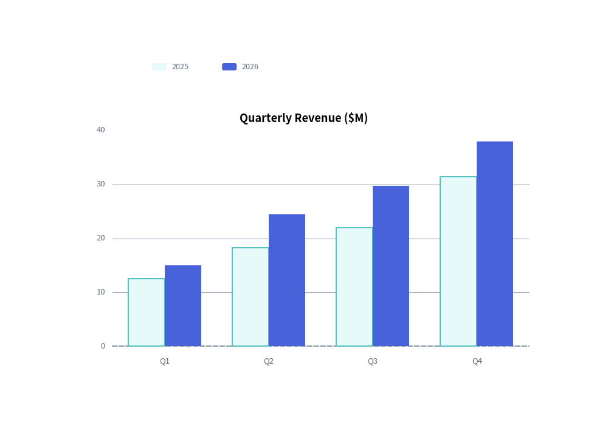
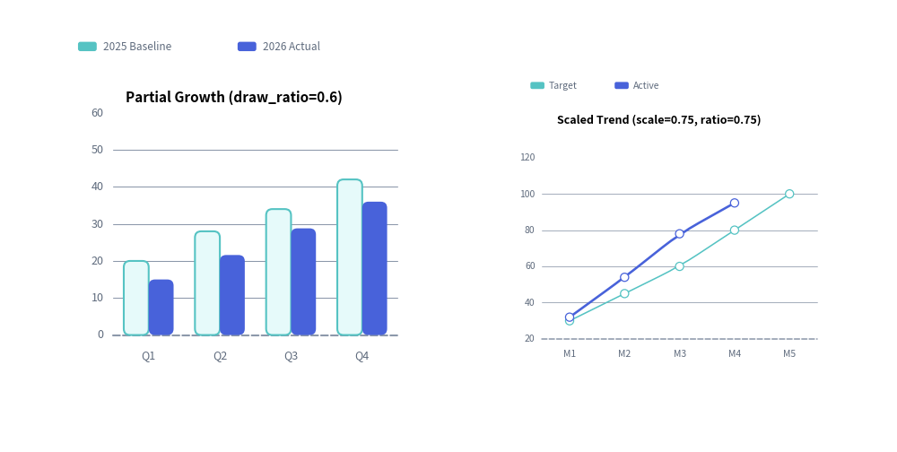

# Charts Overview

The `drawlib.charts` module provides a declarative, pure-Python data visualization engine for comparative, statistical, relational, and project schedule charts.

---

## 1. Why Pure-Python Charts in Drawlib?

Unlike traditional Python visualization libraries (such as Matplotlib, Seaborn, or Plotly) that generate isolated image files or web-only canvases, Drawlib charts are **first-class vector canvas elements**:

- **Seamless Canvas Coexistence**: Charts can share the same canvas with architecture schemas, callout bubbles, and icons.
- **Deterministic Layouts**: All margins, tick spaces, and plot boxes are mathematically computed from explicit canvas dimensions (`width`, `height`).
- **Consistent Visual Theming & Style Presence**: Charts follow the "style-as-presence" philosophy. If an element has a style, it is drawn; if omitted (`None`), no fallback element or unwanted default grid/background is rendered. Legends are decoupled and rendered explicitly via `chart.draw_legend(...)`.


<figure class="drawlib-image" style="text-align: center;">
  
  <figcaption class="drawlib-caption">Declarative Multi-Series Bar Chart</figcaption>
</figure>


---

## 2. The Seven Chart Families

Drawlib organizes charts into seven specialized submodules under `drawlib.charts`:

| Module | Primary Class | Best Suited For |
| :--- | :--- | :--- |
| `drawlib.charts.bar` | **`BarChart`** | Categorical comparisons (vertical, horizontal, grouped, stacked). |
| `drawlib.charts.line` | **`LineChart`** | Continuous metrics and trends over time (linear or spline smoothed). |
| `drawlib.charts.area` | **`AreaChart`** | Cumulative volume and part-to-whole trends over time. |
| `drawlib.charts.pie` | **`PieChart`** | Proportional distributions, donut charts, and center KPI badges. |
| `drawlib.charts.radar` | **`RadarChart`** | Multi-attribute evaluation, skill matrices, and spiderweb plots. |
| `drawlib.charts.scatter` | **`ScatterChart`** | 2D correlations, cluster distributions, and 3D bubble plots. |
| `drawlib.charts.gantt` | **`GanttChart`** | Project roadmaps, phase tasks, milestones, and dependency arrows. |

---

## 3. Universal Chart Architecture

Every chart in Drawlib follows a consistent lifecycle and coordinate contract:

### 1. Dimension Instantiation & Mandatory Anchor
Specify category labels and a mandatory `axis_line_style` (the structural anchor) during initialization:
```python
chart = BarChart(
    categories=["US", "EU", "APAC"],
    axis_line_style=Styles.Primary,
    axis_text_style=Styles.Black,
    grid_style=Styles.MutedThin,
    width=90,
    height=50,
    title="Regional Distribution",
    title_style=Styles.BlackBold,
)
```

### 2. Adding Data Series
Add data series directly with explicit styles:
```python
chart.add_series("Allocated", [120, 180, 240], style=Styles.PrimaryFlat)
chart.add_series("Available", [90, 150, 210], style=Styles.SecondaryFlat)
```

### 3. Rendering via Bottom-Left Anchor & Decoupled Legend
All charts are anchored by their **bottom-left corner** via `draw(xy=(x, y))`. Legends are rendered independently wherever desired via `draw_legend(xy=(x, y), text_style=...)`:
```python
chart.draw(xy=(15, 10))
chart.draw_legend(xy=(85, 50), text_style=Styles.Black)
```

---

## 4. Component Lifecycle, Partial Rendering & Spatial Scaling

All Drawlib charts follow the unified 4-phase component lifecycle (**1. Instantiate -> 2. Register Elements -> 3. Mutate State -> 4. Render**), making it effortless to create step-by-step slide builds, progressive data reveals, and multi-chart dashboards:

### 1. Element Visibility (`show`) & Stable Axis Bounds
Every element registration method (`add_series`, `add_slice`, `add`, `add_task`, `add_section`, `add_milestone`, `add_marker`, `add_dependency`) accepts `show: bool = True` and returns the mutable element instance (`Series`, `Slice`, `Point`, `Task`, etc.).
- Toggling `elem.show = False` (or `draw_ratio = 0.0`) hides that element during rendering while **preserving the full 100% dataset's automatic axis scale, pie total proportion, and Gantt row layout**. Axes never jump when series are revealed sequentially across slides or animation frames.

### 2. Partial Spatial Rendering (`draw_ratio` & `draw_direction`)
`Series`, `Slice`, and `Task` objects support `draw_ratio: float = 1.0` (`0.0` to `1.0`) and `draw_direction: DrawDirection` (`"bottom_to_top"` or `"left_to_right"`):

| Chart Class | Default `draw_direction` | `"bottom_to_top"` Behavior | `"left_to_right"` Behavior |
| :--- | :--- | :--- | :--- |
| **`BarChart`** | `"bottom_to_top"` | All bars grow simultaneously from the baseline toward target value. | Bars reveal sequentially category-by-category from left to right. |
| **`LineChart`** | `"left_to_right"` | All vertices rise simultaneously from the baseline toward target `y`. | Curve extends continuously from left to right along arc length. |
| **`AreaChart`** | `"left_to_right"` | Area polygon and top contour rise from the baseline / lower stack. | Area polygon and top contour sweep continuously from left to right. |
| **`ScatterChart`** | `"left_to_right"` | Points rise from the bottom axis toward target `y` (`radius * r`). | Points reveal left-to-right across the X-axis range. |
| **`PieChart`** | `"left_to_right"` | Wedge grows radially outward from inner hole to outer radius. | Wedge sweeps angularly from `start_angle` across `sweep_angle * r`. |
| **`RadarChart`** | `"bottom_to_top"` | Polygon expands radially outward from center `min_value`. | Polygon sweeps spoke-by-spoke around the perimeter. |
| **`GanttChart`** | `"left_to_right"` | Task bar grows vertically from its bottom edge to full height. | Task bar extends horizontally from `start` toward `end`. |

### 3. Spatial Overrides & Proportional Scaling (`scale`)
Every `draw()` call accepts optional temporary layout overrides (`width`, `height`, and `radius` on `PieChart`/`RadarChart`) as well as `scale: float = 1.0` (also supported on `draw_legend()`). Passing `scale != 1.0` scales the entire chart—including plot geometry, stroke widths, point markers, and font sizes—proportionally from `xy`:


<figure class="drawlib-image" style="text-align: center;">
  
  <figcaption class="drawlib-caption">Partial Spatial Rendering (draw_ratio) and Proportional Scaling (scale)</figcaption>
</figure>


