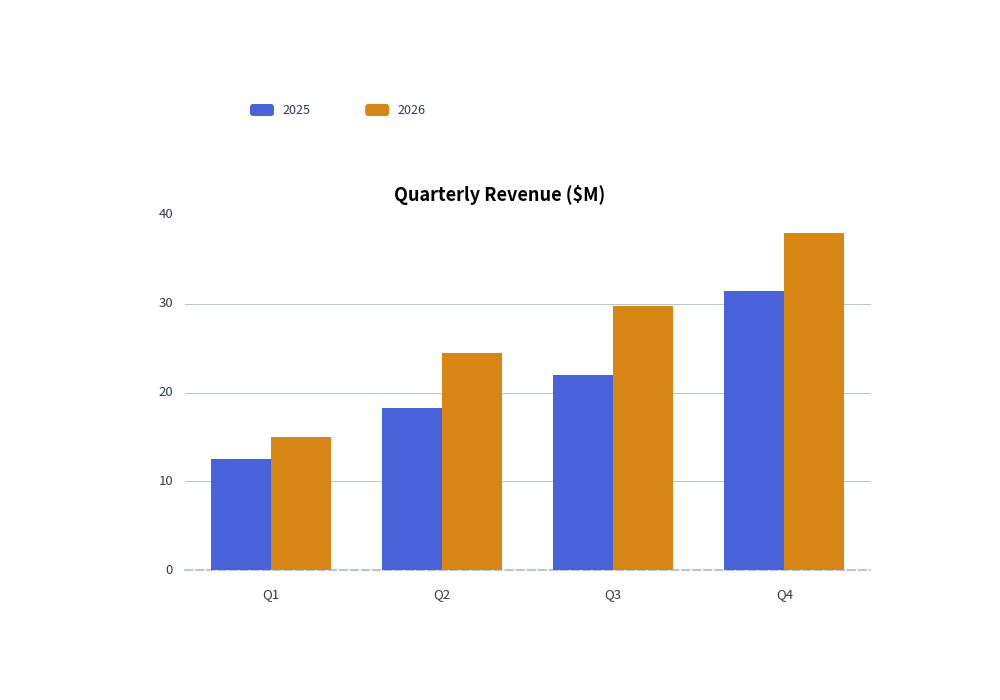

# Charts Overview

The `drawlib.charts` module provides a declarative, pure-Python data visualization engine for comparative, statistical, relational, and project schedule charts.

---

## 1. Why Pure-Python Charts in Drawlib?

Unlike traditional Python visualization libraries (such as Matplotlib, Seaborn, or Plotly) that generate isolated image files or web-only canvases, Drawlib charts are **first-class vector canvas elements**:

- **Seamless Canvas Coexistence**: Charts can share the same canvas with architecture schemas, callout bubbles, and icons.
- **Deterministic Layouts**: All margins, tick spaces, and legend boxes are mathematically computed from explicit canvas dimensions (`width`, `height`).
- **Consistent Visual Theming**: Chart elements—bars, areas, gridlines, axes, labels, and legends—automatically adapt to Drawlib's active styling presets (`Styles.PrimaryFlat`, `Styles.AccentFlat`, etc.).


<figure class="drawlib-image" style="text-align: center;">
  
  <figcaption class="drawlib-caption">Declarative Multi-Series Bar Chart</figcaption>
</figure>


---

## 2. The Seven Chart Families

Drawlib organizes charts into seven specialized submodules under `drawlib.charts`:

| Module | Primary Class | Best Suited For |
| :--- | :--- | :--- |
| `drawlib.charts.bar` | **`BarChart`** | Categorical comparisons (vertical, horizontal, grouped, stacked). |
| `drawlib.charts.line` | **`LineChart`** | Continuous metrics and trends over time (linear or spline smoothed). |
| `drawlib.charts.area` | **`AreaChart`** | Cumulative volume and part-to-whole trends over time. |
| `drawlib.charts.pie` | **`PieChart`** | Proportional distributions, donut charts, and center KPI badges. |
| `drawlib.charts.radar` | **`RadarChart`** | Multi-attribute evaluation, skill matrices, and spiderweb plots. |
| `drawlib.charts.scatter` | **`ScatterChart`** | 2D correlations, cluster distributions, and 3D bubble plots. |
| `drawlib.charts.gantt` | **`GanttChart`** | Project roadmaps, phase tasks, milestones, and dependency arrows. |

---

## 3. Universal Chart Architecture

Every chart in Drawlib follows a consistent lifecycle and coordinate contract:

### 1. Dimension Instantiation
Specify virtual canvas dimensions (`width`, `height`) during initialization:
```python
chart = BarChart(width=90, height=50, categories=[...], title="Performance Metrics")
```

### 2. Adding Data Series
Add data series directly with explicit styles:
```python
chart.add_series("US Region", [120, 180, 240], style=Styles.PrimaryFlat)
chart.add_series("EU Region", [90, 150, 210], style=Styles.SecondaryFlat)
```

### 3. Rendering via Bottom-Left Anchor
All charts are anchored by their **bottom-left corner** via `draw(xy=(x, y))`:
```python
chart.draw(xy=(15, 10))
```
