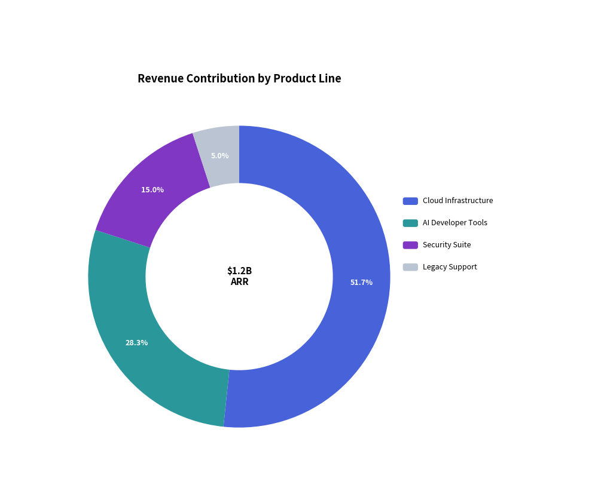
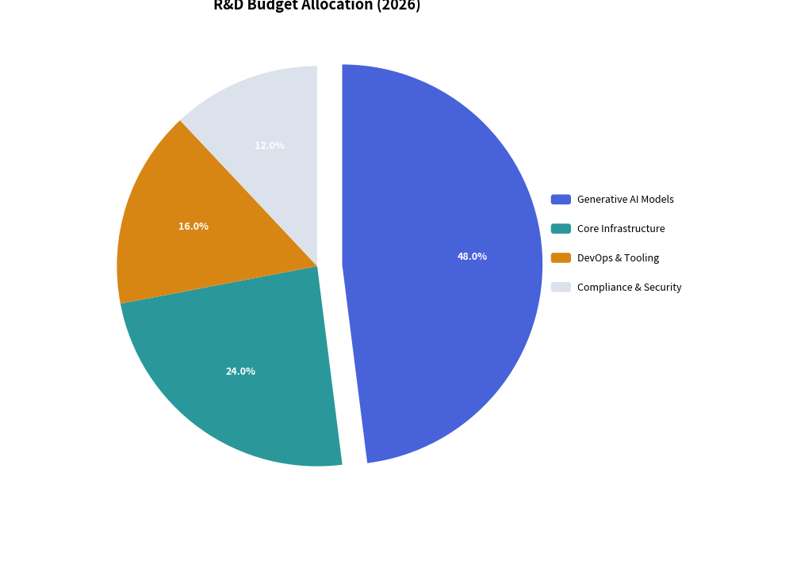

# PieChart: Proportional Compositions & Donut Badges

`PieChart` visualizes proportional compositions where slices represent parts of a whole ($100\%$). It supports classic solid pie charts, modern donut rings with center KPI badges, outward slice explosion, and decoupled legend rendering.

---

## 1. Overview & Topologies

```text
        Standard Pie Chart                          Donut Chart with Center KPI
            12 o'clock                                      12 o'clock
                ▲                                               ▲
            . - ~ - .                                       . - ~ - .
        . '    |    ' .                             . '    |    ' .
      /        |  45%   \                         /    ┌───────┐    \
     |  35%    |         |                       |     │ $1.2B │     |
     |         |   20%   |                       |     │  ARR  │     |
      \        |        /                         \    └───────┘    /
        . '    |    ' .                             . '    |    ' .
            ' - ~ - '                                       ' - ~ - '
```

- **Solid Pie (`hole_ratio=0.0`)**: Traditional full sector representation.
- **Donut Chart (`hole_ratio=0.5` to `0.7`)**: Modern ring layout that provides central canvas real estate for large numeric key indicators (`center_text`).
- **Exploded Slices (`explode > 0.0`)**: Displaces a specific wedge radially outwards from the center for visual emphasis.
- **Decoupled Legend**: Render slice legends anywhere on the canvas via `chart.draw_legend(...)`.

---

## 2. Constructor & Configuration

```python
from drawlib.charts.pie import PieChart
from drawlib.styles import Styles

chart = PieChart(
    radius=26.0,                # Outer radius in canvas coordinate units
    hole_ratio=0.62,            # Inner hole ratio (0.0 for pie, 0.6+ for donut)
    center_text="$1.2B\nARR",   # Center badge text (supports multiline)
    center_text_style=Styles.BlackBold.patch(text_size=11.0),
    title="Revenue by Product", # Top title text
    title_style=Styles.BlackBold.patch(text_size=13.0),
    start_angle=90.0,           # Starting angle in degrees (90.0 = 12 o'clock)
    clockwise=True,             # Clockwise slice progression
    value_text_style=Styles.WhiteBold.patch(text_size=9.0),  # Percentage labels on slices
    value_format="{:.1f}%",     # Formatter for percentage badges
)

# Register slices with optional visibility, partial rendering, and angular/radial direction
s1 = chart.add_slice(
    "Cloud Infrastructure",
    620.0,
    style=Styles.PrimaryFlat,
    explode=0.0,
    show=True,
    draw_ratio=1.0,
    draw_direction="left_to_right",  # "left_to_right" (angular sweep) or "bottom_to_top" (radial growth)
)

# Render chart and legend with optional radius/size overrides and uniform scaling
chart.draw(xy=(10.0, 8.0), width=None, height=None, radius=None, scale=1.0)
chart.draw_legend(xy=(64.0, 48.0), text_style=Styles.Black, scale=1.0)
```

---

## 3. Donut Chart with Center KPI Badge

Donut charts are the preferred choice for enterprise dashboards and executive presentations.


<figure class="drawlib-image" style="text-align: center;">
  
  <figcaption class="drawlib-caption">Revenue Contribution Donut Chart</figcaption>
</figure>


---

## 4. Exploded Slice Allocation

Setting `explode > 0.0` radially displaces a slice away from the center origin, drawing immediate focus to that wedge:


<figure class="drawlib-image" style="text-align: center;">
  
  <figcaption class="drawlib-caption">Budget Allocation with Exploded Slice</figcaption>
</figure>


