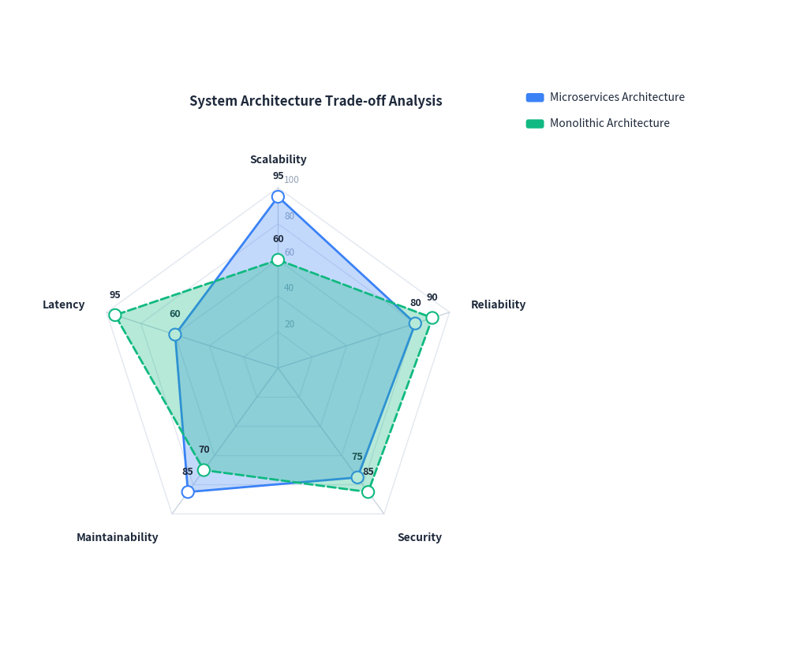
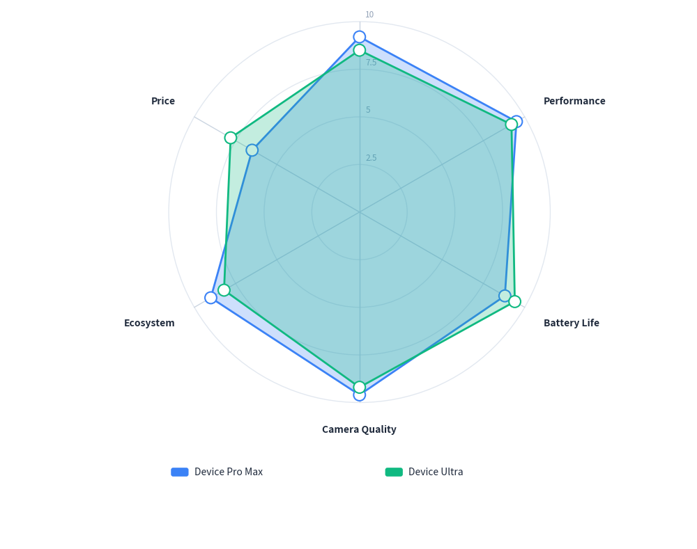

# RadarChart: Multivariate Radial Metrics & Spider Webs

`RadarChart` (also known as a spider web or star chart) evaluates multivariate entities across three or more symmetric radial dimensions emanating from a common center origin point. It is widely used for skill matrices, competitive benchmark profiles, and system architectural trade-off evaluations.

---

## 1. Overview & Radial Geometry

```text
                     Dimension 1 (Top spoke, 90°)
                         ▲
                        ╱ ╲
                       ╱ ● ╲ Series Alpha
                      ╱ ╱ ╲ ╲
        Dimension 5  ●─┼───┼─●  Dimension 2
                     │ │ * │ │
                     │ └───┘ │
                      ╲     ╱
                       ╲   ╱
                        ╲ ╱
                         ▼
                    Dimension 3
```

- **Symmetric Spoke Rays**: Each category forms a radial ray extending from `min_value` at the center to `max_value` at the outer perimeter.
- **Concentric Grid Contours**: Configured with `grid_shape="polygon"` (faceted polygon rings matching the vertex count) or `grid_shape="circle"` (smooth circular concentric rings).
- **Semi-transparent Series Volumes**: Multiple series overlay each other using semi-transparent polygon fills (`fill_alpha=0.2` to `0.4`) and distinct contour line styles (`solid`, `dashed`).

---

## 2. Constructor & Configuration

```python
from drawlib.charts.radar import RadarChart

chart = RadarChart(
    categories=["Scalability", "Reliability", "Security", "Maintainability", "Latency"],
    radius=24.0,                # Outer boundary spoke radius
    min_value=0.0,              # Value at center origin
    max_value=100.0,            # Scale value at outer ring (None = auto)
    levels=5,                   # Number of concentric grid contours
    grid_shape="polygon",       # "polygon" or "circle"
    title="System Architecture Trade-offs",
    legend_position="right",    # "right", "bottom", "top", "none"
    show_values=True,           # Display numeric values near vertices
    value_format="{:.0f}",
)
```

### Parameter Reference

| Parameter | Type | Default | Description |
|---|---|---|---|
| `categories` | `list[str]` | Required | Names of radial dimensions (minimum 3 required). |
| `radius` | `float` | `25.0` | Radius of the outer boundary spoke circle. |
| `min_value` | `float` | `0.0` | Data value at the central origin point. |
| `max_value` | `float \| None` | `None` | Scale value at outer ring. If `None`, computed automatically. |
| `levels` | `int` | `5` | Number of concentric grid contours. |
| `grid_shape` | `"polygon"` \| `"circle"` | `"polygon"` | Shape of concentric gridlines (regular polygon or circles). |
| `show_grid_labels` | `bool` | `True` | Whether to print numeric scale ticks along reference spoke. |
| `grid_label_format` | `FormatterType` | `None` | Formatter string or function for scale levels. |
| `legend_position` | `LegendPosition` | `"right"` | Position of the legend box. |
| `show_values` | `bool` | `False` | Whether to print numeric data values next to series vertices. |
| `value_format` | `FormatterType` | `None` | Formatter for vertex values. |

---

## 3. Polygonal Grid Architecture Benchmark

Polygonal gridlines align precisely with spokes, making it easy to gauge relative metric ratings:


<figure class="drawlib-image" style="text-align: center;">
  
  <figcaption class="drawlib-caption">System Architecture Non-Functional Analysis</figcaption>
</figure>


---

## 4. Circular Grid Product Benchmark

Using `grid_shape="circle"` renders smooth concentric circles, ideal for scoring matrices and consumer benchmark comparisons:


<figure class="drawlib-image" style="text-align: center;">
  
  <figcaption class="drawlib-caption">Device Feature Matrix with Circular Contours</figcaption>
</figure>


---

## 5. Best Practices & Guidelines

1. **Category Limit**: For best legibility, use between 4 and 8 dimensions. More than 8 categories makes spoke labels crowded.
2. **Normalized Dimensions**: Ensure all radial metrics share a similar range (e.g. 0 to 10 or 0% to 100%). Mixing incompatible units (e.g., latency in ms with availability in %) can mislead readers without normalization.
3. **Alpha Blending**: Keep `fill_alpha` around `0.2` to `0.35` so overlapping series do not obscure inner boundaries.
