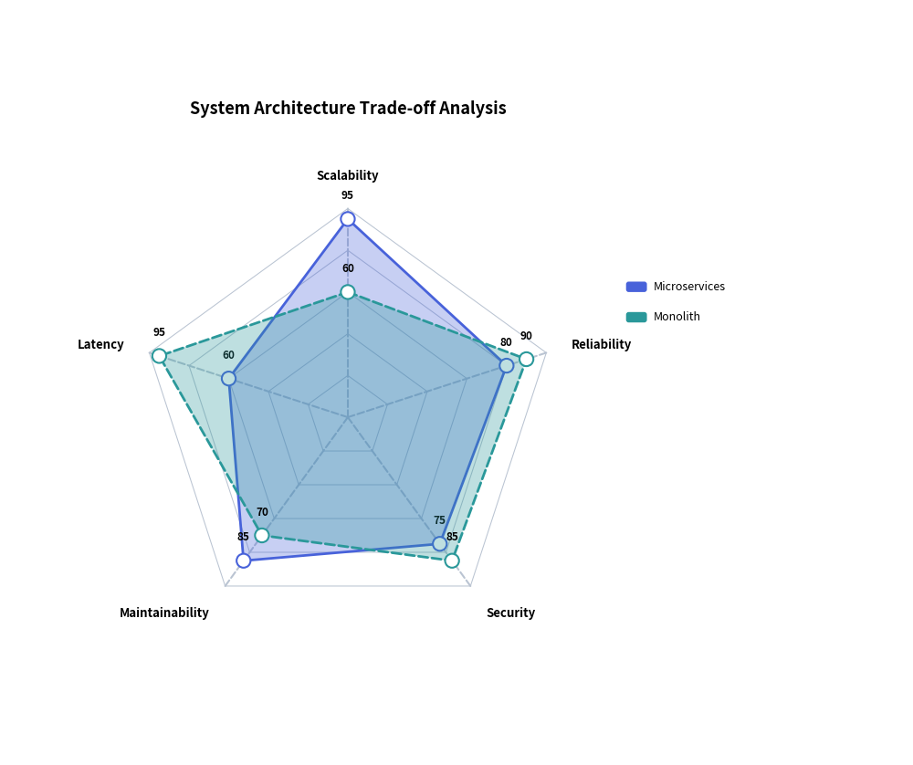
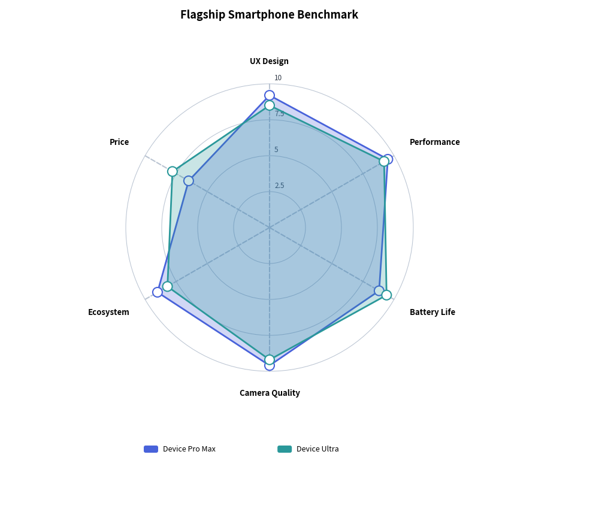

# RadarChart: Multivariate Radial Metrics & Spider Webs

`RadarChart` (also known as a spider web or star chart) evaluates multivariate entities across three or more symmetric radial dimensions emanating from a common center origin point. It is widely used for skill matrices, competitive benchmark profiles, and system architectural trade-off evaluations.

---

## 1. Overview & Radial Geometry

```text
                     Dimension 1 (Top spoke, 90°)
                         ▲
                        ╱ ╲
                       ╱ ● ╲ Series Alpha
                      ╱ ╱ ╲ ╲
        Dimension 5  ●─┼───┼─●  Dimension 2
                     │ │ * │ │
                     │ └───┘ │
                      ╲     ╱
                       ╲   ╱
                        ╲ ╱
                         ▼
                    Dimension 3
```

- **Symmetric Spoke Rays**: Each category forms a radial ray extending from `min_value` at the center to `max_value` at the outer perimeter (anchored by `axis_line_style`).
- **Concentric Grid Contours**: Rendered if `grid_style` is provided, configured with `grid_shape="polygon"` or `grid_shape="circle"`.
- **Semi-transparent Series Volumes**: Multiple series overlay each other using semi-transparent polygon fills (`fill_alpha=0.2` to `0.4`) and distinct contour line styles (`solid`, `dashed`).
- **Decoupled Legend**: Render series legends anywhere on the canvas via `draw_legend(...)`.

---

## 2. Constructor & Configuration

```python
from drawlib.charts.radar import RadarChart
from drawlib.styles import Styles

chart = RadarChart(
    categories=["Scalability", "Reliability", "Security", "Maintainability", "Latency"],
    axis_line_style=Styles.MutedDashed,
    axis_text_style=Styles.BlackBold.patch(text_size=9.5),
    grid_style=Styles.MutedThin,
    scale_text_style=Styles.Muted.patch(text_size=8.5),
    value_text_style=Styles.BlackBold.patch(text_size=8.5),
    radius=24.0,                # Outer boundary spoke radius
    min_value=0.0,              # Value at center origin
    max_value=100.0,            # Scale value at outer ring (None = auto)
    levels=5,                   # Number of concentric grid contours
    grid_shape="polygon",       # "polygon" or "circle"
    title="System Architecture Trade-offs",
    title_style=Styles.BlackBold.patch(text_size=13.0),
    value_format="{:.0f}",
)
```

---

## 3. Polygonal Grid Architecture Benchmark

Polygonal gridlines align precisely with spokes, making it easy to gauge relative metric ratings:


<figure class="drawlib-image" style="text-align: center;">
  
  <figcaption class="drawlib-caption">System Architecture Non-Functional Analysis</figcaption>
</figure>


---

## 4. Circular Grid Product Benchmark

Using `grid_shape="circle"` renders smooth concentric circles, ideal for scoring matrices and consumer benchmark comparisons:


<figure class="drawlib-image" style="text-align: center;">
  
  <figcaption class="drawlib-caption">Device Feature Matrix with Circular Contours</figcaption>
</figure>


