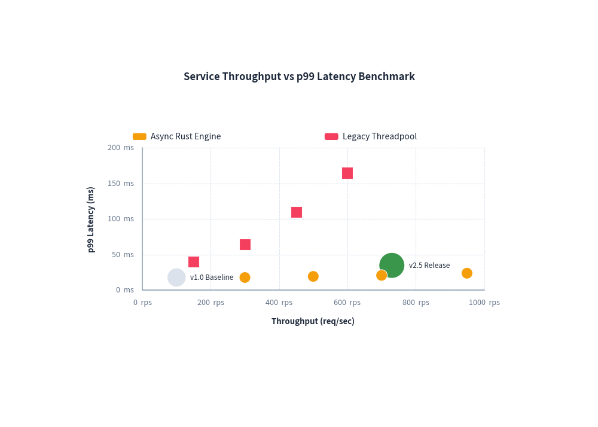
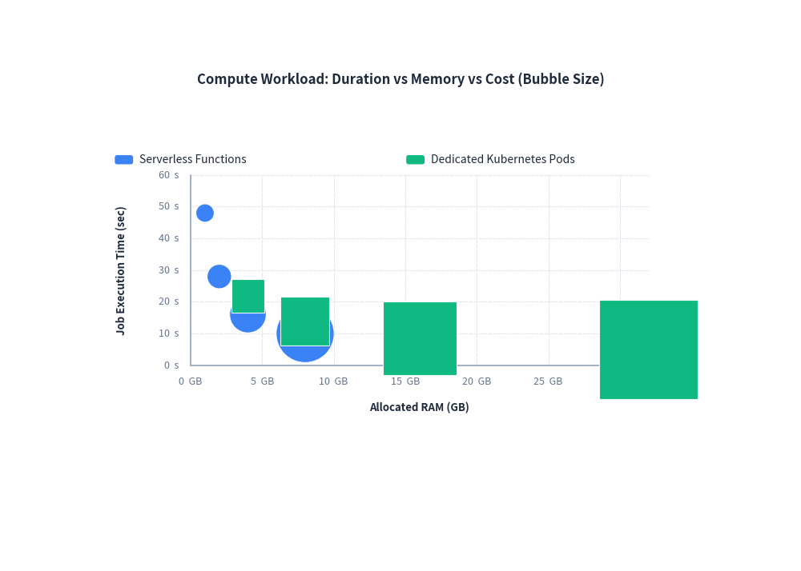

# ScatterChart: Dual-Axis Plots & Multidimensional Bubble Charts

`ScatterChart` plots continuous numerical data across dual Cartesian axes ($X$ and $Y$). It is ideal for identifying statistical correlations, clustering patterns, latency vs. throughput trade-offs, and 3D bubble analysis (where marker radius encodes a third numerical variable).

---

## 1. Overview & Topologies

```text
    Latency (ms) ▲
             100 │           ● Legacy (High Latency)
              80 │
              60 │                ▲ Competitor
              40 │        ●
              20 │    ● Optimized v2.0
               0 └────────────────────────────► Throughput (req/s)
                 0    200   400   600   800
```

- **Dual Continuous Axes**: Unlike categorical charts where the X-axis represents discrete bins, `ScatterChart` computes independent numerical scales for both axes using linear or logarithmic scaling.
- **Annotated Individual Points**: Use `chart.add()` to place highlighted reference points with dedicated text callouts (e.g., benchmark baselines or SLA targets).
- **Multidimensional Bubble Plots**: Passing 3-tuples `(x, y, radius)` to `add_series()` scales point sizes dynamically to communicate a third dimension (such as cost, memory footprint, or cluster size).

---

## 2. Constructor & Configuration

```python
from drawlib.charts.scatter import ScatterChart

chart = ScatterChart(
    width=85.0,                 # Total chart bounding width
    height=52.0,                # Total chart bounding height
    title="Service Throughput vs Latency",
    default_radius=1.0,         # Default radius for points
    default_shape="circle",     # "circle", "square", "rhombus", "triangle"
    legend_position="auto",     # "top", "bottom", "right", "none", "auto"
    show_labels=True,           # Display text annotation labels
)
```

### Parameter Reference

| Parameter | Type | Default | Description |
|---|---|---|---|
| `width` / `height` | `float` | `88.0` / `55.0` | Overall container dimensions in canvas units. |
| `title` | `str` | `""` | Chart title displayed at the top. |
| `default_radius` | `float` | `1.0` | Default radius for point markers when unspecified. |
| `default_shape` | `PointShape` | `"circle"` | Marker shape (`"circle"`, `"square"`, `"rhombus"`, `"triangle"`). |
| `legend_position` | `LegendPosition` | `"auto"` | Location of series legend box. |
| `show_labels` | `bool` | `True` | Whether to display text annotation labels next to points. |

---

## 3. Benchmark Scatter Plot with Baseline Callouts

Combining series with individually annotated baseline points makes system performance reports immediately actionable:


<figure class="drawlib-image" style="text-align: center;">
  
  <figcaption class="drawlib-caption">Throughput vs p99 Latency Benchmark</figcaption>
</figure>


---

## 4. Multidimensional Cloud Cost Bubble Chart

By providing 3-tuples `(x, y, radius)` in series data, the radius reflects a 3rd numerical dimension:


<figure class="drawlib-image" style="text-align: center;">
  
  <figcaption class="drawlib-caption">Compute Workload Multidimensional Bubble Plot</figcaption>
</figure>


---

## 5. Best Practices & Guidelines

1. **Explicit Axis Bounds**: Specifying `min_value` and `max_value` on both axes ensures consistent coordinate framing across comparative diagrams.
2. **Bubble Scaling**: Keep marker radii between `1.0` and `6.0` canvas coordinate units to prevent bubbles from occluding neighbouring points.
3. **Logarithmic Scaling**: If throughput or latency spans multiple orders of magnitude, set `scale="log"` on the respective axis via `chart.configure_x_axis(scale="log")`.
