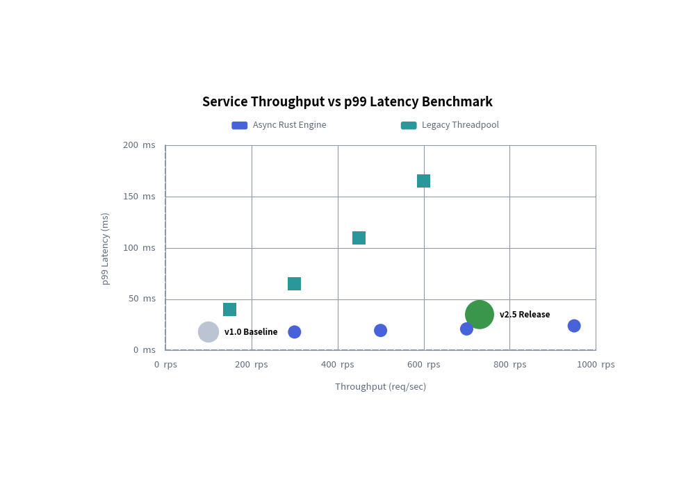
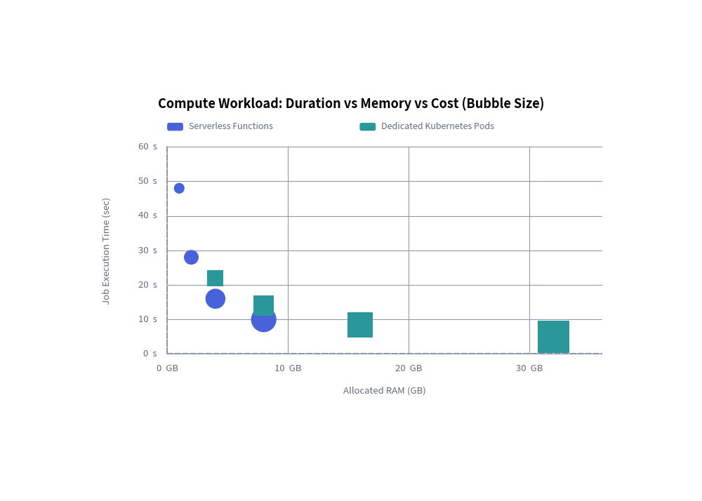

# ScatterChart: Dual-Axis Plots & Multidimensional Bubble Charts

`ScatterChart` plots continuous numerical data across dual Cartesian axes ($X$ and $Y$). It is ideal for identifying statistical correlations, clustering patterns, latency vs. throughput trade-offs, and 3D bubble analysis (where marker radius encodes a third numerical variable).

---

## 1. Overview & Topologies

```text
    Latency (ms) ▲
             100 │           ● Legacy (High Latency)
              80 │
              60 │                ▲ Competitor
              40 │        ●
              20 │    ● Optimized v2.0
               0 └────────────────────────────► Throughput (req/s)
                 0    200   400   600   800
```

- **Dual Continuous Axes**: Unlike categorical charts where the X-axis represents discrete bins, `ScatterChart` computes independent numerical scales for both axes using linear or logarithmic scaling.
- **Annotated Individual Points**: Use `chart.add()` to place highlighted reference points with dedicated text callouts.
- **Multidimensional Bubble Plots**: Passing 3-tuples `(x, y, radius)` to `add_series()` scales point sizes dynamically to communicate a third dimension.
- **Decoupled Legend**: Render series legends anywhere on the canvas via `draw_legend(...)`.

---

## 2. Constructor & Configuration

```python
from drawlib.charts.scatter import ScatterChart
from drawlib.styles import Styles

chart = ScatterChart(
    axis_line_style=Styles.MutedDashed,
    axis_text_style=Styles.Muted.patch(text_size=9.5),
    grid_style=Styles.MutedThin,
    width=85.0,                 # Total chart bounding width
    height=52.0,                # Total chart bounding height
    title="Service Throughput vs Latency",
    title_style=Styles.BlackBold.patch(text_size=13.0),
    default_radius=1.0,         # Default radius for points
    default_shape="circle",     # "circle", "square", "rhombus", "triangle"
)
```

---

## 3. Benchmark Scatter Plot with Baseline Callouts

Combining series with individually annotated baseline points makes system performance reports immediately actionable:


<figure class="drawlib-image" style="text-align: center;">
  
  <figcaption class="drawlib-caption">Throughput vs p99 Latency Benchmark</figcaption>
</figure>


---

## 4. Multidimensional Cloud Cost Bubble Chart

By providing 3-tuples `(x, y, radius)` in series data, the radius reflects a 3rd numerical dimension:


<figure class="drawlib-image" style="text-align: center;">
  
  <figcaption class="drawlib-caption">Compute Workload Multidimensional Bubble Plot</figcaption>
</figure>


