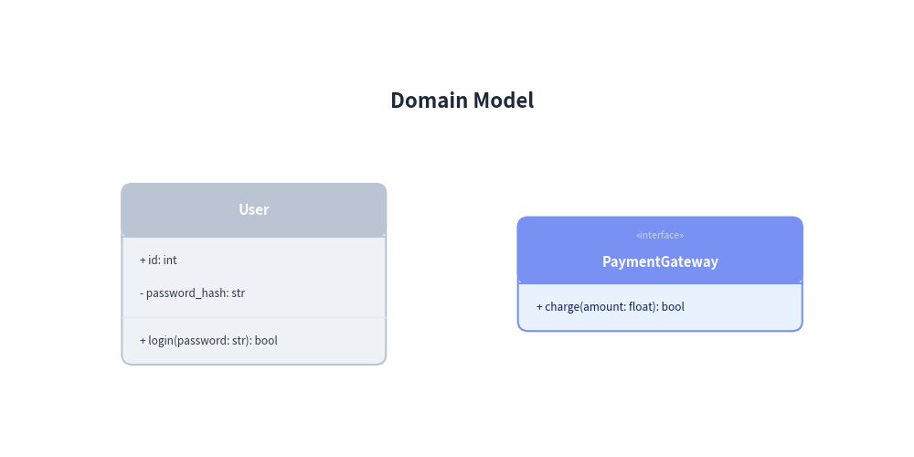
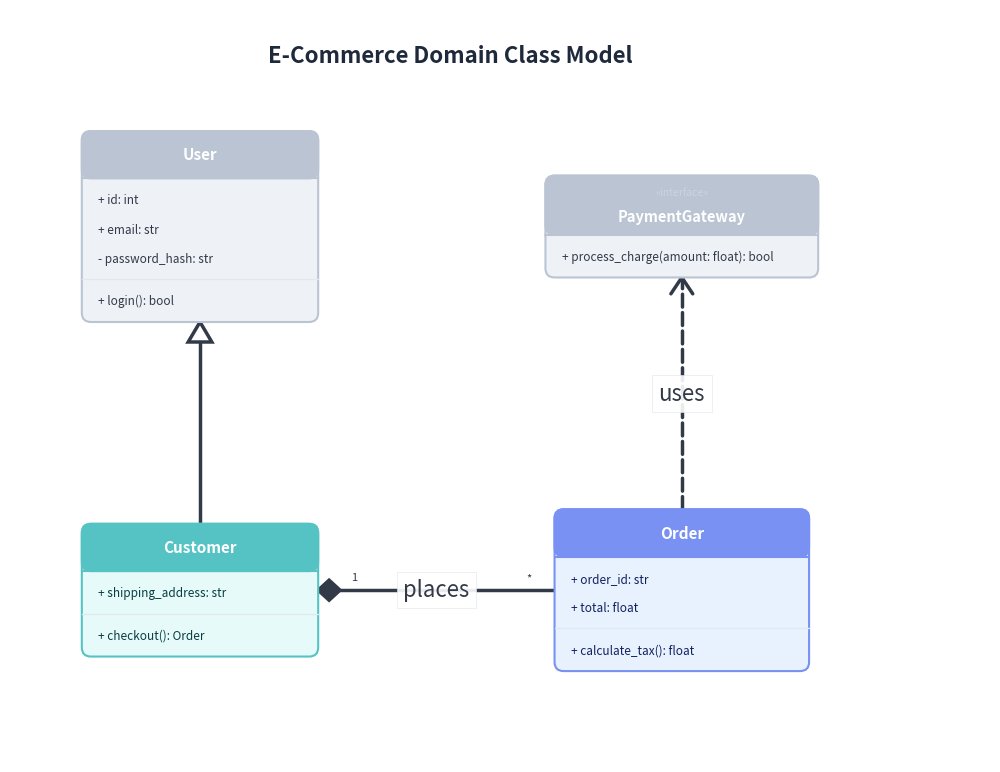
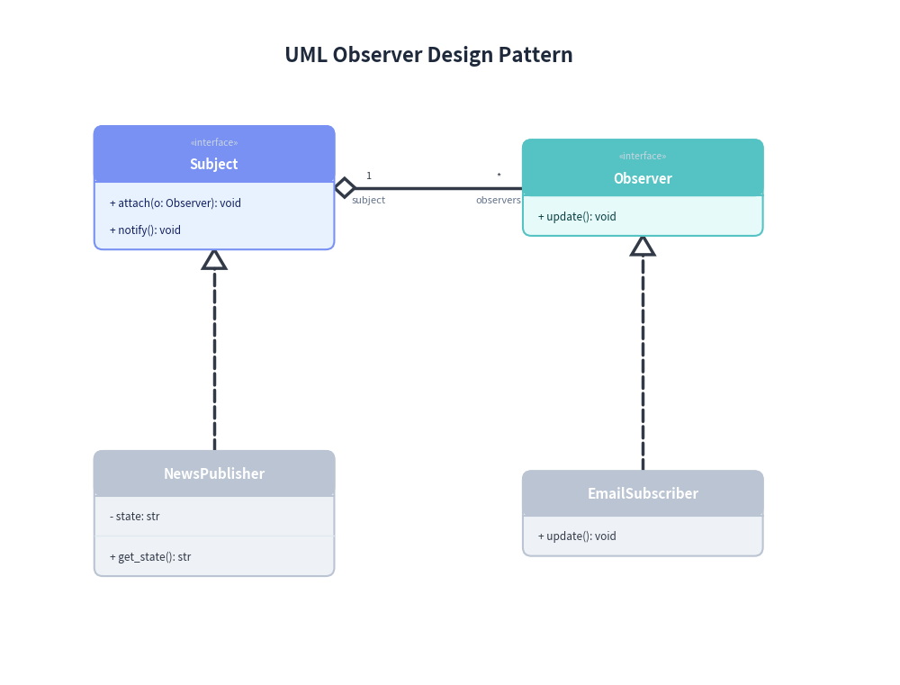

# ClassDiagram: UML 2.0 Class Hierarchies & Relationships

`ClassDiagram` implements standard UML 2.0 Object-Oriented structural modeling. It features three-compartment class cards (class name, attributes, methods), stereotypes, abstract classes, and all 6 standard UML relationships via intuitive verb methods.

---

## 1. Overview & Three-Compartment Cards

```text
   ┌──────────────────────────┐
   │       «interface»        │
   │      PaymentService      │
   ├──────────────────────────┤
   │ + pay(amount): bool      │
   └─────────────▲────────────┘
                 ┆ (Realization: .realize())
   ┌─────────────┴────────────┐            1            * ┌──────────────────────────┐
   │      StripeService       │◆─────────────────────────►│        Transaction       │
   ├──────────────────────────┤   (Composition:           ├──────────────────────────┤
   │ - api_key: str           │    .composite())          │ - id: str                │
   ├──────────────────────────┤                           │ - amount: float          │
   │ + pay(amount): bool      │                           └──────────────────────────┘
   └──────────────────────────┘
```

- **Three Compartments**: Class cards automatically separate the class title/stereotype header, attribute declarations, and method signatures into distinct compartments with divider lines.
- **Access Modifiers**: Supports standard UML visibility prefixes: `+` (public), `-` (private), `#` (protected), `~` (package).
- **Dynamic Sizing**: The card height automatically expands to accommodate all attributes and methods.

---

## 2. Constructor & Class Definition


```python
from drawlib.canvas import save, setup
from drawlib.diagrams.class_diagram import ClassDiagram, ClassNode
from drawlib.styles import Styles

setup(width=90, height=45)

cd = ClassDiagram(
    node_style=Styles.Neutral,
    edge_style=Styles.DarkBold,
    edge_text_style=Styles.Dark,
    title="Domain Model",
)

# Class with attributes and methods
user = cd.add(ClassNode(name="User", width=26.0), xy=(25.0, 18.0))
user.add_attribute("id", type="int", is_public=True)
user.add_attribute("password_hash", type="str", is_public=False)
user.add_method("login", params="password: str", return_type="bool")

# Interface with stereotype
gateway = cd.add(ClassNode(name="PaymentGateway", stereotype="interface", width=28.0, style=Styles.PrimaryNeutral), xy=(65.0, 18.0))
gateway.add_method("charge", params="amount: float", return_type="bool")

cd.draw(xy=(0.0, 0.0))
save()
```

<figure class="drawlib-image" style="text-align: center;">
  
  <figcaption class="drawlib-caption">Basic Class and Interface Nodes</figcaption>
</figure>


---

## 3. The 6 UML Relationship Types

Relationships between classes are registered cleanly at the diagram level via `cd.connect(source, target, relationship_type=...)`:

| `relationship_type` | Relationship | Line Stroke | End Marker | Semantic Meaning |
|---|---|---|---|---|
| `"inheritance"` | **Inheritance** | Solid | Hollow Triangle (at target) | Superclass generalization |
| `"realization"` | **Realization** | Dashed | Hollow Triangle (at target) | Interface implementation |
| `"composition"` | **Composition** | Solid | Filled Diamond (at source) | Strong lifecycle ownership |
| `"aggregation"` | **Aggregation** | Solid | Hollow Diamond (at source) | Shared lifecycle / part-whole |
| `"association"` | **Association** | Solid | None (or Open Arrow) | Structural reference |
| `"dependency"` | **Dependency** | Dashed | Open Arrow (at target) | Uses-a dependency |

`cd.connect(...)` accepts `start_side`, `end_side`, `start_multiplicity` (`"1"`, `"0..1"`), `end_multiplicity` (`"*"`, `"1..*"`), `start_role`, `end_role`, and `label`.

---

## 4. E-Commerce Domain Model

The following example combines inheritance, composition, and interface dependency:


<figure class="drawlib-image" style="text-align: center;">
  
  <figcaption class="drawlib-caption">E-Commerce Domain Class Hierarchy</figcaption>
</figure>


---

## 5. Design Pattern Modeling: Observer Pattern

Class diagrams excel at illustrating software design patterns such as the Observer pattern:


<figure class="drawlib-image" style="text-align: center;">
  
  <figcaption class="drawlib-caption">UML Observer Design Pattern</figcaption>
</figure>


---

## 6. Best Practices & Guidelines

1. **Card Width Sizing**: Choose a consistent card width (`26.0` to `30.0` units) across horizontally aligned classes to maintain visual balance.
2. **Explicit Connection Sides**: Specifying `start_side` and `end_side` ensures orthogonal lines route cleanly around cards without cutting through text compartments.
