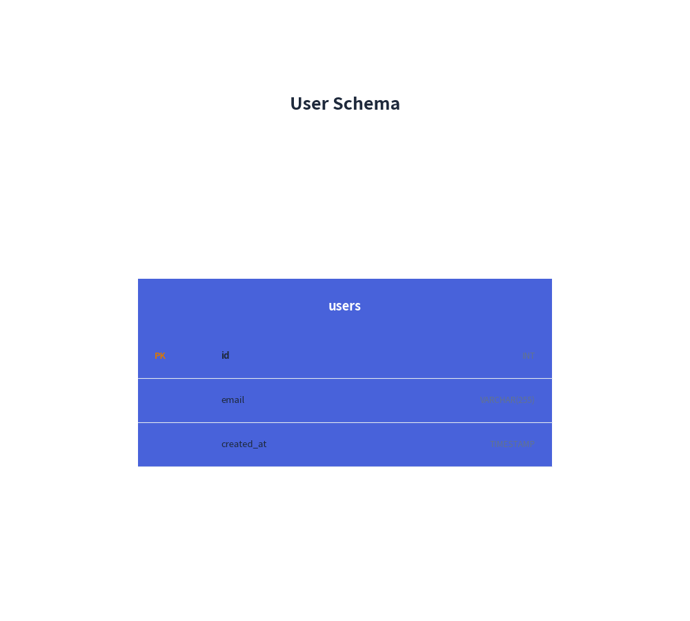
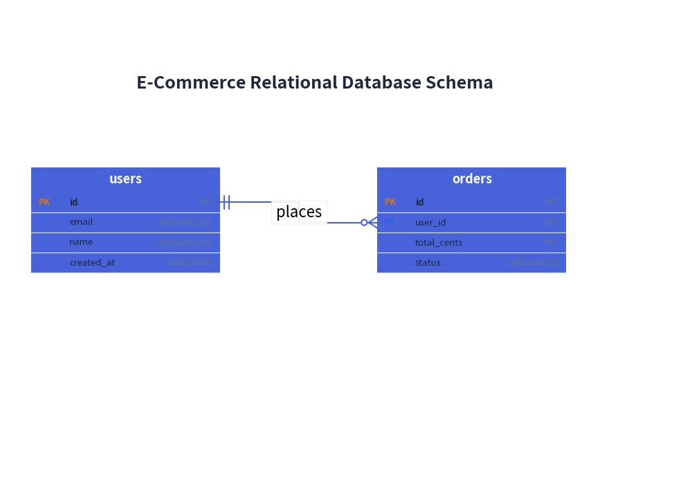

# ERDiagram: Relational Schemas & Crow's Foot Notations

`ERDiagram` visualizes relational database architectures adhering strictly to **Information Engineering (IE) / Crow's Foot notation**—the industry standard for physical database schema modeling.

---

## 1. Overview & Crow's Foot Notation

```text
     users                               orders
  ┌──────────────────────┐            ┌──────────────────────┐
  │ id          INT [PK] │──||────o<──│ id          INT [PK] │
  │ email   VARCHAR(255) │            │ user_id     INT [FK] │
  │ name    VARCHAR(100) │            │ total  DECIMAL(10,2) │
  └──────────────────────┘            └──────────────────────┘
```

- **Information Engineering (IE) Standard**: Uses standard Crow's Foot markers (`||` for exactly 1, `o<` for zero or more, `|<` for one or more, `o|` for zero or one).
- **Column-Level Anchoring**: Rather than connecting to arbitrary points on the table perimeter, Drawlib allows you to anchor lines directly to the specific primary key and foreign key table rows (`start_column="id"`, `end_column="user_id"`).
- **Key Badges**: Automatically renders `[PK]` and `[FK]` tags next to column definitions with syntax highlighting.

---

## 2. Constructor & Entity Definition


```python
from drawlib.canvas import save, setup
from drawlib.diagrams.er import ERDiagram, Entity
from drawlib.styles import Styles

setup(width=50, height=45)

er = ERDiagram(
    node_style=Styles.PrimaryFlat,
    edge_style=Styles.Primary,
    edge_text_style=Styles.Black,
    title="User Schema",
)

# Create entity table
users = er.add(Entity(name="users", width=30.0), xy=(25.0, 18.0))
users.add_column("id", type="INT", pk=True)
users.add_column("email", type="VARCHAR(255)", nullable=False)
users.add_column("created_at", type="TIMESTAMP")

er.draw(xy=(0.0, 0.0))
save()
```

<figure class="drawlib-image" style="text-align: center;">
  
  <figcaption class="drawlib-caption">Basic Entity Table</figcaption>
</figure>


### Parameter Reference

#### `Entity` Class
| Parameter | Type | Default | Description |
|---|---|---|---|
| `name` | `str` | Required | Table name displayed in entity header band. |
| `width` | `float` | `30.0` | Table bounding width in canvas units. |
| `height` | `float \| None` | `None` | Optional height override (calculated from rows if None). |
| `style` | `Style \| None` | `None` | Optional styling for table border and header. |

#### Column Properties (`add_column`)
| Parameter | Type | Default | Description |
|---|---|---|---|
| `name` | `str` | Required | Column field name. |
| `type` | `str` | `""` | Data type (e.g. `INT`, `VARCHAR(255)`). |
| `pk` | `bool` | `False` | When True, displays the `[PK]` badge. |
| `fk` | `bool` | `False` | When True, displays the `[FK]` badge. |
| `nullable` | `bool` | `True` | Whether field allows NULL values. |

---

## 3. Supported Cardinality Notations

| Cardinality String | Parent Marker | Child Marker | Standard Semantics |
|---|---|---|---|
| `"1:*"` | Exactly 1 (`||`) | Zero or more (`o<`) | One-to-Many (Default) |
| `"1:1"` | Exactly 1 (`||`) | Exactly 1 (`||`) | One-to-One |
| `"1:1..*"` | Exactly 1 (`||`) | One or more (`|<`) | Mandatory Child One-to-Many |
| `"1:0..1"` | Exactly 1 (`||`) | Zero or one (`o|`) | Optional Child One-to-One |
| `"0..1:1"` | Zero or one (`o|`) | Exactly 1 (`||`) | Optional Parent One-to-One |
| `"0..1:*"` | Zero or one (`o|`) | Zero or more (`o<`) | Optional Parent One-to-Many |
| `"*:*"` | Zero or more (`o<`) | Zero or more (`o<`) | Many-to-Many |

---

## 4. E-Commerce Relational Schema with Column Anchors

The following example anchors connections directly to the exact foreign and primary key rows:


<figure class="drawlib-image" style="text-align: center;">
  
  <figcaption class="drawlib-caption">E-Commerce Relational Database Schema</figcaption>
</figure>


---

## 5. Best Practices & Guidelines

1. **Always Use Column Anchoring**: Supplying `start_column` and `end_column` visually connects the specific foreign key attribute to its referenced primary key, making schemas intuitive and professional.
2. **Width Budgeting**: Tables with long data types (e.g., `VARCHAR(255)`) look best with a `width` of `28.0` to `34.0` canvas units.
3. **Cardinality Strings**: Always use explicit cardinality strings (`"1:*"`, `"1:1"`, etc.) rather than manual arrow heads.
