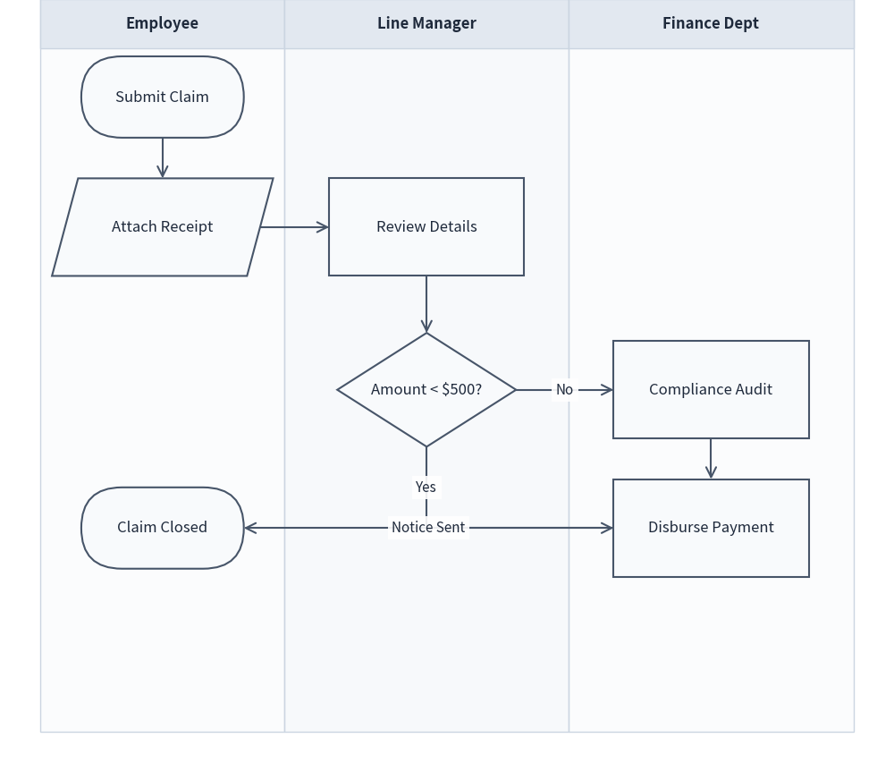
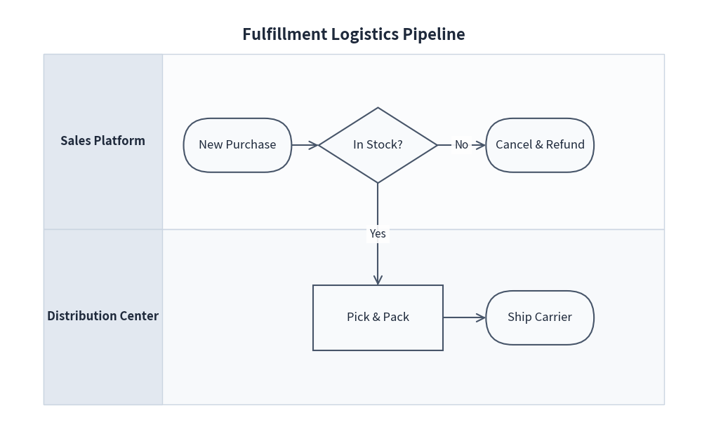

# FlowDiagram: ISO Flowcharts & Cross-Functional Swimlanes

`FlowDiagram` implements standard flowchart symbols according to ISO 5807 and JIS X 0121 standards, with native support for cross-functional swimlane layouts (vertical columns or horizontal rows) sharing a unified global coordinate plane.

---

## 1. Overview & Standard Symbols

```text
  Lane: Customer                Lane: Gateway              Lane: Warehouse
 ┌───────────────────────────┬───────────────────────────┬───────────────────────────┐
 │   (Start)                 │                           │                           │
 │      │                    │                           │                           │
 │      ▼                    │                           │                           │
 │ [Submit Order]───────────►│ <Payment Valid?>          │                           │
 │                           │    │           │ (No)     │                           │
 │                           │    ▼ (Yes)     ▼          │                           │
 │                           │    │        [Show Error]  │                           │
 │                           │    ▼                      │                           │
 │                           │    └─────────────────────►│ [Pack & Ship]             │
 └───────────────────────────┴───────────────────────────┴───────────────────────────┘
```

### Flowchart Symbol Classes

| Class | Shape Geometry | Default Size ($W \times H$) | Standard ISO Usage |
|---|---|---|---|
| `Start` | Stadium / Pill (`r=5.0`) | `20.0 x 10.0` | Initial entry point |
| `End` | Stadium / Pill (`r=5.0`) | `20.0 x 10.0` | Terminal completion point |
| `Process` | Rectangle | `24.0 x 12.0` | Execution task, calculation, or step |
| `Decision` | Rhombus / Diamond | `22.0 x 14.0` | Conditional branch (Yes/No, True/False) |
| `Data` | Parallelogram | `24.0 x 12.0` | Input, output, or file I/O |
| `Junction` | Coordinate point | `0.0 x 0.0` | Wire tap, waypoint, or merge junction |
| `Lane` | Boundary container | Dynamic | Swimlane column or row |

---

## 2. Global Coordinate Architecture

In Drawlib's `FlowDiagram`, swimlanes provide a structured visual background and column/row headers **without trapping nodes inside local relative coordinates**.

All nodes share a single global canvas coordinate system. This means:
- Steps occurring at the same stage in different departments can be placed at the exact same vertical $Y$ coordinate.
- Connecting lines cross swimlane boundaries cleanly with automatic orthogonal right-angle routing.

---

## 3. Vertical Swimlanes: Approval Workflow

The following example illustrates a multi-department expense reimbursement process across three vertical swimlanes:


<figure class="drawlib-image" style="text-align: center;">
  
  <figcaption class="drawlib-caption">Cross-Department Reimbursement Approval Workflow</figcaption>
</figure>


---

## 4. Horizontal Swimlanes: Order Logistics

By specifying `lane_orientation="horizontal"`, lanes are laid out as stacked horizontal bands:


<figure class="drawlib-image" style="text-align: center;">
  
  <figcaption class="drawlib-caption">Fulfillment Logistics Horizontal Pipeline</figcaption>
</figure>


---

## 5. Best Practices & Guidelines

1. **Explicit Decision Exits**: Always specify `start_side` (e.g. `start_side="right"` for "No", `start_side="bottom"` for "Yes") on `Decision` nodes to keep branch directions clear and consistent.
2. **Merge with `flow.junction`**: When multiple paths lead to a single destination or pass through a bottleneck, route them through an intermediate junction to prevent crossing lines.
3. **Lane Width Balancing**: Ensure lane widths accommodate the widest nodes with at least 5 coordinate units of padding on either side.
