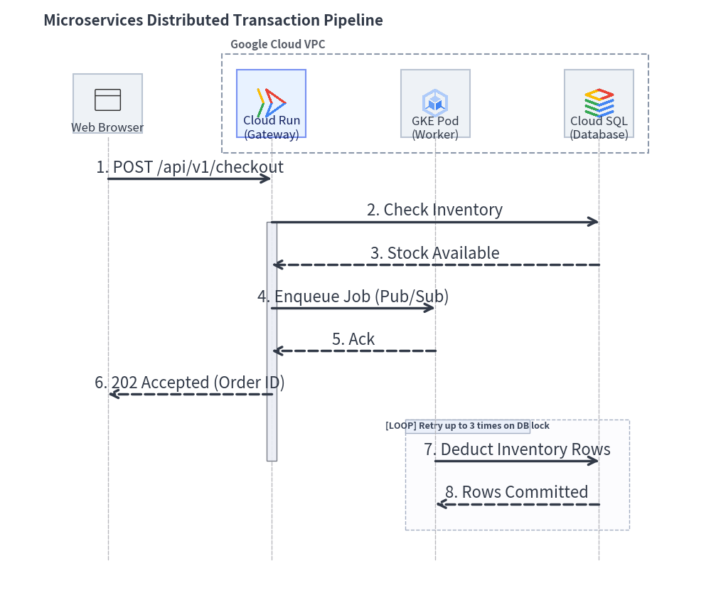
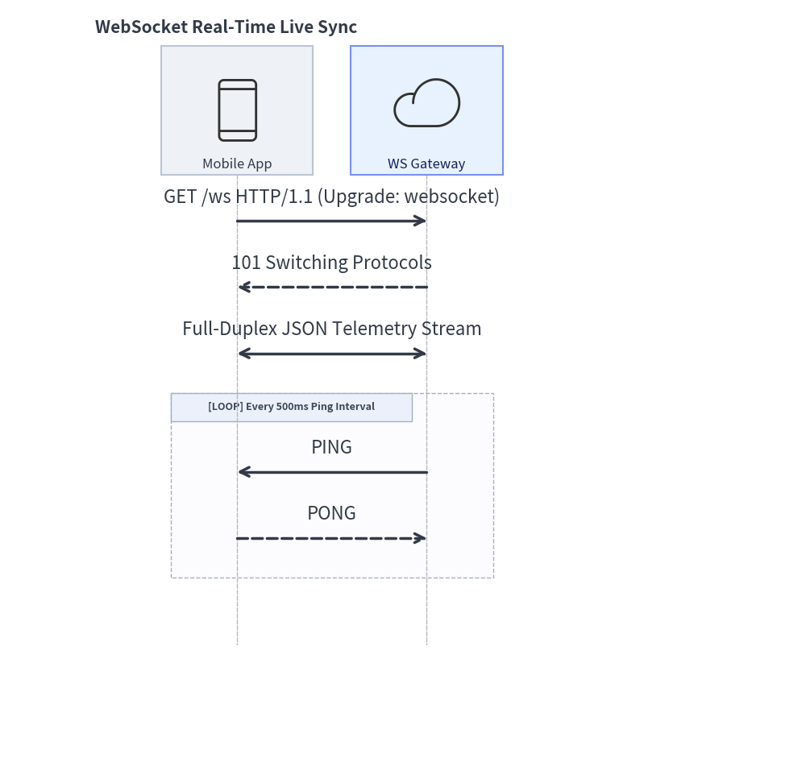

# SequenceDiagram: Lifelines, Synchronous Calls & Condition Blocks

`SequenceDiagram` models chronological interactions and communication protocols between collaborating participants over time. Time progresses strictly downwards along vertical lifelines, with horizontal arrows representing messages.

---

## 1. Overview & Key Concepts

```text
    Client               API Server            Database
      │                      │                    │
      │ ──POST /login───────►│                    │
      │                      │ ──SELECT user─────►│
      │                      │                    │ █ (Activation)
      │                      │ ◄──User Record─────│
      │ ◄──200 OK (JWT)──────│                    │
      │                      │                    │
```

- **Vertical Lifelines**: Participants are placed along the horizontal header band, with lifelines extending downwards.
- **Message Semantics**:
  - `request()`: Solid line with filled arrow (`―▶`). With `is_async=True`, renders an open arrow (`―>`).
  - `reply()`: Dashed line with filled arrow (`---▶`).
  - `connect()`: Bidirectional communication (`<->`), such as full-duplex WebSocket channels.
  - Self-Calls: `p.request(p, label)` loops back to the caller's own lifeline.
- **Activation Boxes**: `p.activate()` and `p.deactivate()` draw execution focus rectangles along lifelines.
- **Autonumbering**: Setting `autonumber=True` automatically numbers messages sequentially (`1.`, `2.`, `3.`, ...).
- **Pythonic Condition Frames (`with`)**: Use Python context managers (`with d.loop()`, `with d.alt()`, `with d.opt()`) to wrap structured interaction frames cleanly.

---

## 2. Constructor & Participant Management

```python
from drawlib.diagrams.sequence import (
    Block,
    GcpIcon,
    Participant,
    ParticipantGroup,
    PhosphorIcon,
    SequenceDiagram,
)
from drawlib.styles import Styles

d = SequenceDiagram(
    node_style=Styles.Neutral,
    edge_style=Styles.DarkBold,
    edge_text_style=Styles.Dark,
    title="Checkout Transaction Pipeline",
    autonumber=True,            # Auto-number messages (1., 2., 3., ...)
)

# Participant group for clustered backend services
vpc = d.add(ParticipantGroup(title="Google Cloud VPC", padding=4.0))
api = vpc.add(Participant("Cloud Run\n(Gateway)", icon=GcpIcon.CLOUD_RUN, style=Styles.PrimaryNeutral))
db = vpc.add(Participant("Cloud SQL", icon=GcpIcon.CLOUD_SQL))

# External participant
client = d.add(Participant("Web Browser", icon=PhosphorIcon.BROWSER))
```

---

## 3. Distributed Transaction Pipeline

The following complete example showcases participant groups, cloud icons, activations, sticky notes, asynchronous dispatches, and a retry loop frame:


<figure class="drawlib-image" style="text-align: center;">
  
  <figcaption class="drawlib-caption">Microservices Distributed Transaction Pipeline</figcaption>
</figure>


---

## 4. WebSocket Full-Duplex Streaming

For real-time bidirectional streams, use `connect()` with `arrow="<->"`:


<figure class="drawlib-image" style="text-align: center;">
  
  <figcaption class="drawlib-caption">WebSocket Full-Duplex Telemetry Stream</figcaption>
</figure>


---

## 5. Condition Frames & Structured Blocks

Drawlib supports standard UML interaction operators using clean Python context managers:

| Frame Type | Syntax | Standard UML Operator |
|---|---|---|
| **Loop** | `with d.loop("condition"):` | `loop` |
| **Alternative** | `with d.alt("condition"):`<br>`with d.else_("condition"):` | `alt` / `else` |
| **Option** | `with d.opt("condition"):` | `opt` |
| **Parallel** | `with d.par("description"):` | `par` |

Frames automatically compute their enclosing bounding box around all enclosed message lines and draw the standard UML frame tag in the top-left corner.
