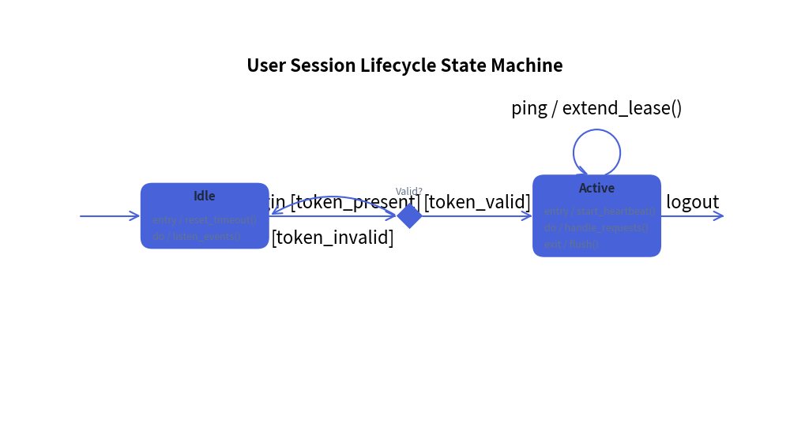
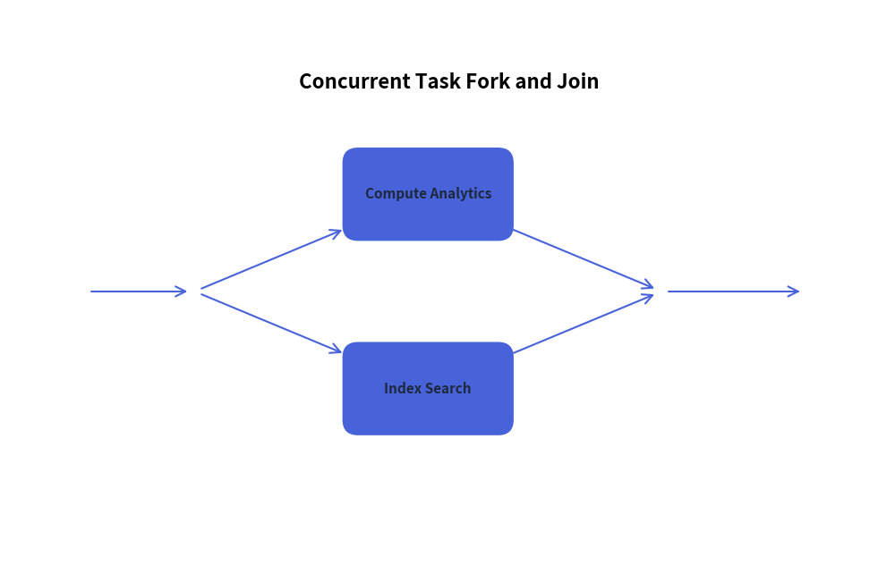

# StateDiagram: UML Statecharts, Automata & Transitions

`StateDiagram` models behavioral state transitions, Finite State Machines (FSM), and UML 2.0 Statecharts. It provides dedicated pseudo-states, internal action compartments (`entry`, `do`, `exit`), and curved arc transitions.

---

## 1. Overview & Action Compartments

```text
    (Initial)
        │
        ▼
   ┌─────────┐      event [guard] / action
   │  Idle   ├─────────────────────────────────►┌──────────────┐
   └────▲────┘                                  │  Processing  │
        │           failure (bend=0.3)          ├──────────────┤
        └───────────────────────────────────────┤ entry/timer  │
                                                │ do/calculate │
                                                └──────────────┘
```

- **UML Action Compartments**: A `State` card can display internal behavior triggers (`entry`, `do`, `exit`) below a divider line.
- **Pseudo-States**:
  - `InitialState`: Solid black circle indicating system start.
  - `FinalState`: Bullseye concentric circles indicating termination.
  - `ChoiceState`: Diamond shape for dynamic conditional branching.
  - `ForkJoinState`: Solid synchronization bar for concurrent state splits and joins.
- **Standard Transition Syntax**: Transition labels automatically format as `event [guard] / action`.
- **Bidirectional Arcs (`bend`)**: Setting `bend=0.3` creates smooth curved lines, allowing bidirectional transitions between the same pair of states without overlapping.

---

## 2. Constructor & Core Classes

```python
from drawlib.diagrams.state import (
    ChoiceState,
    FinalState,
    ForkJoinState,
    InitialState,
    State,
    StateDiagram,
)
from drawlib.styles import Styles

sd = StateDiagram(
    node_style=Styles.PrimaryFlat,
    edge_style=Styles.Primary,
    edge_text_style=Styles.Black,
    title="Session Lifecycle State Machine",
)

# State with action compartments
active = sd.add(
    State("Active", shape="box", entry="start_heartbeat()", do="handle_requests()", exit="flush()"),
    xy=(60.0, 40.0),
)

# Transition with guard and action
init = sd.add(InitialState(), xy=(10.0, 40.0))
init.to(active, event="login", guard="token_valid", action="init_session()")
```

---

## 3. Session Lifecycle State Machine

The following complete example showcases pseudo-states, choice diamonds, action compartments, a self-loop, and curved return transitions:


<figure class="drawlib-image" style="text-align: center;">
  
  <figcaption class="drawlib-caption">User Session Lifecycle State Machine</figcaption>
</figure>


---

## 4. Concurrent Task Synchronization (Fork & Join)

Use `ForkJoinState` to represent concurrent parallel threads:


<figure class="drawlib-image" style="text-align: center;">
  
  <figcaption class="drawlib-caption">Concurrent Task Synchronization with Fork and Join</figcaption>
</figure>


---

## 5. Best Practices & Guidelines

1. **Use `bend` for Opposing Transitions**: When two states transition back and forth (e.g. `Idle` ↔ `Active`), apply `bend=0.25` on one transition and `bend=-0.25` on the return so they do not overlap.
2. **Standard Label Formatting**: Prefer passing `event`, `guard`, and `action` parameters rather than writing `label="login [valid] / init"`. Drawlib guarantees standard UML typography and spacing.
3. **Choice Diamond Clarity**: Label exit branches from `ChoiceState` with explicit `guard` criteria (`guard="is_valid"` vs `guard="is_invalid"`).
