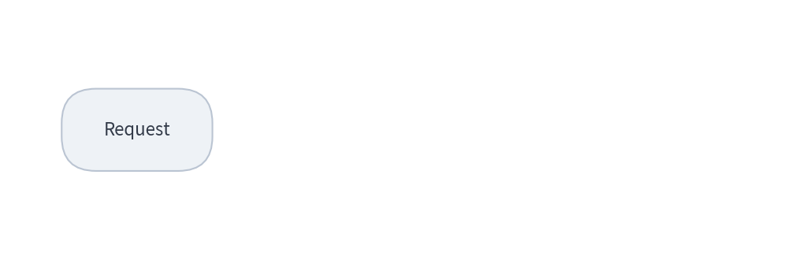
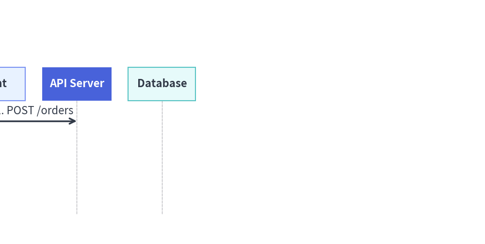
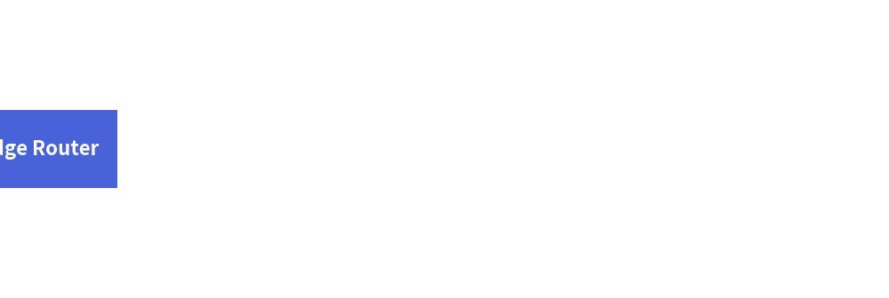

# Animating Technical Diagrams & Auto-Layout Graphs

All 6 technical diagram engines (`FlowDiagram`, `ArchitectureDiagram`, `SequenceDiagram`, `StateDiagram`, `ClassDiagram`, `ERDiagram`) and all 5 auto-layout graph solvers (`ArchitectureGraph`, `LayerGraph`, `TreeGraph`, `RadialGraph`, `GridGraph`) use **Pattern B (Pre-Build & Mutate)**:
1. Construct the entire topology **once** outside the animation loop and keep references to the returned nodes and connections.
2. Inside `with anim.frame():`, mutate `.show`, `.style`, `.text_style`, or `.draw_ratio`, and call `draw(xy=..., scale=...)`.

---

## 1. Key Animation Capabilities on Diagrams

| Feature | How It Works |
| :--- | :--- |
| **Visibility & Automatic Edge Hiding (`.show`)** | Setting `node.show = False` hides the node **and automatically hides all edges connected to it**. For `Junction` points in `FlowDiagram` / `ArchitectureDiagram`, the upstream wire entering the junction stays hidden until at least one downstream target is visible. |
| **Dynamic Style Mutation (`.style`, `.text_style`)** | Reassign `node.style = Styles.PrimaryFlat` or `edge.style = Styles.PrimaryBold` between frames to highlight active execution paths. |
| **Progressive Line Growth (`edge.draw_ratio`)** | All connection objects (`Edge`, `Transition`, `Relationship`, `Message`, `Junction`) support `draw_ratio: float` (`0.0` to `1.0`) and `draw_direction: Literal["forward", "backward"]` to animate arrows growing across the canvas. |
| **Camera Pan & Zoom (`draw(xy=..., scale=...)`)** | Passing `xy=(ox, oy)` and `scale=s` to `d.draw()` translates and scales all coordinates, dimensions, and font sizes uniformly. |

---

## 2. Progressive Node & Arrow Walkthrough (`FlowDiagram`)

By combining `node.show`, `edge.draw_ratio`, and `node.style` mutation, you can animate a request flowing through a pipeline step by step:


```python
from drawlib.anim import Animation
from drawlib.canvas import save, setup
from drawlib.diagrams.flow import End, FlowDiagram, Process, Start
from drawlib.styles import Styles

setup(width=115, height=38)
anim = Animation(fps=8.0)

# 1. Build topology once outside the loop
flow = FlowDiagram(node_style=Styles.Neutral, edge_style=Styles.DarkBold, edge_text_style=Styles.Dark)
n1 = flow.add(Start("Request", width=22, height=12), xy=(20, 19))
n2 = flow.add(
    Process("Authorize", width=26, height=13, style=Styles.PrimaryFlat, text_style=Styles.WhiteBold),
    xy=(57, 19),
    show=False,
)
n3 = flow.add(
    End("200 OK", width=22, height=12, style=Styles.SecondaryNeutral, text_style=Styles.DarkBold),
    xy=(95, 19),
    show=False,
)
e1 = n1.connect(n2)
e2 = n2.connect(n3)

# 2. Frame 1: Initial entry point
with anim.frame(duration=0.6):
    flow.draw()

# 3. Reveal Authorize node and grow arrow e1
n2.show = True
for r in [0.35, 0.7, 1.0]:
    with anim.frame(duration=0.14):
        e1.draw_ratio = r
        flow.draw()

# 4. Settle Authorize into PrimaryNeutral, reveal 200 OK, and grow arrow e2
n2.style = Styles.PrimaryNeutral
n2.text_style = Styles.DarkBold
n3.show = True
for r in [0.35, 0.7, 1.0]:
    with anim.frame(duration=2.5 if r == 1.0 else 0.14):
        e2.draw_ratio = r
        flow.draw()

save()
```

<figure class="drawlib-image" style="text-align: center;">
  
  <figcaption class="drawlib-caption">FlowDiagram Walkthrough with Progressive Edge Growth (draw_ratio)</figcaption>
</figure>


---

## 3. Camera Pan & Zoom (`draw(xy=..., scale=...)`)

Every diagram's `draw(xy=(x, y), scale=s)` method shifts the diagram origin to `(x, y)` and multiplies all coordinates, box sizes, line widths, and font sizes by `scale`. This makes it easy to create smooth slide-in or zoom transitions:


```python
from drawlib.anim import Animation
from drawlib.canvas import save, setup
from drawlib.diagrams.sequence import Participant, SequenceDiagram
from drawlib.styles import Styles

setup(width=115, height=58)
anim = Animation(fps=10.0)

seq = SequenceDiagram(
    node_style=Styles.Neutral,
    edge_style=Styles.DarkBold,
    edge_text_style=Styles.Dark,
    autonumber=True,
)
client = seq.add(Participant("Client", style=Styles.PrimaryNeutral, text_style=Styles.DarkBold))
api = seq.add(Participant("API Server", style=Styles.PrimaryFlat, text_style=Styles.WhiteBold))
db = seq.add(Participant("Database", style=Styles.SecondaryNeutral, text_style=Styles.DarkBold))

m1 = client.request(api, "POST /orders")
m2 = api.request(db, "INSERT order", show=False)
m3 = api.reply(client, "201 Created", show=False)

# Phase 1: Slide in from left
for ox in [-15, -8, -3, 0]:
    with anim.frame(duration=0.1):
        seq.draw(xy=(ox, 0), scale=1.0)

# Phase 2: Reveal remaining messages with progressive draw_ratio
m2.show = True
for r in [0.5, 1.0]:
    m2.draw_ratio = r
    with anim.frame(duration=0.15):
        seq.draw()

m3.show = True
for r in [0.5, 1.0]:
    m3.draw_ratio = r
    with anim.frame(duration=2.5 if r == 1.0 else 0.15):
        seq.draw()

save()
```

<figure class="drawlib-image" style="text-align: center;">
  
  <figcaption class="drawlib-caption">Sliding and Revealing a SequenceDiagram via draw(xy, scale)</figcaption>
</figure>


---

## 4. Auto-Layout Graphs (`drawlib.graph`)

For declarative graph solvers (`ArchitectureGraph`, `LayerGraph`, `TreeGraph`, `RadialGraph`, `GridGraph`), `g.node(id, label, ...)` returns a mutable `Node` declaration (`node.show`, `node.style`, `node.text_style`). Because the layout solver (`g.calc()`) always computes coordinates across the full topology regardless of `show=False`, mutating `node.show` and calling `g.draw(margin=..., scale=...)` inside the loop keeps all node positions and container boxes locked in place:


```python
from drawlib.anim import Animation
from drawlib.canvas import save, setup
from drawlib.graph import LayerGraph
from drawlib.styles import Styles

setup(width=125, height=42)
anim = Animation(fps=1.5)

g = LayerGraph(direction="LR", default_node_width=22.0, default_node_height=11.0)
nodes = [
    g.node("edge", "Edge Router", layer=0),
    g.node("auth", "Auth Guard", layer=1),
    g.node("core", "Core API", layer=2),
    g.node("db", "Primary DB", layer=3),
]

g.edge("edge", "auth")
g.edge("auth", "core")
g.edge("core", "db")

for step in range(len(nodes)):
    for i, node in enumerate(nodes):
        node.show = (i <= step)
        node.style = Styles.PrimaryFlat if i == step else Styles.PrimaryNeutral
        node.text_style = Styles.WhiteBold if i == step else Styles.DarkBold

    is_last = (step == len(nodes) - 1)
    with anim.frame(duration=2.5 if is_last else 0.8):
        g.draw(margin=8.0)

save()
```

<figure class="drawlib-image" style="text-align: center;">
  
  <figcaption class="drawlib-caption">Auto-Layout LayerGraph Step-by-Step Reveal</figcaption>
</figure>


