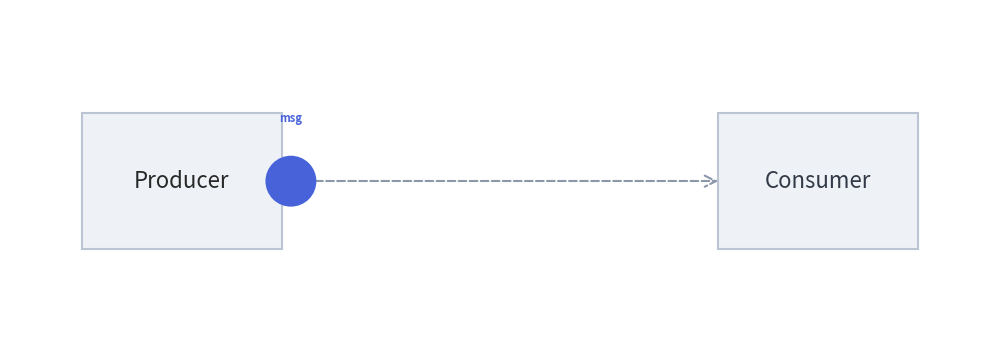
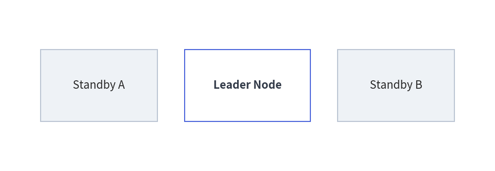
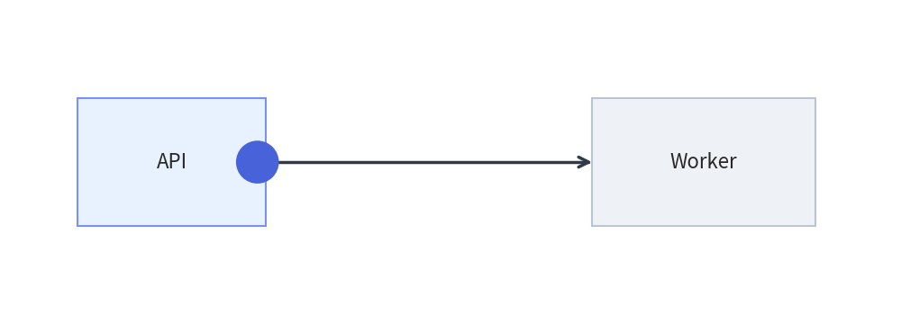

# Animating Primitives & Color Transitions

Low-level drawing primitives (`drawlib.shapes`, `drawlib.lines`, `drawlib.text`, `drawlib.icons`) are stateless functions that draw directly onto the canvas. To animate them, use **Pattern A (In-Frame Build)** with `clear=True` (the default of `with anim.frame():`), computing per-frame coordinates, sizes, or styles inside a loop.

---

## 1. Moving & Scaling Primitives Across Frames

Hoist static configuration (canvas dimensions, node coordinates, and trajectory lists) outside the loop, and redraw the scene at each step inside `with anim.frame():`:


```python
from drawlib.anim import Animation
from drawlib.canvas import save, setup
from drawlib.lines import line
from drawlib.shapes import circle, rectangle
from drawlib.styles import Styles
from drawlib.text import text

setup(width=110, height=40)
anim = Animation(fps=10.0)

xs = [32, 41, 50, 59, 68, 77]

for i, pkt_x in enumerate(xs):
    is_last = (i == len(xs) - 1)
    with anim.frame(duration=1.8 if is_last else 0.12):
        # Static baseline endpoints
        rectangle((20, 20), width=22, height=15, style=Styles.Neutral, text="Producer")
        recv_style = Styles.PrimaryFlat if is_last else Styles.Neutral
        recv_text = Styles.WhiteBold if is_last else Styles.Dark
        rectangle((90, 20), width=22, height=15, style=recv_style, text="Consumer", text_style=recv_text)

        # Wire and moving packet
        line((31, 20), (79, 20), style=Styles.MutedDashed, arrow_head="->")
        if not is_last:
            circle((pkt_x, 20), radius=2.8, style=Styles.PrimaryFlat)
            text((pkt_x, 27), "msg", style=Styles.PrimaryBold.patch(text_size=8))

save()
```

<figure class="drawlib-image" style="text-align: center;">
  
  <figcaption class="drawlib-caption">Packet Transmission Between Services</figcaption>
</figure>


---

## 2. Smooth Color Interpolation (`get_intermediate_color` & `get_intermediate_colors`)

When you want a shape's fill, border, or text color to transition smoothly from **Color A** to **Color B** across frames, use the color interpolation helpers in `drawlib.styles` (also available in `drawlib.preset_colors`):

```python
from drawlib.styles import Colors, get_intermediate_color, get_intermediate_colors
```

| Function | Signature | Description |
| :--- | :--- | :--- |
| **`get_intermediate_color`** | `(color1: ColorType, color2: ColorType) -> Color` | Returns the single 50% midpoint `Color` between `color1` and `color2` (wrapper around `get_intermediate_colors(color1, color2, num=1)[0]`). |
| **`get_intermediate_colors`** | `(color1: ColorType, color2: ColorType, num: int = 1, *, include_ends: bool = False) -> list[Color]` | Returns `num` evenly spaced intermediate `Color` objects in RGBA space. Set `include_ends=True` to return `[color1, ..., color2]` (`num + 2` colors total). |

Both functions accept any `ColorType` (`Color` instance, `(R, G, B)` / `(R, G, B, A)` tuple, or hex string like `"#3B82F6"`).

### Animating Style Fades with `Style.patch()`
Generate the color sequence once before the loop with `include_ends=True`, and apply each frame's color via `.patch(shape_fill_color=bg)`:


```python
from drawlib.anim import Animation
from drawlib.canvas import save, setup
from drawlib.shapes import rectangle
from drawlib.styles import Colors, Styles, get_intermediate_colors

setup(width=110, height=38)
anim = Animation(fps=10.0)

# Generate 7 colors from White -> Primary (including both endpoints)
fade_in = get_intermediate_colors(Colors.White, Colors.Primary, num=5, include_ends=True)

for i, bg_color in enumerate(fade_in):
    is_last = (i == len(fade_in) - 1)
    with anim.frame(duration=2.0 if is_last else 0.12):
        # Static neutral peers
        rectangle((22, 19), width=26, height=16, style=Styles.Neutral, text="Standby A")
        rectangle((88, 19), width=26, height=16, style=Styles.Neutral, text="Standby B")

        # Hero node smoothly fading from White to Primary
        active_style = Styles.PrimaryOutline.patch(shape_fill_color=bg_color)
        active_text = Styles.WhiteBold if i >= 3 else Styles.DarkBold
        rectangle((55, 19), width=28, height=16, style=active_style, text="Leader Node", text_style=active_text)

save()
```

<figure class="drawlib-image" style="text-align: center;">
  
  <figcaption class="drawlib-caption">Smooth Color Interpolation with get_intermediate_colors()</figcaption>
</figure>


---

## 3. Combining Motion, Scaling & Color Transitions

You can combine coordinate interpolation and `get_intermediate_colors()` in multi-phase animations—for example, moving a request packet across a link and then smoothly fading the target node into its active state:


```python
from drawlib.anim import Animation
from drawlib.canvas import save, setup
from drawlib.lines import line
from drawlib.shapes import circle, rectangle
from drawlib.styles import Colors, Styles, get_intermediate_colors

setup(width=105, height=38)
anim = Animation(fps=10.0)

packet_xs = [30, 42, 55, 67]
fade_colors = get_intermediate_colors(Colors.White, Colors.Primary, num=3, include_ends=True)

# Phase 1: Packet travels from API to Worker
for pkt_x in packet_xs:
    with anim.frame(duration=0.1):
        rectangle((20, 19), width=22, height=15, style=Styles.PrimaryNeutral, text="API")
        rectangle((82, 19), width=26, height=15, style=Styles.Neutral, text="Worker")
        line((31, 19), (69, 19), style=Styles.DarkBold, arrow_head="->")
        circle((pkt_x, 19), radius=2.5, style=Styles.PrimaryFlat)

# Phase 2: Worker smoothly transitions from White to Primary
for i, bg in enumerate(fade_colors):
    is_last = (i == len(fade_colors) - 1)
    with anim.frame(duration=2.0 if is_last else 0.12):
        rectangle((20, 19), width=22, height=15, style=Styles.PrimaryNeutral, text="API")
        worker_style = Styles.PrimaryOutline.patch(shape_fill_color=bg)
        worker_text = Styles.WhiteBold if i >= 2 else Styles.DarkBold
        rectangle((82, 19), width=26, height=15, style=worker_style, text="Worker", text_style=worker_text)
        line((31, 19), (69, 19), style=Styles.DarkBold, arrow_head="->")

save()
```

<figure class="drawlib-image" style="text-align: center;">
  
  <figcaption class="drawlib-caption">Two-Phase Packet Motion and Smooth Receiver Highlight</figcaption>
</figure>


