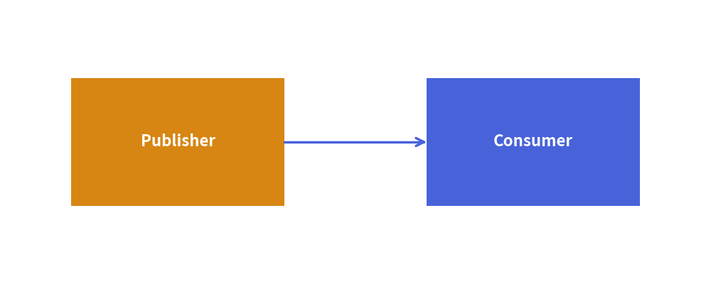

# Embedded Code Blocks (````drawlib````)

Drawlib allows you to embed Python drawing scripts directly into Markdown documents using the ````drawlib```` code fence. The builder compiles these blocks into vector images during site or document builds, automatically generating HTML elements, companion image files, and syntax-highlighted code blocks.

---

## 1. Basic Code Fence Syntax

Embedded drawing blocks use the `drawlib` language identifier:


```python
from drawlib.canvas import save, setup
from drawlib.shapes import rectangle
from drawlib.lines import line
from drawlib.styles import Styles

setup(width=100, height=40)
rectangle((25, 20), width=30, height=18, style=Styles.accent_flat, text="Publisher", textstyle=Styles.white_bold)
rectangle((75, 20), width=30, height=18, style=Styles.primary_flat, text="Consumer", textstyle=Styles.white_bold)
line((40, 20), (60, 20), arrowhead="->", style=Styles.bold)
save()
```

<figure class="drawlib-image" style="text-align: center;">
  
  <figcaption class="drawlib-caption">Service Architecture Example</figcaption>
</figure>


---

## 2. Header Attributes Reference

Options are specified space-delimited on the opening code fence line:

```text
``` drawlib [DISPLAY_MODE] [WIDTH] [ALIGNMENT] [file:NAME] [caption:"TEXT"]
```

*(Note: In authoring, replace the brackets with your desired configuration options without the space after the backticks.)*

### 2.1 Code Display Modes

| Option | HTML Rendering Behavior | Markdown Rendering Behavior |
|---|---|---|
| `hide-code` *(default)* | Displays image only (`<figure></figure>`). | Replaces block with standard Markdown image link. |
| `show-code` | Displays syntax-highlighted code block followed immediately by the image. | Renders code block followed by image link. |
| `fold-code` | Displays image followed by a collapsible dropdown (`<details><summary>Source Code</summary>...</details>`). | Displays image followed by collapsed details dropdown. |

### 2.2 Dimensions & Alignment

- **Width**: Specify pixel width (e.g. `500px`, `650px`) or percentages (e.g. `80%`, `100%`).
- **Alignment**:
  - `center` *(default)*: Centered horizontally on the page.
  - `left`: Aligned to the left margin.
  - `right`: Aligned to the right margin.

### 2.3 Captions & Image Filenames

- **Caption**: `caption:"Description of diagram"` wraps the rendered figure in semantic HTML `<figure>` and `<figcaption>` elements with clean typography.
- **Custom Filename**: By default, Drawlib numbers companion images sequentially (`1.png`, `2.png`). Specify `file:my_diagram.png` to set an explicit filename in the output directory.

> [!TIP]
> **Best Practice for AI & Automation**:
> Always specify an explicit `file:<name>.png` attribute for every embedded block. Named blocks prevent numbering shifts when diagrams are inserted or removed, produce clean asset directories, and allow individual diagrams to be verified deterministically via `drawlib show <file> <image_name.png>`.

---

## 3. Working Directory & Path Resolution

When compiling embedded code blocks:
1. **Working Directory (`os.chdir`)**: Drawlib automatically sets the current working directory to the directory containing the Markdown document.
2. **Relative File Paths**: Relative paths to local assets (e.g. `image("../_assets/logo.png")`) resolve identically whether running `drawlib build` or testing with `drawlib show`.
3. **Module Resolution (`sys.path`)**: The document directory and project root are added to `sys.path`, allowing you to import local helper modules (such as `import styles` or `import utils`).

---

## 4. Canvas Isolation & Sandbox

- **Automatic Clear**: Drawlib invokes `canvas.clear()` before executing each embedded code block. State, shapes, and settings from a preceding diagram will never contaminate subsequent blocks.
- **Explicit Imports**: Embedded drawing blocks require explicit imports (e.g. `from drawlib.shapes import circle`, `from drawlib.styles import Styles`). This guarantees clean namespace boundaries, full IDE autocompletion support, and self-contained reproducibility.
- **Automatic Capture & `save()` Handling**: The Document Builder automatically captures the canvas and renders the companion image to disk when a block finishes execution. Calling `save()` within a block is optional; if present, the engine safely overrides it as a no-op to prevent duplicate file writes or collisions. In complete examples, including `save()` (without arguments) is recommended to maintain 100% copy-paste portability with standalone Python scripts.

---

## 5. Rapid Verification Workflow

Do not run a full site build to verify minor coordinate changes. Inspect individual code blocks instantly using `drawlib show`:

```bash
# Preview block #1 of docs_src/my_doc.md with coordinate grid:
uv run drawlib show docs_src/my_doc.md 1 -g -o scratch/preview.png
```
