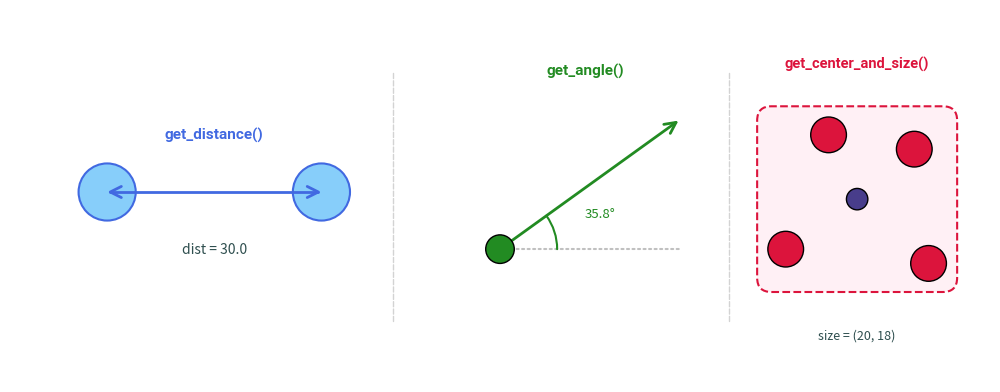
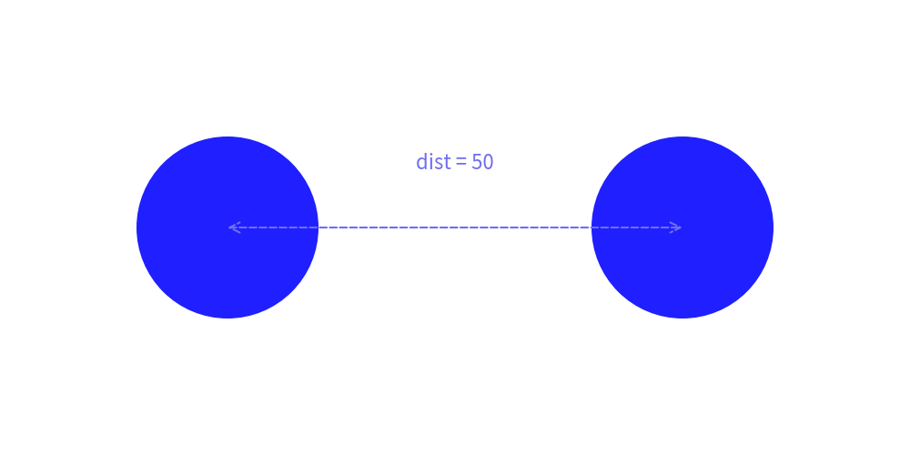
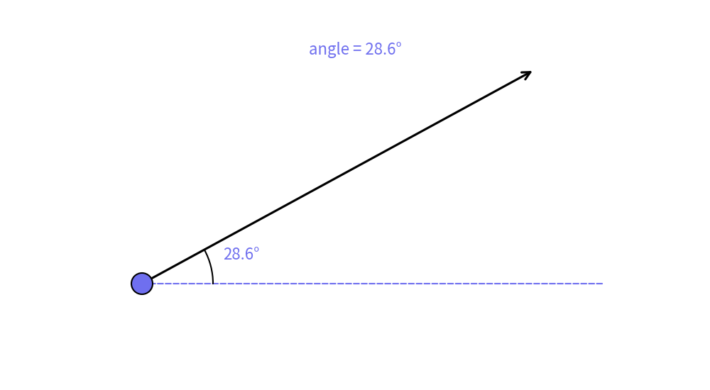
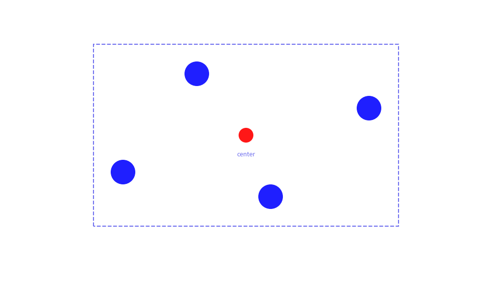

# Geometry & Math Utilities

The `drawlib.math` module provides lightweight mathematical and geometric helper functions for computing angles, Euclidean distances, bounding boxes, and centroids during programmatic illustration authoring.

---

## 1. Available Functions

```python
from drawlib.math import (
    get_angle,
    get_center_and_size,
    get_distance,
)
```

| Function | Signature | Return Type | Description |
| :--- | :--- | :--- | :--- |
| **`get_distance`** | `get_distance(xy1, xy2)` | `float` | Computes the Euclidean distance between two 2D coordinates `xy1=(x1, y1)` and `xy2=(x2, y2)`. |
| **`get_angle`** | `get_angle(xy1, xy2)` | `float` | Calculates the angle in degrees (0.0 to 360.0) from point `xy1` to `xy2` relative to the positive X-axis. |
| **`get_center_and_size`** | `get_center_and_size(xys)` | `tuple[tuple[float, float], tuple[float, float]]` | Calculates the geometric center `(center_x, center_y)` and bounding box dimensions `(width, height)` for an array of coordinates. |


<figure class="drawlib-image" style="text-align: center;">
  
  <figcaption class="drawlib-caption">Visual Summary of Math & Geometry Functions</figcaption>
</figure>


---

## 2. Usage Examples

### 2.1 Calculating Distance and Dynamic Radius


```python
from drawlib.canvas import config
from drawlib.lines import line
from drawlib.math import get_distance
from drawlib.shapes import circle
from drawlib.text import text

config(width=100, height=50)

p1 = (25, 25)
p2 = (75, 25)
dist = get_distance(p1, p2)  # 50.0

# Draw concentric nodes based on computed distance:
circle(p1, radius=dist / 5, style="blue_flat")
circle(p2, radius=dist / 5, style="blue_flat")
line(p1, p2, arrowhead="<->", style="dashed")
text((50, 32), f"dist = {dist:.0f}")
```

<div class="drawlib-image" style="text-align: center;">
  
</div>


### 2.2 Computing Rotation Angle for Custom Vectors


```python
from drawlib.canvas import config
from drawlib.lines import line, line_arc
from drawlib.math import get_angle
from drawlib.shapes import circle
from drawlib.text import text

config(width=100, height=55)

start = (20, 15)
target = (75, 45)
angle = get_angle(start, target)

# Baseline and directional vector
line(start, (85, 15), style="dashed")
line(start, target, arrowhead="->", style="bold")
line_arc(start, width=20, height=20, angle_start=0, angle_end=angle)
circle(start, radius=1.5)
text((34, 19), f"{angle:.1f}°")
text((50, 48), f"angle = {angle:.1f}°")
```

<div class="drawlib-image" style="text-align: center;">
  
</div>


### 2.3 Centroid and Bounding Box for Clusters


```python
from drawlib.canvas import config
from drawlib.math import get_center_and_size
from drawlib.shapes import circle, rectangle
from drawlib.text import text

config(width=100, height=60)

nodes = [(25, 25), (40, 45), (55, 20), (75, 38)]
(center_x, center_y), (width, height) = get_center_and_size(nodes)

# Automatically enclose nodes within a cluster boundary box with padding:
rectangle(
    xy=(center_x, center_y),
    width=width + 12,
    height=height + 12,
    style="dashed",
)
for pt in nodes:
    circle(pt, radius=2.5, style="blue_flat")
circle((center_x, center_y), radius=1.5, style="red_flat")
text((center_x, center_y - 4), "center", size=9)
```

<div class="drawlib-image" style="text-align: center;">
  
</div>


---

<p align="center"><em>© 2026 drawlib by Yuichi Ito. Released under the Apache 2.0 License.</em></p>
