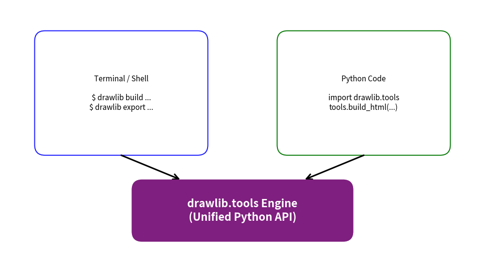

# Programmatic Tools API (`drawlib.tools`)

The `drawlib.tools` module is the official Python developer API that powers the Drawlib CLI.  
While terminal commands like `drawlib build`, `drawlib export`, and `drawlib serve` are ideal for command-line workflows, you should use `drawlib.tools` **whenever you need to execute CLI-equivalent operations directly within Python code**.

This programmatic interface is specifically designed for:
- **CI/CD Build Pipelines**: Automating multi-format documentation builds (HTML, Markdown, PDF) inside deployment scripts.
- **Automated Testing Suites**: Extracting diagrams and asserting image generation using `pytest` without invoking shell subprocesses.
- **Custom Documentation Generators**: Embedding Drawlib's diagram compiler into existing Python-based static site engines or documentation toolchains.
- **Automation Sidecars & Bots**: Generating, exporting, or validating diagrams dynamically from background tasks and server services.

---

## 1. CLI Command vs. Programmatic API Mapping

All top-level CLI commands have direct 1-to-1 functional counterparts in `drawlib.tools`:

| CLI Command | Programmatic Function | Description |
| :--- | :--- | :--- |
| `drawlib build html` | `build_html(...)` | Compile Markdown files or directory into an HTML site. |
| `drawlib build markdown` | `build_markdown(...)` | Compile Markdown files for GitHub repository browsing. |
| `drawlib build pdf` | `build_pdf(...)` | Compile documents to vector PDF via headless Chromium. |
| `drawlib build images` | `build_image(...)` | Batch execute standalone Python drawing scripts into images. |
| `drawlib export` | `export_block(...)` | Extract and render a single diagram block or script to image. |
| `drawlib show` | `show_block(...)` | Render and display diagram block in desktop GUI viewer. |
| `drawlib init` | `init_project(...)` | Scaffold starter documentation project structures. |
| `drawlib serve` | `serve_docs(...)` | Launch local preview HTTP web server with link checker. |
| `drawlib cache` | `list_cache()`, `clear_cache()` | Inspect, download, or clear font and icon asset cache. |
| `drawlib css` | `list_css()`, `export_css()` | Inspect and export built-in CSS stylesheets. |


<figure class="drawlib-image" style="text-align: center;">
  
  <figcaption class="drawlib-caption">Architecture: drawlib.tools as the Backend Engine</figcaption>
</figure>


---

## 2. Imports & Module Structure

You can import functions either directly from `drawlib.tools` or from categorized submodules:

```python
# Direct top-level imports
from drawlib.tools import (
    build_html,
    build_markdown,
    build_pdf,
    build_image,
    export_block,
    show_block,
    init_project,
    serve_docs,
    clear_cache,
    download_cache,
    list_cache,
    list_css,
    export_css,
)
```

---

## 3. Document & Image Compilation (`build`)

### 3.1. `build_html()`
Compiles authoring Markdown source files into a responsive static HTML site. Note that `template.html` and `style.css` must exist in the source directory (scaffolded via `drawlib init`):

```python
from drawlib.tools import build_html

build_html(
    input_path="docs_src/",            # Source directory or single .md file
    output="docs_html/",               # Destination directory or .html file
    config="config.py",                # Optional Python configuration script
    no_cache=False,                    # Set True to force re-executing all diagram blocks
    image_format="png",                # "png" or "webp"
)
```

### 3.2. `build_markdown()`
Compiles Markdown documents for GitHub repository browsing. Code blocks are preserved as Python syntax-highlighted blocks followed by relative image links:

```python
from drawlib.tools import build_markdown

build_markdown(
    input_path="docs_src/",
    output="docs/",
    config="config.py",
    image_format="png",
)
```

### 3.3. `build_pdf()`
Renders Markdown documents to print-ready vector PDF using headless Chromium via Playwright:

```python
from drawlib.tools import build_pdf

build_pdf(
    inputs="doc_src/",
    output="doc.pdf",
    config="config.py",
    timestamp=False,  # Set True to preserve current build timestamp instead of normalizing
)
```

### 3.4. `build_image()`
Executes all standalone `.py` drawing scripts within a directory and exports rendered images:

```python
from drawlib.tools import build_image

build_image(
    input_path="drawings/",
    output="dist/images/",
    config="config.py",
    grid=False,
)
```

---

## 4. Single Diagram Extraction & Verification (`export` & `show`)

### 4.1. `export_block()`
Extracts and renders a single ````drawlib```` block from a Markdown file or a standalone Python script directly to an image file.  
This is the primary function used by automated testing suites and CI workflows:

```python
from drawlib.tools import export_block

# Export block 1 from a Markdown document:
export_block(
    file_path="docs_src/overview.md",
    target="1",                         # 1-based index or target image name (e.g. "arch.png")
    output_path="scratch/arch.png",
    grid=True,                          # Overlay coordinate grid lines (-g)
    config_path="config.py",
)

# Export directly from a standalone Python script:
export_block(
    file_path="scripts/my_schema.py",
    output_path="dist/schema.png",
    grid=False,
)
```

### 4.2. `show_block()`
Opens an interactive desktop GUI preview window displaying the rendered diagram:

```python
from drawlib.tools import show_block

# Open desktop GUI preview for block 2 with coordinate grid overlay:
show_block(
    file_path="docs_src/overview.md",
    target="2",
    grid=True,
)
```

---

## 5. Project Scaffolding (`init`)

The `init` tools automate generating initial directory trees and starter files:

```python
from drawlib.tools import init_project, list_project_types

# Check available starter templates:
print(list_project_types())
# Output: ['site', 'simple', 'pdf', 'image']

# Scaffold a documentation website project:
init_project(
    project_type="site",
    target_dir="./my_project",
    force=False,
)
```

---

## 6. Local Server & Asset Management

### 6.1. Local HTTP Server (`serve_docs`)
Runs a local HTTP development server to test compiled documentation websites:

```python
from drawlib.tools import serve_docs

serve_docs(
    directory="docs_html/",
    port=8080,
    open_browser=True,
    check_links=True,     # Pre-scans for broken links or missing static assets
)
```

### 6.2. Font & Icon Cache (`cache`)
Manage downloaded assets programmatically:

```python
from drawlib.tools import clear_cache, download_cache, list_cache

# List cached font files and icons:
cached_files = list_cache()

# Pre-download all default font packages for offline execution:
download_cache()

# Clear cache to free storage:
clear_cache()
```

### 6.3. CSS Management (`css`)

```python
from drawlib.tools import export_css, list_css

# Inspect available CSS presets:
presets = list_css(target="html")

# Export a CSS preset directly into your project's stylesheet:
export_css(name="google", output_path="docs_src/style.css", force=True)
```

---

## 7. Practical Automation Examples

### 7.1. Full Documentation Pipeline Script (`build_pipeline.py`)

A complete automated build script that compiles GitHub Markdown, static HTML, and release artifacts simultaneously:

```python
import sys
from pathlib import Path
from drawlib.tools import build_html, build_markdown, export_block

def main() -> None:
    src_dir = Path("docs_src")
    md_dir = Path("docs")
    html_dir = Path("docs_html")

    print("[1/3] Compiling GitHub Markdown documentation...")
    build_markdown(input_path=str(src_dir), output_path=str(md_dir))

    print("[2/3] Compiling Responsive HTML static site...")
    build_html(input_path=str(src_dir), output_path=str(html_dir))

    print("[3/3] Exporting hero diagram for repository banner...")
    export_block(
        file_path=str(src_dir / "index.md"),
        target="1",
        output_path="assets/banner.png",
    )
    print("Documentation build completed successfully!")

if __name__ == "__main__":
    main()
```

### 7.2. Automated Visual Testing with Pytest

Validate that Markdown diagrams compile without errors and produce valid image outputs:

```python
from pathlib import Path
from drawlib.tools import export_block

def test_architecture_diagram_renders(tmp_path: Path) -> None:
    """Ensure that the architecture diagram compiles and produces a non-empty image."""
    output_image = tmp_path / "arch_test.png"

    export_block(
        file_path="docs_src/foundations/canvas.md",
        target="1",
        output_path=str(output_image),
        grid=False,
    )

    assert output_image.exists()
    assert output_image.stat().st_size > 1024  # Ensure image is not 0 bytes
```

---

## 8. Related Topics
- [CLI Reference](../cli/index.md)
- [Document Builder Overview](../doc_builder/index.md)
- [Working with AI Agents](../advanced_topics/ai_agents.md)
- [Rendering from Code (`get_dimage_from_code`)](../advanced_topics/dimage_from_code.md)

---

<p align="center"><em>© 2026 drawlib by Yuichi Ito. Released under the Apache 2.0 License.</em></p>
