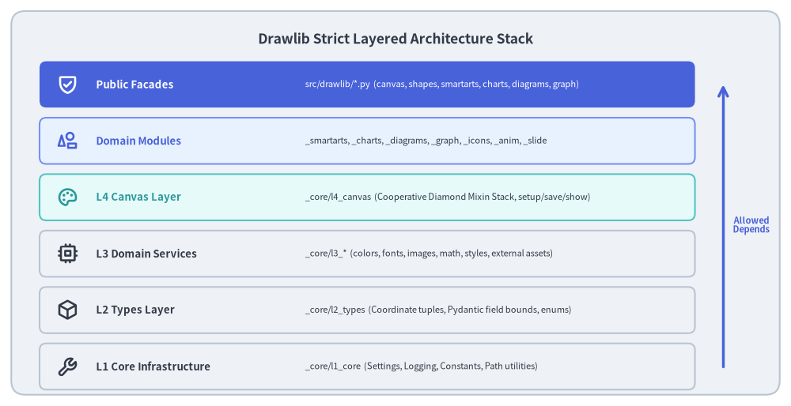
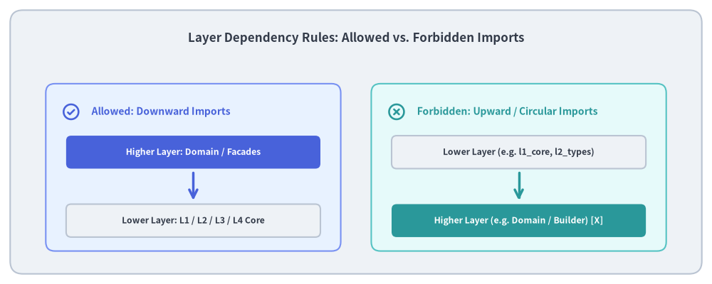

# Layer Hierarchy & Architectural Rules

A drawing library faces severe architectural challenges: complex geometry transformations, stateful rendering backends, styling cascades, high-level layout algorithms, and document compilation. Without strict architectural boundaries, code quickly degrades into tangled inter-module dependencies and circular imports.

To ensure long-term maintainability, Drawlib enforces a strict **Unidirectional Layered Architecture** across its core drawing engine and domain subsystems.


<figure class="drawlib-image" style="text-align: center;">
  
  <figcaption class="drawlib-caption">Drawlib Strict Layered Architecture Stack</figcaption>
</figure>

<details class="drawlib-code-details">
<summary>Source Code</summary>

```python
from drawlib.canvas import save, setup
from drawlib.icons import phosphor
from drawlib.lines import line
from drawlib.shapes import rectangle
from drawlib.styles import Styles
from drawlib.text import text

setup(width=140, height=72)

rectangle((70, 36), width=136, height=68, style=Styles.Neutral.patch(shape_r=2.5))
text(
    (70, 65),
    "Drawlib Strict Layered Architecture Stack",
    style=Styles.DarkBold.patch(text_size=12.5),
)

layers = [
    (57, "Public Facades", "src/drawlib/*.py  (canvas, shapes, smartarts, charts, diagrams, graph)", Styles.PrimaryFlat, Styles.WhiteBold, phosphor.shield_check),
    (47, "Domain Modules", "_smartarts, _charts, _diagrams, _graph, _icons, _anim, _slide", Styles.PrimaryNeutral, Styles.PrimaryBold, phosphor.shapes),
    (37, "L4 Canvas Layer", "_core/l4_canvas  (Cooperative Diamond Mixin Stack, setup/save/show)", Styles.SecondaryNeutral, Styles.SecondaryBold, phosphor.palette),
    (27, "L3 Domain Services", "_core/l3_*  (colors, fonts, images, math, styles, external assets)", Styles.Neutral, Styles.DarkBold, phosphor.cpu),
    (17, "L2 Types Layer", "_core/l2_types  (Coordinate tuples, Pydantic field bounds, enums)", Styles.Neutral, Styles.DarkBold, phosphor.cube),
    (7, "L1 Core Infrastructure", "_core/l1_core  (Settings, Logging, Constants, Path utilities)", Styles.Neutral, Styles.DarkBold, phosphor.wrench),
]

for y, title, desc, card_style, text_style, icon_func in layers:
    rectangle((65, y), width=116, height=8.2, style=card_style.patch(shape_r=1.2))
    icon_func((12, y), width=3.8, style=text_style)
    text((17, y), title, style=text_style.patch(halign="left", text_size=9.5))
    sub_style = Styles.White if card_style == Styles.PrimaryFlat else Styles.Dark
    text((54, y), desc, style=sub_style.patch(halign="left", text_size=8.0))

# Arrow indicating unidirectional flow from L1 upwards
line((128, 7), (128, 57), arrow_head="->", style=Styles.PrimaryBold)
text((133, 32), "Allowed\nDepends", style=Styles.PrimaryBold.patch(text_size=8.0))

save()
```

</details>


---

## 1. Concept: Unidirectional Dependency Invariant

The fundamental law of Drawlib's codebase is **Unidirectional Downward Dependency**:

> **The Architectural Law**:  
> A higher-level layer may import symbols from lower-level layers, but a lower-level layer must **never** import symbols from higher-level layers.

This principle guarantees:
- **Zero Circular Dependencies**: Modules can always be loaded in topological order without import deadlocks.
- **Independent Testability**: Lower layers (like `l1_core` and `l2_types`) can be unit tested without initializing graphics backends, Matplotlib figures, or complex styling trees.
- **Swappable Backends**: The graphics rendering pipeline (`l4_canvas` and Matplotlib) can be modified or extended without altering core data types or high-level layout algorithms.

---

## 2. Positioning: Layer Responsibilities Breakdown

Drawlib decomposes drawing mechanics into six discrete horizontal layers:

| Layer | Directory Path | Primary Responsibility | Upstream Consumers |
| :--- | :--- | :--- | :--- |
| **Public Facades** | `src/drawlib/*.py` | Clean re-exports of user-facing functions and classes (`canvas`, `shapes`, `styles`). | End-user drawing code & AI agents |
| **Domain Modules** | `src/drawlib/_*/` | High-level diagramming modules (`_smartarts`, `_charts`, `_diagrams`, `_graph`). | Public facades |
| **L4 Canvas** | `_core/l4_canvas` | Global Canvas context, diamond multiple inheritance feature mixins, transform stack. | Domain modules, Public facades |
| **L3 Services** | `_core/l3_*` | Independent specialized services (`l3_colors`, `l3_fonts`, `l3_images`, `l3_math`, `l3_styles`, `l3_external`). | L4 Canvas, Domain modules |
| **L2 Types** | `_core/l2_types` | Functional coordinate primitives (`Coordinate`, `Coordinates`), Pydantic field bounds, enums. | L3 Services, L4 Canvas, Domain |
| **L1 Core** | `_core/l1_core` | Core runtime settings (`dutil_settings`), logging, path utilities, static asset directory constants. | All higher layers |


<figure class="drawlib-image" style="text-align: center;">
  
  <figcaption class="drawlib-caption">Layer Dependency Rules: Allowed vs. Forbidden Imports</figcaption>
</figure>

<details class="drawlib-code-details">
<summary>Source Code</summary>

```python
from drawlib.canvas import save, setup
from drawlib.icons import phosphor
from drawlib.lines import line
from drawlib.shapes import rectangle
from drawlib.styles import Styles
from drawlib.text import text

setup(width=140, height=56)

rectangle((70, 28), width=136, height=52, style=Styles.Neutral.patch(shape_r=2.5))
text(
    (70, 48.5),
    "Layer Dependency Rules: Allowed vs. Forbidden Imports",
    style=Styles.DarkBold.patch(text_size=12.2),
)

# Left Column: Allowed Dependencies (Downward)
rectangle((38, 23), width=58, height=33, style=Styles.PrimaryNeutral.patch(shape_r=1.8))
phosphor.check_circle((14, 34), width=3.8, style=Styles.PrimaryBold)
text((18, 34), "Allowed: Downward Imports", style=Styles.PrimaryBold.patch(halign="left", text_size=10.0))

rectangle((38, 26), width=50, height=6.5, style=Styles.PrimaryFlat.patch(shape_r=1.0))
text((38, 26), "Higher Layer: Domain / Facades", style=Styles.WhiteBold.patch(text_size=8.8))

line((38, 22), (38, 16.5), arrow_head="->", style=Styles.PrimaryBold)

rectangle((38, 12.5), width=50, height=6.5, style=Styles.Neutral.patch(shape_r=1.0))
text((38, 12.5), "Lower Layer: L1 / L2 / L3 / L4 Core", style=Styles.DarkBold.patch(text_size=8.8))

# Right Column: Forbidden Dependencies (Upward or Cross-Domain Cycles)
rectangle((102, 23), width=58, height=33, style=Styles.SecondaryNeutral.patch(shape_r=1.8))
phosphor.x_circle((78, 34), width=3.8, style=Styles.SecondaryBold)
text((82, 34), "Forbidden: Upward / Circular Imports", style=Styles.SecondaryBold.patch(halign="left", text_size=10.0))

rectangle((102, 26), width=50, height=6.5, style=Styles.Neutral.patch(shape_r=1.0))
text((102, 26), "Lower Layer (e.g. l1_core, l2_types)", style=Styles.DarkBold.patch(text_size=8.8))

line((102, 22), (102, 16.5), arrow_head="->", style=Styles.SecondaryBold)

rectangle((102, 12.5), width=50, height=6.5, style=Styles.SecondaryFlat.patch(shape_r=1.0))
text((102, 12.5), "Higher Layer (e.g. Domain / Builder) [X]", style=Styles.WhiteBold.patch(text_size=8.8))

save()
```

</details>


---

## 3. Details: Layer Isolation Mechanics

### 3.1. Layer 1 (`l1_core`) — The Bedrock
`l1_core` has zero internal Drawlib dependencies. It relies strictly on the Python standard library:
- **Runtime Settings (`_settings.py`)**: `DrawlibSettings` (accessed via the singleton `dutil_settings`) manages global verbosity (`"normal"`, `"quiet"`, `"verbose"`, `"developer"`), warning suppression, test mode detection, and grid overlay forcing (`_force_grid`).
- **Logging (`_logging.py`)**: Centralized Python `logging` instance under the `"drawlib"` namespace.
- **Constants & Path Utils (`_const.py`, `_path_utils.py`)**: Static directories for fonts, icons, maps, and rules, alongside call-stack inspection tools (`get_script_path()`).
- **Declarative Validation (No Boilerplate Exception Classes)**: Drawlib avoids custom exception hierarchies. Boundary validation is declared via Pydantic (`@validate_call`, `Field`, `BeforeValidator`), raising standard Pydantic `ValidationError` or built-in `ValueError`.

### 3.2. Layer 2 (`l2_types`) — Value Primitives & Constraints
`l2_types` defines lightweight, functional type primitives:
- **Coordinate Primitives (`_geometry.py`)**: `Coordinate = tuple[float, float]`, `Coordinates = list[Coordinate]`, `Bezier2`, and `Bezier3`.
- **Pydantic Bounds (`_primitive.py`, `_style.py`)**: `PosInt`, `PosFloat`, `Ratio` ($[0.0, 1.0]$), and `Angle` with cyclic normalization modulo 360°.
- Does not contain any rendering logic or Matplotlib objects.

### 3.3. Layer 3 (`l3_*`) — Domain Services
Layer 3 provides specialized domain engines that operate on `l2_types` without knowing about the Canvas lifecycle:
- **`l3_colors`**: `Color(BaseModel)` immutable RGBA model, `ColorType` annotation, and `ColorUtil` linear interpolation.
- **`l3_styles`**: Unified flat `Style(BaseModel)` with explicit target declarations (`supports: frozenset[SupportType]`) and `BaseStyles(BaseModel, metaclass=_BaseStylesMeta)`.
- **`l3_fonts`**: Language-specific font enums, true-type font resources, and metadata caching.
- **`l3_images`**: `Dimage` PIL fluent wrapper for cropping, tinting, and scaling.
- **`l3_math`**: Functional 2D geometry (`_geometry.py`) and orthogonal path routing (`_routing.py`).
- **`l3_external`**: GitHub Release asset synchronization (`ReleaseAssetPackage`, `AssetManifest`, deterministic `.zip` generator).

### 3.4. Layer 4 (`l4_canvas`) — Canvas & Graphics Bridge
`l4_canvas` brings together all lower layers to manage the active drawing canvas:
- Terminal `Canvas` class composed through cooperative diamond multiple inheritance (`CanvasBase` + 7 feature mixins).
- Coordinates calls between user drawing operations and Matplotlib patch primitives.
- Exposes `setup()`, `save()`, `show()`, and the `transform()` context manager.

### 3.5. Automated Enforcement in CI/CD
This layering invariant is strictly enforced:
- **Ruff Linting**: Rejects cyclic imports and invalid cross-module references.
- **Ty Type Checking**: Verifies that lower-layer type signatures never leak higher-layer classes.
- Run verification at any time via:
  ```bash
  ./dcli code-check type
  ```

Continue to **[Canvas & Geometry](../02_core_engine/01_canvas_and_geometry.md)** to inspect the core drawing engine.
