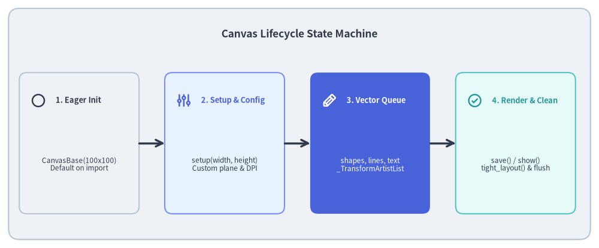
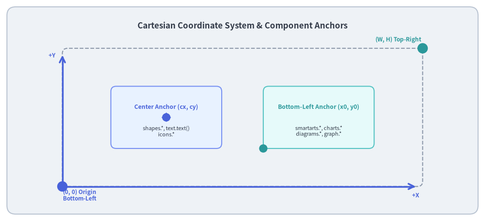
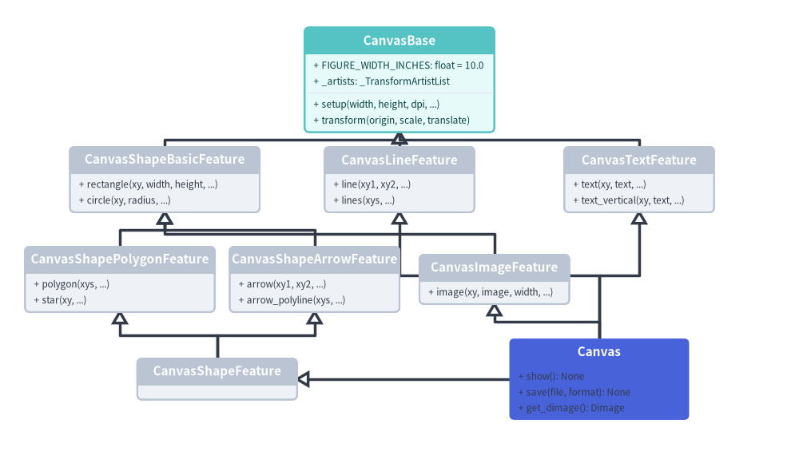

# Canvas Lifecycle & Coordinate System

At the heart of Drawlib lies the **Canvas Engine** (`_core/l4_canvas`), which abstracts physical display devices and plotting libraries into a clean, deterministic virtual coordinate plane.

This document details the Cartesian virtual geometry model, anchor point conventions, and the Canvas lifecycle state machine.


<figure class="drawlib-image" style="text-align: center;">
  
  <figcaption class="drawlib-caption">Canvas Lifecycle State Machine</figcaption>
</figure>

<details class="drawlib-code-details">
<summary>Source Code</summary>

```python
from drawlib.canvas import save, setup
from drawlib.icons import phosphor
from drawlib.lines import line
from drawlib.shapes import rectangle
from drawlib.styles import Styles
from drawlib.text import text

setup(width=140, height=58)

rectangle((70, 29), width=136, height=54, style=Styles.Neutral.patch(shape_r=2.5))
text(
    (70, 50),
    "Canvas Lifecycle State Machine",
    style=Styles.DarkBold.patch(text_size=12.5),
)

states = [
    (18.5, "1. Eager Init", "CanvasBase(100x100)\nDefault on import", Styles.Neutral, Styles.DarkBold, phosphor.circle),
    (52.5, "2. Setup & Config", "setup(width, height)\nCustom plane & DPI", Styles.PrimaryNeutral, Styles.PrimaryBold, phosphor.sliders),
    (86.5, "3. Vector Queue", "shapes, lines, text\n_TransformArtistList", Styles.PrimaryFlat, Styles.WhiteBold, phosphor.pencil),
    (120.5, "4. Render & Clean", "save() / show()\ntight_layout() & flush", Styles.SecondaryNeutral, Styles.SecondaryBold, phosphor.check_circle),
]

for x, title, desc, card_style, text_style, icon_func in states:
    rectangle((x, 24.5), width=28, height=33, style=card_style.patch(shape_r=1.8))
    icon_func((x - 9.5, 34.5), width=3.6, style=text_style)
    text((x - 5.5, 34.5), title, style=text_style.patch(halign="left", text_size=9.2))
    sub_style = Styles.White if card_style == Styles.PrimaryFlat else Styles.Dark
    text((x, 19.5), desc, style=sub_style.patch(text_size=8.5))

for i in range(3):
    x_from = states[i][0] + 14.0
    x_to = states[i + 1][0] - 14.0
    line((x_from, 24.5), (x_to, 24.5), arrow_head="->", style=Styles.DarkBold)

save()
```

</details>


---

## 1. Concept: Cartesian Virtual Space vs. Screen Coordinates

Most graphics and GUI engines (HTML5 Canvas, SVG, PIL, OpenCV) place the coordinate origin `(0, 0)` at the **top-left corner**, with the Y-axis pointing downward (`+Y` down). 

While natural for cascading web layouts, this convention is counter-intuitive for humans and mathematical reasoning:
- Ground/baseline objects have high Y coordinates, while headers have low Y coordinates.
- Trigonometric rotations (clockwise vs. counter-clockwise) require inverted angle calculations.
- Bar charts, line graphs, and hierarchy trees must invert vertical bounds manually.

### The Drawlib Solution: Pure Cartesian Plane
Drawlib uses a standard **Cartesian coordinate system**:
- **Origin `(0, 0)`** is anchored at the **bottom-left corner**.
- `+X` extends horizontally to the **right** (`0` → `W`).
- `+Y` extends vertically **upward** (`0` → `H`).
- Rotations are standard counter-clockwise angles ($0^\circ$ points East, $90^\circ$ points North).


<figure class="drawlib-image" style="text-align: center;">
  
  <figcaption class="drawlib-caption">Cartesian Coordinate System & Component Anchors</figcaption>
</figure>

<details class="drawlib-code-details">
<summary>Source Code</summary>

```python
from drawlib.canvas import save, setup
from drawlib.icons import phosphor
from drawlib.lines import line
from drawlib.shapes import circle, rectangle
from drawlib.styles import Styles
from drawlib.text import text

setup(width=140, height=64)

rectangle((70, 32), width=136, height=60, style=Styles.Neutral.patch(shape_r=2.5))
text(
    (70, 56.5),
    "Cartesian Coordinate System & Component Anchors",
    style=Styles.DarkBold.patch(text_size=12.2),
)

# Simulated Canvas Boundary (X: 18 to 122, Y: 10 to 50)
rectangle((70, 30), width=104, height=40, style=Styles.MutedDashed.patch(shape_r=1.5))

# Origin (0,0) at bottom-left
circle((18, 10), radius=1.5, style=Styles.PrimaryFlat)
text((23, 7.5), "(0, 0) Origin\nBottom-Left", style=Styles.PrimaryBold.patch(text_size=8.5))

# Top-Right (W, H)
circle((122, 50), radius=1.5, style=Styles.SecondaryFlat)
text((115, 52.5), "(W, H) Top-Right", style=Styles.SecondaryBold.patch(text_size=8.5))

# Primitive: Center Anchor (cx, cy)
rectangle((48, 30), width=32, height=18, style=Styles.PrimaryNeutral.patch(shape_r=1.5))
circle((48, 30), radius=1.2, style=Styles.PrimaryFlat)
phosphor.crosshair((48, 30), width=2.8, style=Styles.PrimaryBold)
text((48, 33), "Center Anchor (cx, cy)", style=Styles.PrimaryBold.patch(text_size=8.8))
text((48, 26), "shapes.*, text.text()\nicons.*", style=Styles.Dark.patch(text_size=8.0))

# Component: Bottom-Left Anchor (x0, y0)
rectangle((92, 30), width=32, height=18, style=Styles.SecondaryNeutral.patch(shape_r=1.5))
circle((76, 21), radius=1.2, style=Styles.SecondaryFlat)
phosphor.arrow_up_right((76, 21), width=2.8, style=Styles.SecondaryBold)
text((92, 33), "Bottom-Left Anchor (x0, y0)", style=Styles.SecondaryBold.patch(text_size=8.8))
text((92, 26), "smartarts.*, charts.*\ndiagrams.*, graph.*", style=Styles.Dark.patch(text_size=8.0))

# Axes indicators
line((18, 10), (18, 48), arrow_head="->", style=Styles.PrimaryBold)
text((15, 48), "+Y", style=Styles.PrimaryBold.patch(text_size=8.8))
line((18, 10), (120, 10), arrow_head="->", style=Styles.PrimaryBold)
text((120, 7.5), "+X", style=Styles.PrimaryBold.patch(text_size=8.8))

save()
```

</details>


---

## 2. Positioning: The Dual-Anchor Architecture

A key architectural design in Drawlib is the clean separation of anchor semantics between **low-level primitives** and **high-level components**:

| Category | Typical Modules | Anchor Point | Mathematical Definition |
| :--- | :--- | :--- | :--- |
| **Primitives** | `shapes.*`, `text.text()`, `icons.*` | **Center `(cx, cy)`** | Position specifies the exact geometric centroid of the shape, glyph, or icon. |
| **Components** | `smartarts.*`, `charts.*`, `diagrams.*`, `graph.*` | **Bottom-Left `(x0, y0)`** | Position specifies the minimum bounding corner of the enclosing box `[x0, x0 + width] × [y0, y0 + height]`. |

### Why This Dual-Anchor Design?
1. **Primitives Are Symmetry-Centric**: Rotating a box or placing a label on an arrow is simplest when coordinates specify the shape's center `(cx, cy)`.
2. **Components Are Container-Centric**: Stacking tables, aligning bar charts, or positioning DAG clusters is simplest when defining the enclosing bounding box from its bottom-left origin `(x0, y0)`.
3. To center a component with width $w$ horizontally on a canvas of width $W$, simply compute:
   $$x_0 = \frac{W - w}{2}$$

---

## 3. Details: Canvas Engine Architecture & Multiple Inheritance

### 3.1. Cooperative Diamond Inheritance Hierarchy
The terminal `Canvas` class (`_core/l4_canvas/canvas.py`) does not implement all drawing operations directly. Instead, it is composed via Python multiple inheritance across seven feature mixin classes rooted in `CanvasBase`:


<figure class="drawlib-image" style="text-align: center;">
  
  <figcaption class="drawlib-caption">L4 Canvas Cooperative Diamond Inheritance Hierarchy</figcaption>
</figure>

<details class="drawlib-code-details">
<summary>Source Code</summary>

```python
from drawlib.canvas import save, setup
from drawlib.diagrams.class_diagram import ClassDiagram, ClassNode
from drawlib.styles import Styles

setup(width=160, height=92)

cd = ClassDiagram(
    node_style=Styles.Neutral,
    edge_style=Styles.DarkBold,
    edge_text_style=Styles.Dark,
    title="L4 Canvas Cooperative Diamond Inheritance Hierarchy",
)

# Base class
base = cd.add(ClassNode(name="CanvasBase", width=38.0, style=Styles.SecondaryNeutral), xy=(80.0, 76.0))
base.add_attribute("FIGURE_WIDTH_INCHES: float = 10.0")
base.add_attribute("_artists: _TransformArtistList")
base.add_method("setup", params="width, height, dpi, ...")
base.add_method("transform", params="origin, scale, translate")

# Intermediate feature mixins (Row 2)
shape_basic = cd.add(ClassNode(name="CanvasShapeBasicFeature", width=38.0), xy=(33.0, 56.0))
shape_basic.add_method("rectangle", params="xy, width, height, ...")
shape_basic.add_method("circle", params="xy, radius, ...")

line_feat = cd.add(ClassNode(name="CanvasLineFeature", width=30.0), xy=(80.0, 56.0))
line_feat.add_method("line", params="xy1, xy2, ...")
line_feat.add_method("lines", params="xys, ...")

text_feat = cd.add(ClassNode(name="CanvasTextFeature", width=30.0), xy=(128.0, 56.0))
text_feat.add_method("text", params="xy, text, ...")
text_feat.add_method("text_vertical", params="xy, text, ...")

# Specialized feature mixins (Row 3)
shape_poly = cd.add(ClassNode(name="CanvasShapePolygonFeature", width=38.0), xy=(24.0, 36.0))
shape_poly.add_method("polygon", params="xys, ...")
shape_poly.add_method("star", params="xy, ...")

shape_arrow = cd.add(ClassNode(name="CanvasShapeArrowFeature", width=34.0), xy=(63.0, 36.0))
shape_arrow.add_method("arrow", params="xy1, xy2, ...")
shape_arrow.add_method("arrow_polyline", params="xys, ...")

image_feat = cd.add(ClassNode(name="CanvasImageFeature", width=30.0), xy=(99.0, 36.0))
image_feat.add_method("image", params="xy, image, width, ...")

# Aggregate & Terminal (Row 4)
shape_feat = cd.add(ClassNode(name="CanvasShapeFeature", width=32.0), xy=(43.5, 16.0))

canvas_cls = cd.add(ClassNode(name="Canvas", width=36.0, style=Styles.PrimaryFlat), xy=(120.0, 16.0))
canvas_cls.add_method("show", return_type="None")
canvas_cls.add_method("save", params="file, format", return_type="None")
canvas_cls.add_method("get_dimage", return_type="Dimage")

# Inheritance connections
cd.connect(shape_basic, base, "inheritance", start_side="top", end_side="bottom")
cd.connect(line_feat, base, "inheritance", start_side="top", end_side="bottom")
cd.connect(text_feat, base, "inheritance", start_side="top", end_side="bottom")

cd.connect(shape_poly, shape_basic, "inheritance", start_side="top", end_side="bottom")
cd.connect(shape_arrow, shape_basic, "inheritance", start_side="top", end_side="bottom")
cd.connect(image_feat, shape_basic, "inheritance", start_side="top", end_side="bottom")

cd.connect(shape_feat, shape_poly, "inheritance", start_side="top", end_side="bottom")
cd.connect(shape_feat, shape_arrow, "inheritance", start_side="top", end_side="bottom")

cd.connect(canvas_cls, shape_feat, "inheritance", start_side="left", end_side="right")
cd.connect(canvas_cls, line_feat, "inheritance", start_side="top", end_side="bottom")
cd.connect(canvas_cls, text_feat, "inheritance", start_side="top", end_side="bottom")
cd.connect(canvas_cls, image_feat, "inheritance", start_side="top", end_side="bottom")

cd.draw(xy=(0.0, 0.0))
save()
```

</details>


### 3.2. Physical Unit & 720pt Typography Mapping
Rather than dynamically scaling physical dimensions based on arbitrary scale factors, Drawlib anchors every canvas to a **fixed 10.0-inch width** (`FIGURE_WIDTH_INCHES = 10.0` in `CanvasBase`).
- **Physical Width**: Exactly 10.0 inches across the horizontal coordinate span (`[0, width]`).
- **Physical Height**: Proportional to the aspect ratio:
  $$\text{fig\_height} = \text{height} \times \frac{10.0}{\text{width}}$$
- **Typographic Scale Invariant**: Because 1 inch is exactly 72 PostScript points, the canvas width represents precisely 720 points ($10.0 \times 72 = 720\text{ pt}$). Consequently, the rendered font size in points is:
  $$\text{Rendered Font Size (pt)} = \text{text\_size} \times \frac{720.0}{\text{Canvas Width}}$$
  When a diagram is displayed at standard documentation column widths, an in-canvas `text_size=10.5`–`12.0` matches standard $16\text{px}$ HTML body text.

### 3.3. Spatial Transformations & Transform Stack
Domain modules (such as `_charts` and `_diagrams`) frequently require local coordinate frames. Instead of manually recomputing every coordinate:
- `CanvasBase.transform(origin, scale, translate)` provides a context manager that pushes an affine similarity transform onto `_transform_stack`.
- **`_TransformArtistList`**: A specialized list subclass holding pending Matplotlib artists. When artists are added via `.append()` or `.extend()`, the list intercepts them and scales patch coordinates, line widths, text font sizes, and bounding boxes in-place.
- Upon exiting the `with canvas.transform(...)` context, the previous transformation state is popped from the stack cleanly.

### 3.4. Eager Initialization & Canvas Lifecycle
- **Zero "Uninitialized" State**: `CanvasBase.__init__()` eagerly calls `self.setup()`, defaulting to a $100 \times 100$ coordinate plane. Standalone scripts can call drawing primitives immediately without an explicit `setup()` call.
- **Rendering & Artist Flushing**: When `canvas.save()` or `canvas.show()` is invoked:
  1. Artists in `_artists` are added to the Matplotlib `Axes` with ascending `zorder`.
  2. Canvas margins are eliminated via `tight_layout()` and `subplots_adjust(left=0, right=1, bottom=0, top=1)`.
  3. The image is rendered to disk or memory.
  4. All artists are removed from the `Axes` via `_remove_artists_from_ax()`, leaving the canvas ready for subsequent frames or animations without memory leaks.

Next, explore the type safety and styling system in **[Types & Style Models](02_types_and_styles.md)**.

