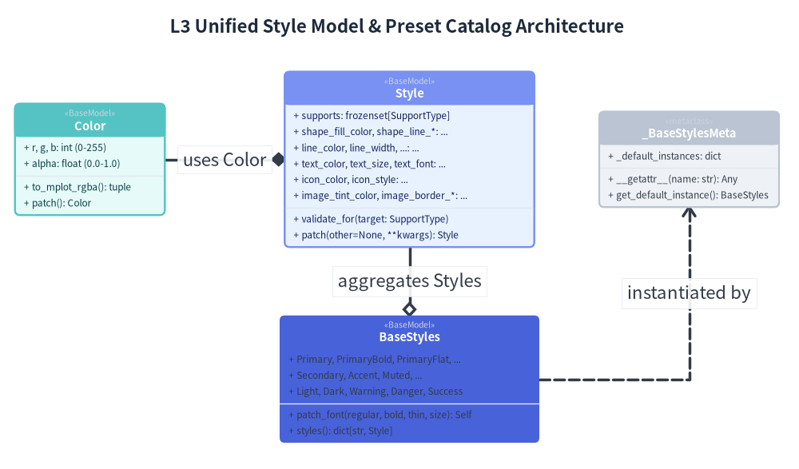
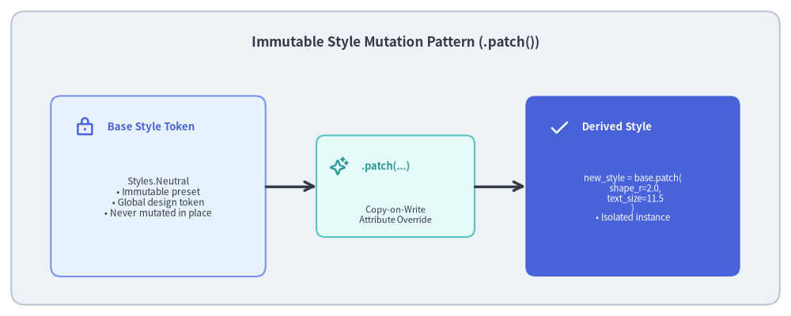

# Type System, Guarded Models & Styles

A scalable illustration engine requires rock-solid type safety. In traditional plotting libraries, styles are passed as untyped dictionaries (e.g. `{"color": "blue", "lw": 2}`), where typos (`"colour"` or `"width"`) fail silently or crash at runtime deep inside backend rendering code.

Drawlib eliminates this fragility through a **strongly-typed, composite style architecture** (`_core/l2_types` and `_core/l3_styles`), featuring immutable design tokens and guarded validation.


<figure class="drawlib-image" style="text-align: center;">
  
  <figcaption class="drawlib-caption">L3 Unified Style Model & Preset Catalog Architecture</figcaption>
</figure>

<details class="drawlib-code-details">
<summary>Source Code</summary>

```python
from drawlib.canvas import save, setup
from drawlib.diagrams.class_diagram import ClassDiagram, ClassNode
from drawlib.styles import Styles

setup(width=160, height=94)

cd = ClassDiagram(
    node_style=Styles.Neutral,
    edge_style=Styles.DarkBold,
    edge_text_style=Styles.Dark,
    title="L3 Unified Style Model & Preset Catalog Architecture",
)

# Color Model
color_node = cd.add(ClassNode(name="Color", stereotype="BaseModel", width=30.0, style=Styles.SecondaryNeutral), xy=(18.0, 62.0))
color_node.add_attribute("r, g, b: int (0-255)")
color_node.add_attribute("alpha: float (0.0-1.0)")
color_node.add_method("to_mplot_rgba", return_type="tuple")
color_node.add_method("patch", return_type="Color")

# Unified Style Model
style_node = cd.add(ClassNode(name="Style", stereotype="BaseModel", width=50.0, style=Styles.PrimaryNeutral), xy=(82.0, 62.0))
style_node.add_attribute("supports: frozenset[SupportType]")
style_node.add_attribute("shape_fill_color, shape_line_*: ...")
style_node.add_attribute("line_color, line_width, ...: ...")
style_node.add_attribute("text_color, text_size, text_font: ...")
style_node.add_attribute("icon_color, icon_style: ...")
style_node.add_attribute("image_tint_color, image_border_*: ...")
style_node.add_method("validate_for", params="target: SupportType")
style_node.add_method("patch", params="other=None, **kwargs", return_type="Style")

# Metaclass
meta_node = cd.add(ClassNode(name="_BaseStylesMeta", stereotype="metaclass", width=36.0), xy=(138.0, 62.0))
meta_node.add_attribute("_default_instances: dict")
meta_node.add_method("__getattr__", params="name: str", return_type="Any")
meta_node.add_method("get_default_instance", return_type="BaseStyles")

# BaseStyles Catalog
catalog_node = cd.add(ClassNode(name="BaseStyles", stereotype="BaseModel", width=52.0, style=Styles.PrimaryFlat), xy=(82.0, 18.0))
catalog_node.add_attribute("Primary, PrimaryBold, PrimaryFlat, ...")
catalog_node.add_attribute("Secondary, Accent, Muted, ...")
catalog_node.add_attribute("Light, Dark, Warning, Danger, Success")
catalog_node.add_method("patch_font", params="regular, bold, thin, size", return_type="Self")
catalog_node.add_method("styles", return_type="dict[str, Style]")

# Relationships
cd.connect(style_node, color_node, "composition", start_side="left", end_side="right", label="uses Color")
cd.connect(catalog_node, style_node, "aggregation", start_side="top", end_side="bottom", label="aggregates Styles")
cd.connect(catalog_node, meta_node, "dependency", start_side="right", end_side="bottom", label="instantiated by")

cd.draw(xy=(0.0, 0.0))
save()
```

</details>


---

## 1. Concept: Value Objects & Immutable Style Tokens

Styles in Drawlib are not loose configurations; they are **immutable Value Objects**.

### 1.1. Single Universal Model with Target Declarations
Rather than fracturing styling into disparate, fragmented classes, Drawlib unifies all visual styling into a single, flat Pydantic model: `Style(BaseModel)`.
- **28 First-Class Properties**: Encompassing shape fills/lines, line widths/arrows, typography/fonts, icon styling, image tinting, and coordinate alignment offsets.
- **Explicit Target Tracking (`supports`)**: Each style declares which target primitives it supports (`supports: frozenset[SupportType]` where `SupportType = Literal["shape", "line", "text", "icon", "image"]`).
- **Auto-Inference & Invariant Validation**: If not declared explicitly, `_infer_supports()` dynamically analyzes populated attributes. Furthermore, `_validate_invariants()` ensures mandatory attributes (e.g. `shape_fill_color` for shapes) are never missing when a target is claimed.
- **Runtime Target Guarding**: Before drawing, primitives call `style.validate_for("shape")`, raising a clear validation error if a style is applied to an incompatible graphic element.

### 1.2. The `.patch()` Functional Mutation Pattern
To customize an existing style without side effects, Drawlib uses a **Copy-on-Write `.patch()` method**:
- `.patch(other=None, **kwargs)` clones the underlying model, applies overrides with full Pydantic validation, and returns a new frozen `Style` instance.
- The original design token remains 100% pristine.


<figure class="drawlib-image" style="text-align: center;">
  
  <figcaption class="drawlib-caption">Immutable Style Mutation Pattern (.patch())</figcaption>
</figure>

<details class="drawlib-code-details">
<summary>Source Code</summary>

```python
from drawlib.canvas import save, setup
from drawlib.icons import phosphor
from drawlib.lines import line
from drawlib.shapes import rectangle
from drawlib.styles import Styles
from drawlib.text import text

setup(width=140, height=56)

rectangle((70, 28), width=136, height=52, style=Styles.Neutral.patch(shape_r=2.5))
text(
    (70, 48.5),
    "Immutable Style Mutation Pattern (.patch())",
    style=Styles.DarkBold.patch(text_size=12.2),
)

# 1. Base Token (Left)
rectangle((28, 23), width=38, height=32, style=Styles.PrimaryNeutral.patch(shape_r=1.8))
phosphor.lock((15, 33.5), width=3.6, style=Styles.PrimaryBold)
text((19, 33.5), "Base Style Token", style=Styles.PrimaryBold.patch(halign="left", text_size=9.5))
text(
    (28, 21),
    "Styles.Neutral\n• Immutable preset\n• Global design token\n• Never mutated in place",
    style=Styles.Dark.patch(text_size=8.5),
)

# 2. Patch Transformation (Center)
rectangle((70, 23), width=28, height=18, style=Styles.SecondaryNeutral.patch(shape_r=1.5))
phosphor.sparkle((60, 26.5), width=3.4, style=Styles.SecondaryBold)
text((64, 26.5), ".patch(...)", style=Styles.SecondaryBold.patch(halign="left", text_size=9.2))
text((70, 18), "Copy-on-Write\nAttribute Override", style=Styles.Dark.patch(text_size=8.0))

line((47, 23), (56, 23), arrow_head="->", style=Styles.DarkBold)
line((84, 23), (93, 23), arrow_head="->", style=Styles.DarkBold)

# 3. Derived Style (Right)
rectangle((112, 23), width=38, height=32, style=Styles.PrimaryFlat.patch(shape_r=1.8))
phosphor.check((99, 33.5), width=3.6, style=Styles.WhiteBold)
text((103, 33.5), "Derived Style", style=Styles.WhiteBold.patch(halign="left", text_size=9.5))
text(
    (112, 21),
    "new_style = base.patch(\n  shape_r=2.0,\n  text_size=11.5\n)\n• Isolated instance",
    style=Styles.White.patch(text_size=8.2),
)

save()
```

</details>


---

## 2. Positioning: Layer 2 Types & Layer 3 Style Services

The type and styling system bridges low-level geometry and high-level domain components:

- **`_core/l2_types`**:
  - `Coordinate = tuple[float, float]` and `Coordinates = list[Coordinate]`: Lightweight functional coordinate representations without class overhead.
  - `Bezier2` and `Bezier3`: Control-point tuples for quadratic and cubic curves.
  - Pydantic bounds: `PosInt`, `PosFloat`, `Ratio` ($[0.0, 1.0]$), and `Angle` with cyclic normalization modulo 360°.
- **`_core/l3_colors`**:
  - `Color(BaseModel)`: Immutable RGBA model supporting hex codes (`#3b82f6`), RGB tuples, and RGBA floats.
  - `.to_mplot_rgba()`: Generates Matplotlib-ready normalized float tuples rounded to 5 decimal places.
  - `ColorUtil`: Linear color interpolation and WCAG contrast ratio calculations.
- **`_core/l3_styles`**:
  - `Style`: The flat universal style value object.
  - `BaseStyles`: Preset catalog providing 17 visual variations for 4 semantic roles (`Primary`, `Secondary`, `Accent`, `Muted`) plus extended roles (`Light`, `Dark`, `Warning`, `Danger`, `Success`).

---

## 3. Details: Metaclass Catalog & Pydantic Validation Mechanics

### 3.1. Metaclass Singleton Resolution (`_BaseStylesMeta`)
To provide the ergonomic syntax `Styles.Primary` or `Styles["Neutral"]` without requiring manual instantiation, `BaseStyles` uses a custom metaclass `_BaseStylesMeta`:

```python
class _BaseStylesMeta(type(BaseModel)):
    _default_instances: dict[type, BaseStyles] = {}

    def __getattr__(cls, name: str) -> Any:
        return getattr(cls.get_default_instance(), name)

    def __getitem__(cls, name: str) -> Style:
        return cls.get_default_instance()[name]
```

When a user imports `from drawlib.styles import Styles` and accesses `Styles.PrimaryNeutral`, the metaclass intercepts the attribute lookup on the class itself and resolves it against a registered default singleton instance.

### 3.2. Cascading Font Updates via `.patch_font()`
Documentation projects frequently need to customize typography across all presets (e.g. switching to Japanese fonts or adjusting default font sizes). 

Instead of requiring users to patch every preset individually, `BaseStyles.patch_font()` updates the entire catalog in a single call:

```python
styles = Styles.patch_font(
    regular=FontJapanese.NOTO_SANS_CJK_JP_REGULAR,
    bold=FontJapanese.NOTO_SANS_CJK_JP_BOLD,
    size=11.0,
)
```

Internally, `.patch_font()` iterates through all `Style` attributes in `BaseStyles`, intelligently mapping `bold` and `thin` variants to corresponding styles, and returns a new cloned catalog with zero global mutation.

### 3.3. Declarative Model Validation
Every style attribute is validated using declarative Pydantic field constraints and `BeforeValidator` functions:

```python
def _normalize_angle(v: float) -> float:
    return float(v) % 360.0

Angle = Annotated[float, BeforeValidator(_normalize_angle)]
Bend = Annotated[float, Field(gt=-2.0, lt=2.0)]
PosFloat = Annotated[float, Field(ge=0.0)]
```

Invalid configurations (such as negative line widths, out-of-range transparencies, or invalid alignments) are trapped at API boundaries before any Matplotlib rendering code is executed.

Next, inspect the cryptographic caching engine in **[Cache & AST Engine](03_caching_and_ast_engine.md)**.


