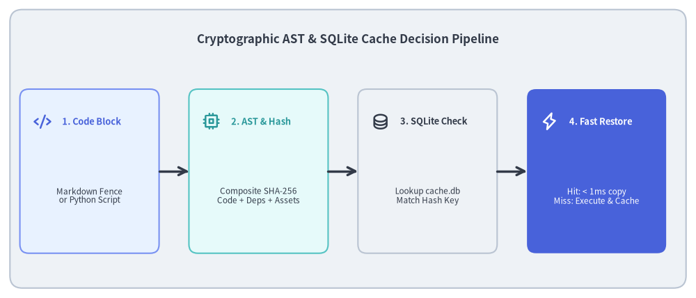
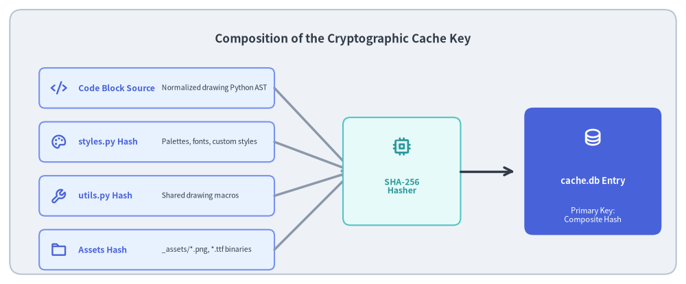

# SQLite Cache Engine & AST Analysis

A major friction point with "Documentation as Code" is compilation speed. If compiling an 80-page documentation site with 400 diagrams requires re-executing every Python script from scratch, build times exceed several minutes, destroying the rapid feedback loop required for interactive documentation authoring.

Drawlib solves this via a **cryptographic caching engine** (`_builder/_common/cache.py`) backed by an embedded SQLite database (`.drawlib/cache.db`), reducing incremental rebuild times to **< 1ms per diagram**.


<figure class="drawlib-image" style="text-align: center;">
  
  <figcaption class="drawlib-caption">Cryptographic AST & SQLite Cache Decision Pipeline</figcaption>
</figure>

<details class="drawlib-code-details">
<summary>Source Code</summary>

```python
from drawlib.canvas import save, setup
from drawlib.icons import phosphor
from drawlib.lines import line
from drawlib.shapes import rectangle
from drawlib.styles import Styles
from drawlib.text import text

setup(width=140, height=60)

rectangle((70, 30), width=136, height=56, style=Styles.Neutral.patch(shape_r=2.5))
text(
    (70, 52),
    "Cryptographic AST & SQLite Cache Decision Pipeline",
    style=Styles.DarkBold.patch(text_size=12.2),
)

nodes = [
    (18, "1. Code Block", "Markdown Fence\nor Python Script", phosphor.code, Styles.PrimaryNeutral, Styles.PrimaryBold),
    (52, "2. AST & Hash", "Composite SHA-256\nCode + Deps + Assets", phosphor.cpu, Styles.SecondaryNeutral, Styles.SecondaryBold),
    (86, "3. SQLite Check", "Lookup cache.db\nMatch Hash Key", phosphor.database, Styles.Neutral, Styles.DarkBold),
    (120, "4. Fast Restore", "Hit: < 1ms copy\nMiss: Execute & Cache", phosphor.lightning, Styles.PrimaryFlat, Styles.WhiteBold),
]

for x, title, desc, icon_func, card_style, icon_style in nodes:
    rectangle((x, 25.5), width=28, height=33, style=card_style.patch(shape_r=1.8))
    icon_func((x - 9.5, 35.5), width=3.6, style=icon_style)
    text((x - 5.5, 35.5), title, style=icon_style.patch(halign="left", text_size=9.2))
    sub_style = Styles.White if card_style == Styles.PrimaryFlat else Styles.Dark
    text((x, 20.5), desc, style=sub_style.patch(text_size=8.5))

for i in range(3):
    x_from = nodes[i][0] + 14.0
    x_to = nodes[i + 1][0] - 14.0
    line((x_from, 25.5), (x_to, 25.5), arrow_head="->", style=Styles.DarkBold)

save()
```

</details>


---

## 1. Concept: Cryptographic Content Hashing vs. Timestamp Invalidation

Traditional build tools (like `make` or file mtime watchers) rely on filesystem modification timestamps. This approach fails catastrophically for embedded documentation diagrams:
- Editing a single typographical error in a Markdown file updates the file's timestamp, which would unnecessarily force the re-rendering of all 10 diagrams on that page.
- Conversely, modifying an external imported theme (`styles.py`) might not touch the Markdown file at all, leaving diagrams stale.

### The Drawlib Solution: Multi-Factor Composite Hashing
Drawlib ignores filesystem timestamps entirely. Instead, it computes a **cryptographic SHA-256 composite hash** for every diagram block based on its true dependency tree:


<figure class="drawlib-image" style="text-align: center;">
  
  <figcaption class="drawlib-caption">Composition of the Cryptographic Cache Key</figcaption>
</figure>

<details class="drawlib-code-details">
<summary>Source Code</summary>

```python
from drawlib.canvas import save, setup
from drawlib.icons import phosphor
from drawlib.lines import line
from drawlib.shapes import rectangle
from drawlib.styles import Styles
from drawlib.text import text

setup(width=140, height=58)

rectangle((70, 29), width=136, height=54, style=Styles.Neutral.patch(shape_r=2.5))
text(
    (70, 50),
    "Composition of the Cryptographic Cache Key",
    style=Styles.DarkBold.patch(text_size=12.2),
)

# 4 Inputs on Left (X: 32)
inputs = [
    (38, "Code Block Source", "Normalized drawing Python AST", phosphor.code),
    (27, "styles.py Hash", "Palettes, fonts, custom styles", phosphor.palette),
    (16, "utils.py Hash", "Shared drawing macros", phosphor.wrench),
    (5, "Assets Hash", "_assets/*.png, *.ttf binaries", phosphor.folder),
]

for y, title, desc, icon_func in inputs:
    rectangle((32, y + 2), width=48, height=8.2, style=Styles.PrimaryNeutral.patch(shape_r=1.2))
    icon_func((12, y + 2), width=3.4, style=Styles.PrimaryBold)
    text((16, y + 2), title, style=Styles.PrimaryBold.patch(halign="left", text_size=8.8))
    text((33, y + 2), desc, style=Styles.Dark.patch(halign="left", text_size=7.5))
    line((56, y + 2), (72, 23), arrow_head="->", style=Styles.MutedBold)

# Center Hashing Function
rectangle((82, 23), width=24, height=22, style=Styles.SecondaryNeutral.patch(shape_r=1.5))
phosphor.cpu((82, 28), width=4.0, style=Styles.SecondaryBold)
text((82, 20), "SHA-256\nHasher", style=Styles.SecondaryBold.patch(text_size=8.8))

line((94, 23), (105, 23), arrow_head="->", style=Styles.DarkBold)

# Output Cache Key & SQLite Entry
rectangle((121, 23), width=28, height=26, style=Styles.PrimaryFlat.patch(shape_r=1.8))
phosphor.database((121, 30), width=4.0, style=Styles.WhiteBold)
text((121, 21), "cache.db Entry", style=Styles.WhiteBold.patch(text_size=9.2))
text((121, 14), "Primary Key:\nComposite Hash", style=Styles.White.patch(text_size=8.0))

save()
```

</details>


---

## 2. Positioning: Cache Engine in the Compilation Pipeline

The cache engine operates transparently between the Markdown block extractor and the drawing canvas:
1. **Extraction**: When `doc_builder` encounters a ````drawlib```` block, `DrawlibBlockProcessor` extracts the Python code and evaluates cache viability.
2. **Static AST Analysis**: Before executing any code, `image_builder.py` parses the AST to statically inspect `canvas.save("...")` invocations, detecting output file name conflicts across multiple documents without execution overhead.
3. **Dependency Hashing**: `_builder/_common/cache.py` computes SHA-256 hashes for:
   - The normalized drawing code.
   - Global configuration files (`styles.py` and `utils.py`).
   - Any local binary assets (`_assets/*.png`, `*.ttf`) discovered via string literal inspection.
4. **Database Query**: Queries `.drawlib/cache.db` using the computed composite key.
   - **Cache Hit**: Restores pre-rendered binary blobs directly from SQLite in **< 1ms**.
   - **Cache Miss**: Executes the Python block in an in-process sandbox, saves the generated images, and persists all format blobs into SQLite.

---

## 3. Details: SQLite Database Schema & Invalidation

### 3.1. Database Schema & Multi-Blob Storage
The cache database resides in `.drawlib/cache.db` with Write-Ahead Logging (`PRAGMA journal_mode=WAL;`) enabled for high-concurrency performance:

```sql
CREATE TABLE IF NOT EXISTS image_cache (
    cache_key TEXT PRIMARY KEY,
    code_hash TEXT NOT NULL,
    config_hash TEXT NOT NULL,
    png_blob BLOB,
    png_grid_blob BLOB,
    webp_blob BLOB,
    webp_grid_blob BLOB,
    total_size_bytes INTEGER NOT NULL,
    created_at TEXT NOT NULL,
    last_accessed_at TEXT NOT NULL
);
CREATE INDEX IF NOT EXISTS idx_image_cache_accessed ON image_cache (last_accessed_at);

CREATE TABLE IF NOT EXISTS cache_meta (
    key TEXT PRIMARY KEY,
    value TEXT NOT NULL
);
```

#### Dual Normal & Coordinate Grid Blobs
To support instantaneous previewing with coordinate grids (`uv run drawlib show page.md block.png -g`), Drawlib stores **four distinct blobs per cache key**:
1. `png_blob`: Standard production raster image.
2. `png_grid_blob`: Raster image with 10-unit/5-unit coordinate overlay grid for authoring.
3. `webp_blob`: Compressed modern web asset.
4. `webp_grid_blob`: Coordinate grid overlay compressed web asset.

### 3.2. Automatic 1 GiB LRU Eviction
To prevent cache bloat in large repositories:
- `total_size_bytes` tracks the exact byte footprint of each record.
- When total cache size exceeds **1 GiB** (`1,073,741,824 bytes`), `BuildImageCache` triggers an automatic **LRU (Least Recently Used) prune**, deleting the oldest 50% of entries sorted by `last_accessed_at`.

### 3.3. Cache Invalidation Triggers
A diagram is invalidated and re-rendered only when:
- The Python code within the code fence is modified.
- Target canvas dimensions (`width`, `height`, or `dpi`) change.
- `styles.py` or `utils.py` is edited.
- Any referenced asset file in `_assets/` (e.g. a company logo or font file) is changed.

### 3.4. Cache Management CLI
Developers and CI runners can inspect and prune the cache via the CLI:
```bash
uv run drawlib cache list            # Display cache statistics and total stored assets
uv run drawlib cache clear --images  # Purge all rendered diagram blobs
uv run drawlib cache clear --all     # Complete reset of database and downloaded assets
```

Next, proceed to Chapter 3: **[Primitives & Backends](../03_domain_subsystems/01_primitives_and_backends.md)**.

