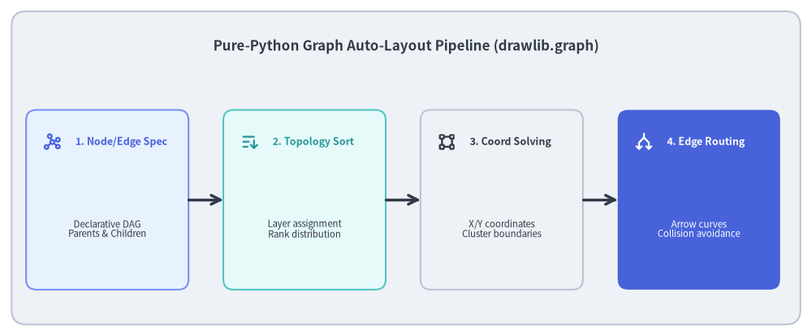
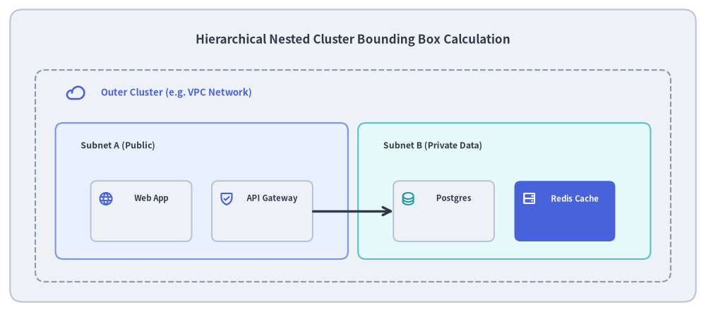

# Declarative Graph Auto-Layout Engine (drawlib.graph)

Visualizing microservices topologies, data pipelines, and cluster networks manually requires calculating dozens of node coordinates and arrow trajectories. However, traditional graph visualization tools (like Graphviz or Cytoscape) rely on heavy external binary runtimes (C/C++ binaries, Java, or Node.js) that complicate CI/CD pipelines and cannot be customized with Python styling tokens.

To solve this, Drawlib includes `drawlib.graph`: a **pure-Python declarative graph auto-layout engine** that calculates topological coordinates, nested cluster boundaries, and edge routing in-memory without external dependencies.


<figure class="drawlib-image" style="text-align: center;">
  
  <figcaption class="drawlib-caption">Pure-Python Graph Auto-Layout Pipeline (drawlib.graph)</figcaption>
</figure>

<details class="drawlib-code-details">
<summary>Source Code</summary>

```python
from drawlib.canvas import save, setup
from drawlib.icons import phosphor
from drawlib.lines import line
from drawlib.shapes import rectangle
from drawlib.styles import Styles
from drawlib.text import text

setup(width=140, height=58)

rectangle((70, 29), width=136, height=54, style=Styles.Neutral.patch(shape_r=2.5))
text(
    (70, 50),
    "Pure-Python Graph Auto-Layout Pipeline (drawlib.graph)",
    style=Styles.DarkBold.patch(text_size=12.2),
)

stages = [
    (18.5, "1. Node/Edge Spec", "Declarative DAG\nParents & Children", phosphor.graph, Styles.PrimaryNeutral, Styles.PrimaryBold),
    (52.5, "2. Topology Sort", "Layer assignment\nRank distribution", phosphor.sort_ascending, Styles.SecondaryNeutral, Styles.SecondaryBold),
    (86.5, "3. Coord Solving", "X/Y coordinates\nCluster boundaries", phosphor.bounding_box, Styles.Neutral, Styles.DarkBold),
    (120.5, "4. Edge Routing", "Arrow curves\nCollision avoidance", phosphor.arrows_split, Styles.PrimaryFlat, Styles.WhiteBold),
]

for x, title, desc, icon_func, card_style, icon_style in stages:
    rectangle((x, 23.5), width=28, height=31, style=card_style.patch(shape_r=1.8))
    icon_func((x - 9.5, 33.5), width=3.4, style=icon_style)
    text((x - 5.5, 33.5), title, style=icon_style.patch(halign="left", text_size=9.0))
    sub_style = Styles.White if card_style == Styles.PrimaryFlat else Styles.Dark
    text((x, 18.5), desc, style=sub_style.patch(text_size=8.2))

for i in range(3):
    x_from = stages[i][0] + 14.0
    x_to = stages[i + 1][0] - 14.0
    line((x_from, 23.5), (x_to, 23.5), arrow_head="->", style=Styles.DarkBold)

save()
```

</details>


---

## 1. Concept: Pure-Python Declarative Graph Layout

Instead of writing graph descriptions in external domain-specific languages (e.g. Graphviz DOT files), `drawlib.graph` allows developers to define nodes, edges, and clusters using native Python syntax:

```python
from drawlib.graph import LayerGraph

g = LayerGraph((10, 10), width=100, height=40, direction="LR")
g.add_node("client", "Web Browser")
g.add_node("gateway", "API Gateway")
g.add_node("service", "Auth Service")
g.add_edge("client", "gateway")
g.add_edge("gateway", "service")
g.draw()
```

### Key Advantages:
- **No External Binaries**: Runs anywhere standard Python runs—including lightweight Docker alpine images and air-gapped CI environments.
- **Unified Visual Styling**: Graph nodes and edges accept standard Drawlib `Style` tokens (`Styles.PrimaryFlat`, `Styles.Neutral`), ensuring aesthetic parity with hand-crafted diagrams.
- **Deterministic Coordinate Mapping**: The solved coordinates can be extracted and composed alongside hand-drawn callouts, legends, and icons.

---

## 2. Positioning: The 5 Graph Layout Engines

All solvers in `drawlib.graph` inherit from the abstract base class `BaseGraph(ABC)` (`_common/_base.py`). `BaseGraph` defines the standard lifecycle:
1. **Specification Phase**: Registering nodes (`add_node()`), edges (`add_edge()`), and nested boundaries (`add_cluster()` or `container()`).
2. **Solve Phase (`calc()`)**: Returns an immutable `GraphLayout` dataclass containing absolute node centroids, cluster bounds, and polyline edge waypoints.
3. **Render Phase (`draw(xy)`)**: Renders artists to the canvas offset by `(x0, y0)`, or serializes to standalone Python code (`export_code()`).

`drawlib.graph` provides **five specialized layout solvers**:

1. **`LayerGraph` (Ranked DAG Layout)**:
   - Uses an adapted Sugiyama-style layering algorithm:
     - Assigns nodes to horizontal or vertical layers (ranks) based on topological sorting and longest-path analysis.
     - Orders nodes within each layer to minimize edge crossings.
     - Solves coordinate positions and projects orthogonal or curved connecting arrows.
2. **`ArchitectureGraph` (2-Level Macro/Micro Compound Topology)**:
   - Specialized layout solver designed for cloud architectures and distributed microservices.
   - Solves layouts across two coupled geometric tiers:
     - **Macro Level**: Arranges top-level containers (VPCs, AWS/GCP regions, client tiers, SaaS services) along the macro flow direction (`LR` or `TB`).
     - **Micro Level**: Automatically arranges internal services, subnets, and databases within their respective container boundaries.
     - Automatically routes cross-container connections with collision-avoiding orthogonal clearance paths.
3. **`TreeGraph` (Hierarchical Directory / Org Layout)**:
   - Optimized for single-parent trees, directory trees, and organizational hierarchies.
   - Computes subtree widths recursively to prevent node overlaps.
4. **`RadialGraph` (Central Hub & Spoke Layout)**:
   - Distributes peripheral nodes in concentric angular orbits around a central hub.
5. **`GridGraph` (Matrix / Cluster Topology)**:
   - Aligns nodes on a 2D coordinate grid with configurable column and row gaps.

---

## 3. Details: ArchitectureGraph & 2-Level Compound Layout

### 3.1. The Macro/Micro Compound Layout Problem
Traditional graph algorithms (like standard Sugiyama layering or force-directed placement) treat all nodes and clusters homogeneously. In cloud architecture diagrams, this creates severe layout failure modes:
- Subnets inside a VPC become stretched across distant columns to align with unrelated external nodes.
- High-level containers collapse or overlap because the solver lacks hierarchical rank separation.

### 3.2. Two-Stage Decomposition in `ArchitectureGraph`
`ArchitectureGraph` (`_architecture/_solver.py`) resolves this via **two-stage geometric decomposition**:
1. **Container Abstraction**: Top-level containers (e.g. `Client Zone`, `VPC`, `External SaaS`) are treated as macro nodes in an overarching container dependency DAG.
2. **Micro Layout & Dimension Solving**: Inside each container, child nodes are resolved locally. The container's intrinsic bounding box is calculated using bottom-up envelope expansion:
   $$\text{width}_{\text{container}} = \max(x_1) - \min(x_0) + 2 \times \text{padding}$$
3. **Macro Positioning & Flow**: Containers are positioned sequentially along the macro axis (`direction="LR"` or `"TB"`), respecting inter-container dependencies and user-configured `container_sep`.
4. **Global Edge Routing**: Edges crossing container boundaries calculate entry and exit boundary anchor points, routing cleanly through inter-container channels.

---

## 4. Details: Nested Cluster Boundary Computation

A standout architectural capability of `drawlib.graph` is **automatic recursive cluster boundary expansion**:


<figure class="drawlib-image" style="text-align: center;">
  
  <figcaption class="drawlib-caption">Hierarchical Nested Cluster Bounding Box Calculation</figcaption>
</figure>

<details class="drawlib-code-details">
<summary>Source Code</summary>

```python
from drawlib.canvas import save, setup
from drawlib.icons import phosphor
from drawlib.lines import line
from drawlib.shapes import rectangle
from drawlib.styles import Styles
from drawlib.text import text

setup(width=140, height=62)

rectangle((70, 31), width=136, height=58, style=Styles.Neutral.patch(shape_r=2.5))
text(
    (70, 54),
    "Hierarchical Nested Cluster Bounding Box Calculation",
    style=Styles.DarkBold.patch(text_size=12.2),
)

# Outer Cluster (VPC)
rectangle((70, 27), width=126, height=42, style=Styles.MutedDashed.patch(shape_r=2.0))
phosphor.cloud((15, 43.5), width=3.8, style=Styles.PrimaryBold)
text((20, 43.5), "Outer Cluster (e.g. VPC Network)", style=Styles.PrimaryBold.patch(halign="left", text_size=9.5))

# Inner Cluster 1 (Public Subnet)
rectangle((40, 24), width=58, height=27, style=Styles.PrimaryNeutral.patch(shape_r=1.5))
text((16, 33), "Subnet A (Public)", style=Styles.DarkBold.patch(halign="left", text_size=8.8))

rectangle((28, 20), width=20, height=12, style=Styles.Neutral.patch(shape_r=1.2))
phosphor.globe((21, 22.5), width=3.0, style=Styles.PrimaryBold)
text((30, 22.5), "Web App", style=Styles.DarkBold.patch(text_size=8.2))

rectangle((52, 20), width=20, height=12, style=Styles.Neutral.patch(shape_r=1.2))
phosphor.shield_check((45, 22.5), width=3.0, style=Styles.PrimaryBold)
text((54, 22.5), "API Gateway", style=Styles.DarkBold.patch(text_size=8.2))

# Inner Cluster 2 (Private Subnet)
rectangle((100, 24), width=58, height=27, style=Styles.SecondaryNeutral.patch(shape_r=1.5))
text((76, 33), "Subnet B (Private Data)", style=Styles.DarkBold.patch(halign="left", text_size=8.8))

rectangle((88, 20), width=20, height=12, style=Styles.Neutral.patch(shape_r=1.2))
phosphor.database((81, 22.5), width=3.0, style=Styles.SecondaryBold)
text((90, 22.5), "Postgres", style=Styles.DarkBold.patch(text_size=8.2))

rectangle((112, 20), width=20, height=12, style=Styles.PrimaryFlat.patch(shape_r=1.2))
phosphor.hard_drives((105, 22.5), width=3.0, style=Styles.WhiteBold)
text((114, 22.5), "Redis Cache", style=Styles.WhiteBold.patch(text_size=8.2))

# Connecting line between clusters
line((62, 20), (78, 20), arrow_head="->", style=Styles.DarkBold)

save()
```

</details>


### Bottom-Up Geometric Solving
When clusters contain child nodes or sub-clusters:
1. **Leaf Node Positioning**: Leaf nodes are positioned first within their local rank coordinate space.
2. **Cluster Bounding Box Calculation**: The enclosing cluster iterates over all member bounding boxes to compute the minimum enclosing envelope:
   $$x_0 = \min_{i}(x_{0,i}) - \text{padding}$$
   $$y_0 = \min_{i}(y_{0,i}) - \text{padding}$$
   $$\text{width} = \max_{i}(x_{1,i}) - x_0 + \text{padding}$$
   $$\text{height} = \max_{i}(y_{1,i}) - y_0 + \text{padding}$$
3. **Parent Propagation**: Parent clusters recursively absorb child cluster envelopes, rendering grouped cloud topologies with balanced padding and zero boundary collisions.

Next, proceed to Chapter 4: **[Compilation Pipeline](../04_doc_builder_and_compiler/01_compilation_pipeline.md)**.

