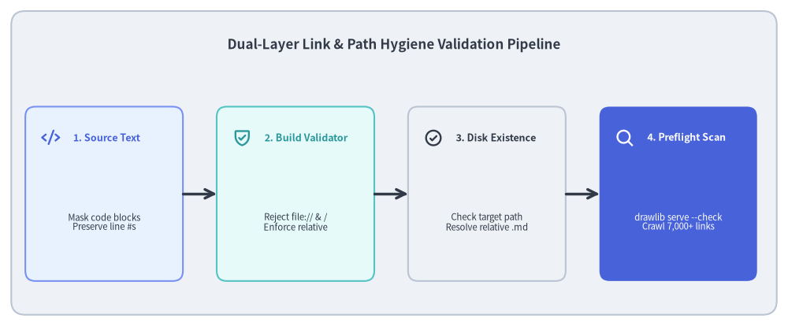
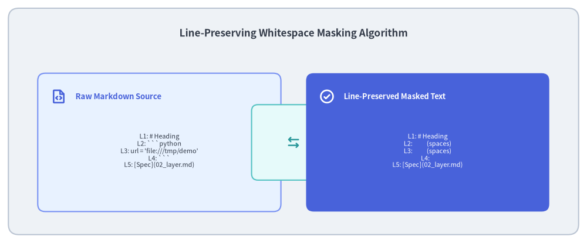

# Link Scanner & Preflight Quality Validation

Technical documentation is only as reliable as its cross-references. In large documentation projects spanning dozens of pages and thousands of links, broken hyperlinks, missing asset files, and accidental local filesystem leaks (`file:///home/user/...`) severely compromise quality and portability.

Drawlib enforces link integrity through a **Dual-Layer Validation Pipeline**: a build-time Markdown link linter (`compiler/base.py`) combined with a preflight recursive HTML link crawler (`_http_server/_link_scanner.py`).


<figure class="drawlib-image" style="text-align: center;">
  
  <figcaption class="drawlib-caption">Dual-Layer Link & Path Hygiene Validation Pipeline</figcaption>
</figure>

<details class="drawlib-code-details">
<summary>Source Code</summary>

```python
from drawlib.canvas import save, setup
from drawlib.icons import phosphor
from drawlib.lines import line
from drawlib.shapes import rectangle
from drawlib.styles import Styles
from drawlib.text import text

setup(width=140, height=58)

rectangle((70, 29), width=136, height=54, style=Styles.Neutral.patch(shape_r=2.5))
text(
    (70, 50),
    "Dual-Layer Link & Path Hygiene Validation Pipeline",
    style=Styles.DarkBold.patch(text_size=12.2),
)

steps = [
    (18.5, "1. Source Text", "Mask code blocks\nPreserve line #s", phosphor.code, Styles.PrimaryNeutral, Styles.PrimaryBold),
    (52.5, "2. Build Validator", "Reject file:// & /\nEnforce relative", phosphor.shield_check, Styles.SecondaryNeutral, Styles.SecondaryBold),
    (86.5, "3. Disk Existence", "Check target path\nResolve relative .md", phosphor.check_circle, Styles.Neutral, Styles.DarkBold),
    (120.5, "4. Preflight Scan", "drawlib serve --check\nCrawl 7,000+ links", phosphor.magnifying_glass, Styles.PrimaryFlat, Styles.WhiteBold),
]

for x, title, desc, icon_func, card_style, icon_style in steps:
    rectangle((x, 23.5), width=28, height=31, style=card_style.patch(shape_r=1.8))
    icon_func((x - 9.5, 33.5), width=3.4, style=icon_style)
    text((x - 5.5, 33.5), title, style=icon_style.patch(halign="left", text_size=9.0))
    sub_style = Styles.White if card_style == Styles.PrimaryFlat else Styles.Dark
    text((x, 18.5), desc, style=sub_style.patch(text_size=8.2))

for i in range(3):
    x_from = steps[i][0] + 14.0
    x_to = steps[i + 1][0] - 14.0
    line((x_from, 23.5), (x_to, 23.5), arrow_head="->", style=Styles.DarkBold)

save()
```

</details>


---

## 1. Concept: The Dangers of Absolute Paths and `file://` Schemes

When authors write documentation—especially with AI coding assistants that use `file:///absolute/path` links for clickable IDE navigation in chat—local filesystem URLs can inadvertently leak into committed Markdown files:
- `[Design Plan](file:///home/developer/git/repo/plan.md)` works perfectly on the author's workstation.
- When pushed to GitHub or deployed as a public static site, every external user and CI runner gets an inaccessible broken link.
- Absolute paths also reveal private workstation directory structures, posing an information disclosure risk.

### The Drawlib Invariant
All intra-documentation links and asset references must be **strictly relative** (e.g. `../02_architecture/overview.md` or `_assets/logo.png`). Drawlib rejects absolute paths and `file://` URLs at build time with zero tolerance.

---

## 2. Positioning: Dual-Layer Validation Architecture

Drawlib validates link hygiene at two complementary stages:

1. **Layer 1: Build-Time Markdown Validator (`validate_markdown_links`)**:
   - Operates on raw Markdown source files during `drawlib build` (HTML, Markdown, and PDF).
   - Scans Markdown links (`[text](url)`) and image tags (`! [alt](url)`).
   - Aborts compilation immediately with exact line numbers if an invalid target is found.
2. **Layer 2: Preflight HTML Link Crawler (`drawlib serve --check`)**:
   - Operates on generated HTML output trees (`docs_html/`).
   - Parses compiled `<a href="...">` and `` tags.
   - Verifies that target files exist on disk, anchors (`#section`) resolve to valid DOM IDs, and zero broken links exist across the entire site.


<figure class="drawlib-image" style="text-align: center;">
  
  <figcaption class="drawlib-caption">Line-Preserving Whitespace Masking Algorithm</figcaption>
</figure>

<details class="drawlib-code-details">
<summary>Source Code</summary>

```python
from drawlib.canvas import save, setup
from drawlib.icons import phosphor
from drawlib.lines import line
from drawlib.shapes import rectangle
from drawlib.styles import Styles
from drawlib.text import text

setup(width=140, height=58)

rectangle((70, 29), width=136, height=54, style=Styles.Neutral.patch(shape_r=2.5))
text(
    (70, 50),
    "Line-Preserving Whitespace Masking Algorithm",
    style=Styles.DarkBold.patch(text_size=12.2),
)

# Left Column: Raw Markdown with Code Block
rectangle((38, 24), width=58, height=33, style=Styles.PrimaryNeutral.patch(shape_r=1.8))
phosphor.file_code((14, 35), width=3.8, style=Styles.PrimaryBold)
text((18, 35), "Raw Markdown Source", style=Styles.PrimaryBold.patch(halign="left", text_size=9.5))
text(
    (38, 22),
    "L1: # Heading\nL2: ```python\nL3: url = 'file:///tmp/demo'\nL4: ```\nL5: [Spec](02_layer.md)",
    style=Styles.Dark.patch(text_size=7.8),
)

# Center: Space Masking Transform
rectangle((70, 24), width=20, height=18, style=Styles.SecondaryNeutral.patch(shape_r=1.5))
phosphor.arrows_left_right((70, 24), width=3.6, style=Styles.SecondaryBold)

# Right Column: Line-Preserved Masked Text
rectangle((102, 24), width=58, height=33, style=Styles.PrimaryFlat.patch(shape_r=1.8))
phosphor.check_circle((78, 35), width=3.8, style=Styles.WhiteBold)
text((82, 35), "Line-Preserved Masked Text", style=Styles.WhiteBold.patch(halign="left", text_size=9.2))
text(
    (102, 22),
    "L1: # Heading\nL2:            (spaces)\nL3:            (spaces)\nL4:    \nL5: [Spec](02_layer.md)",
    style=Styles.White.patch(text_size=7.8),
)

save()
```

</details>


---

## 3. Details: The Line-Preserving Whitespace Masking Algorithm

A common pitfall when linting Markdown links is that code blocks often contain code examples referencing URLs or filesystem paths (e.g. ````python file:///tmp/test.png ````), which must **not** be flagged as errors.

However, simply stripping code blocks with regex alters the total number of lines, causing error messages to report misleading line numbers.

### Drawlib's Non-Destructive Masking Solution
Before running the link pattern scanner, `compiler/base.py` replaces every character inside fenced code blocks and inline code spans with **whitespace spaces**, while strictly preserving newline characters (`\n`):

```python
def _mask_code_blocks(text: str) -> str:
    def replacer(match: re.Match) -> str:
        s = match.group(0)
        return "".join("\n" if c == "\n" else " " for c in s)

    # Mask multiline code blocks (```...``` and ~~~...~~~)
    masked = re.sub(r"(```[\s\S]*?```|~~~[\s\S]*?~~~)", replacer, text)
    # Mask inline code spans (`...`)
    return re.sub(r"(`[^`\n]+`)", replacer, masked)
```

Because newlines are preserved, line numbers calculated via `splitlines()` match the physical Markdown file **1-to-1**:
- Links inside prose are scanned accurately.
- Examples inside Python code fences are safely ignored.
- Build errors point directly to the exact source line in the author's editor.

Next, proceed to Chapter 5: **[CLI Architecture](../05_cli_and_runtime/01_cli_architecture.md)**.
