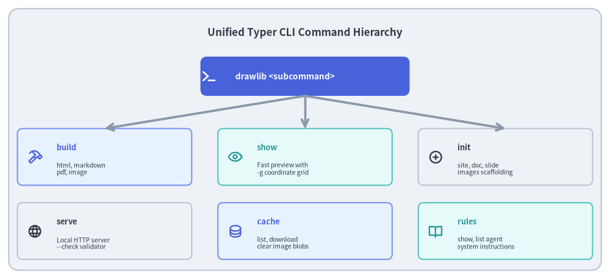
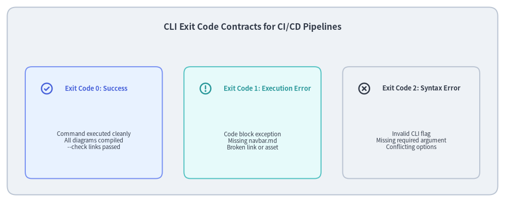

# Unified CLI Architecture (drawlib._cli)

A command-line interface serves as the primary bridge between developers, automated CI/CD runners, AI coding agents, and the underlying drawing and compilation engines. If a CLI lacks structured error reporting, predictable exit codes, or intuitive argument discovery, automation becomes fragile and difficult to maintain.

Drawlib's CLI (`_cli/`) is built on **Typer + Rich**, providing a unified, type-safe command hierarchy with explicit exit code contracts and interactive visual diagnostics.


<figure class="drawlib-image" style="text-align: center;">
  
  <figcaption class="drawlib-caption">Unified Typer CLI Command Hierarchy</figcaption>
</figure>

<details class="drawlib-code-details">
<summary>Source Code</summary>

```python
from drawlib.canvas import save, setup
from drawlib.icons import phosphor
from drawlib.lines import line
from drawlib.shapes import rectangle
from drawlib.styles import Styles
from drawlib.text import text

setup(width=140, height=64)

rectangle((70, 32), width=136, height=60, style=Styles.Neutral.patch(shape_r=2.5))
text(
    (70, 56.5),
    "Unified Typer CLI Command Hierarchy",
    style=Styles.DarkBold.patch(text_size=12.2),
)

# Root Command at Top
rectangle((70, 46.5), width=48, height=9, style=Styles.PrimaryFlat.patch(shape_r=1.5))
phosphor.terminal((48, 46.5), width=3.8, style=Styles.WhiteBold)
text((54, 46.5), "drawlib <subcommand>", style=Styles.WhiteBold.patch(halign="left", text_size=9.8))

# 6 Subcommands in Grid
commands = [
    (24, 28, "build", "html, markdown\npdf, image", phosphor.hammer, Styles.PrimaryNeutral, Styles.PrimaryBold),
    (70, 28, "show", "Fast preview with\n-g coordinate grid", phosphor.eye, Styles.SecondaryNeutral, Styles.SecondaryBold),
    (116, 28, "init", "site, doc, slide\nimages scaffolding", phosphor.plus_circle, Styles.Neutral, Styles.DarkBold),
    (24, 11, "serve", "Local HTTP server\n--check validator", phosphor.globe, Styles.Neutral, Styles.DarkBold),
    (70, 11, "cache", "list, download\nclear image blobs", phosphor.database, Styles.PrimaryNeutral, Styles.PrimaryBold),
    (116, 11, "rules", "show, list agent\nsystem instructions", phosphor.book_open, Styles.SecondaryNeutral, Styles.SecondaryBold),
]

for x, y, cmd, desc, icon_func, card_style, icon_style in commands:
    rectangle((x, y), width=40, height=13, style=card_style.patch(shape_r=1.2))
    icon_func((x - 16, y), width=3.4, style=icon_style)
    text((x - 11, y + 2.2), cmd, style=icon_style.patch(halign="left", text_size=9.2))
    text((x - 11, y - 2.8), desc, style=Styles.Dark.patch(halign="left", text_size=7.5))
    line((70, 42), (x, 34.5), arrow_head="->", style=Styles.MutedBold)

save()
```

</details>


---

## 1. Concept: Type-Safe Command Dispatching

Instead of manual `argparse` dispatching with loose strings, Drawlib utilizes **Typer**, harnessing Python type hints for CLI arguments:
- Parameters annotated with `Path` automatically resolve relative paths and verify filesystem existence.
- Flag options annotated with `bool` generate synchronized positive and negative flags (e.g. `--cache / --no-cache`, `--check / --no-check`).
- Dynamic Shell Autocompletion: Shell completion scripts for Bash, Zsh, and Fish are generated natively via Typer.

---

## 2. Positioning: The Six Core Subcommands

Drawlib exposes six primary command groups:

| Subcommand | Primary Purpose | Key Flags & Arguments |
| :--- | :--- | :--- |
| **`build`** | Multi-target project compiler (`html`, `markdown`, `pdf`, `image`). | `-o/--output-dir`, `-s/--styles`, `-u/--utils`, `--no-cache`. |
| **`show`** | Headless single-diagram exporter with fast visual inspection. | `-g/--grid` (draws coordinate grid), `-o/--output`. |
| **`init`** | Project scaffolding for 4 archetypes (`site`, `doc`, `slide`, `images`). | `-l/--lang ja`, `-s/--style default\|google\|monochrome`. |
| **`serve`** | Threaded local preview server with preflight validation. | `-p/--port 8000`, `--check` (link crawl without serving). |
| **`cache`** | Inspection and pruning of `.drawlib/cache.db`. | `list`, `clear --images`, `clear --all`, `download --all`. |
| **`rules`** | Embedded AI agent instructions and API manuals. | `list`, `show <rule_name>` (`overview`, `style-guide`, etc.). |

---

## 3. Details: Exit Code Contracts for CI/CD Automation

In CI/CD environments (GitHub Actions, GitLab CI, pre-commit hooks), exit codes are the universal contract determining pipeline success or failure:


<figure class="drawlib-image" style="text-align: center;">
  
  <figcaption class="drawlib-caption">CLI Exit Code Contracts for CI/CD Pipelines</figcaption>
</figure>

<details class="drawlib-code-details">
<summary>Source Code</summary>

```python
from drawlib.canvas import save, setup
from drawlib.icons import phosphor
from drawlib.shapes import rectangle
from drawlib.styles import Styles
from drawlib.text import text

setup(width=140, height=56)

rectangle((70, 28), width=136, height=52, style=Styles.Neutral.patch(shape_r=2.5))
text(
    (70, 48.5),
    "CLI Exit Code Contracts for CI/CD Pipelines",
    style=Styles.DarkBold.patch(text_size=12.2),
)

codes = [
    (26, "Exit Code 0: Success", "Command executed cleanly\nAll diagrams compiled\n--check links passed", Styles.PrimaryNeutral, Styles.PrimaryBold, phosphor.check_circle),
    (70, "Exit Code 1: Execution Error", "Code block exception\nMissing navbar.md\nBroken link or asset", Styles.SecondaryNeutral, Styles.SecondaryBold, phosphor.warning_circle),
    (114, "Exit Code 2: Syntax Error", "Invalid CLI flag\nMissing required argument\nConflicting options", Styles.Neutral, Styles.DarkBold, phosphor.x_circle),
]

for x, title, desc, card_style, icon_style, icon_func in codes:
    rectangle((x, 22), width=38, height=31, style=card_style.patch(shape_r=1.8))
    icon_func((x - 13, 31.5), width=3.8, style=icon_style)
    text((x - 8, 31.5), title, style=icon_style.patch(halign="left", text_size=9.2))
    text((x, 17), desc, style=Styles.Dark.patch(text_size=8.2))

save()
```

</details>


### Exit Code Guarantees
- **`0` (Success)**: Compilation completed cleanly, all embedded Python drawing code executed without errors, and all link checks passed.
- **`1` (Execution Failure)**: A Python exception occurred inside a drawing block, a required file (e.g. `navbar.md`) was missing, or `drawlib serve --check` discovered broken links or forbidden absolute paths.
- **`2` (Usage / Syntax Error)**: The user or agent provided invalid CLI arguments or unrecognized option flags.

Next, explore the preview server and tooling in **[Preview Server & Tooling](02_preview_server.md)**.
