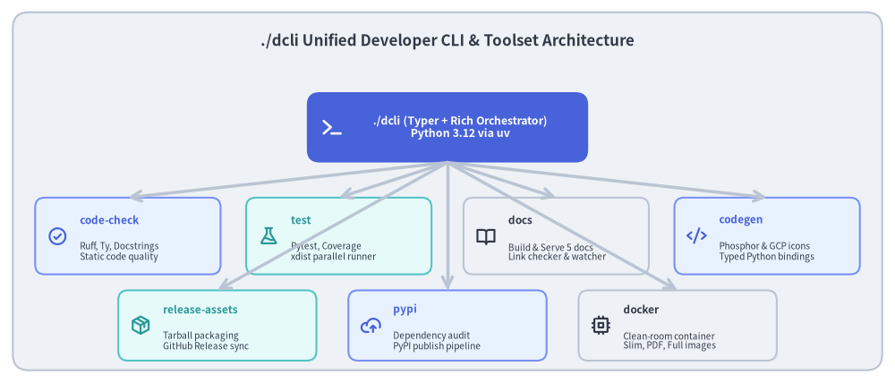
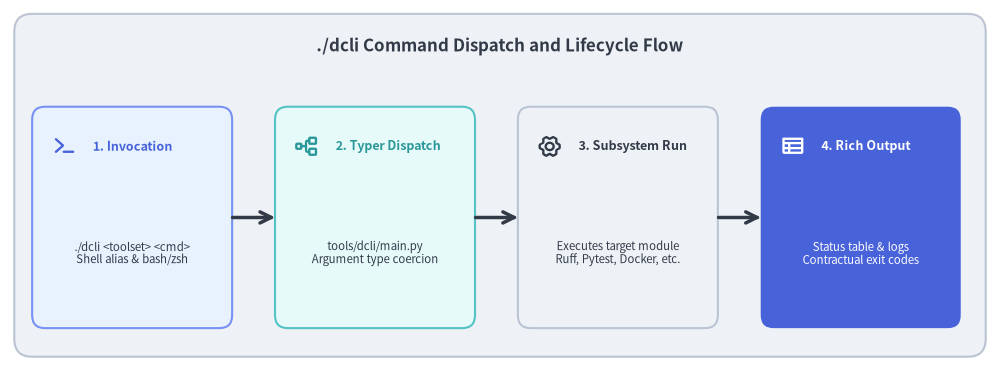

# Developer Tooling: The ./dcli Unified Orchestrator

The Drawlib repository avoids fragmented bash scripts, undocumented flags, and manual multi-tool handoffs by consolidating all engineering operations into a single custom CLI: `./dcli`.


<figure class="drawlib-image" style="text-align: center;">
  
  <figcaption class="drawlib-caption">./dcli Unified Orchestrator Architecture</figcaption>
</figure>

<details class="drawlib-code-details">
<summary>Source Code</summary>

```python
from drawlib.canvas import save, setup
from drawlib.icons import phosphor
from drawlib.lines import line
from drawlib.shapes import rectangle
from drawlib.styles import Styles
from drawlib.text import text

setup(width=140, height=60)

rectangle((70, 30), width=136, height=56, style=Styles.Neutral.patch(shape_r=2.5))
text(
    (70, 53.5),
    "./dcli Unified Developer CLI & Toolset Architecture",
    style=Styles.DarkBold.patch(text_size=12.2),
)

# Central CLI dispatcher
rectangle((70, 40), width=44, height=11, style=Styles.PrimaryFlat.patch(shape_r=2.0))
phosphor.terminal((52, 40), width=3.8, style=Styles.WhiteBold)
text((72, 40), "./dcli (Typer + Rich Orchestrator)\nPython 3.12 via uv", style=Styles.WhiteBold.patch(text_size=8.8))

# 7 Toolsets
row1 = [
    (20, "code-check", "Ruff, Ty, Docstrings\nStatic code quality", phosphor.check_circle, Styles.PrimaryNeutral, Styles.PrimaryBold),
    (53, "test", "Pytest, Coverage\nxdist parallel runner", phosphor.flask, Styles.SecondaryNeutral, Styles.SecondaryBold),
    (87, "docs", "Build & Serve 5 docs\nLink checker & watcher", phosphor.book_open, Styles.Neutral, Styles.DarkBold),
    (120, "codegen", "Phosphor & GCP icons\nTyped Python bindings", phosphor.code, Styles.PrimaryNeutral, Styles.PrimaryBold),
]

row2 = [
    (34, "release-assets", "Tarball packaging\nGitHub Release sync", phosphor.package, Styles.SecondaryNeutral, Styles.SecondaryBold),
    (70, "pypi", "Dependency audit\nPyPI publish pipeline", phosphor.cloud_arrow_up, Styles.PrimaryNeutral, Styles.PrimaryBold),
    (106, "docker", "Clean-room container\nSlim, PDF, Full images", phosphor.cpu, Styles.Neutral, Styles.DarkBold),
]

for x, title, desc, icon_func, card_style, icon_style in row1:
    rectangle((x, 23), width=29, height=12, style=card_style.patch(shape_r=1.5))
    icon_func((x - 11, 23), width=3.2, style=icon_style)
    text((x - 7.5, 25.5), title, style=icon_style.patch(halign="left", text_size=8.5))
    text((x - 7.5, 20.5), desc, style=Styles.Dark.patch(halign="left", text_size=7.2))
    line((70, 34.5), (x, 29), arrow_head="->", style=Styles.NeutralBold)

for x, title, desc, icon_func, card_style, icon_style in row2:
    rectangle((x, 9), width=31, height=11, style=card_style.patch(shape_r=1.5))
    icon_func((x - 12, 9), width=3.2, style=icon_style)
    text((x - 8.5, 11.5), title, style=icon_style.patch(halign="left", text_size=8.5))
    text((x - 8.5, 6.5), desc, style=Styles.Dark.patch(halign="left", text_size=7.2))
    line((70, 34.5), (x, 14.5), arrow_head="->", style=Styles.NeutralBold)

save()
```

</details>


---

## 1. Concept: The Unified Developer CLI Pattern

In complex software repositories, developers and AI coding agents routinely execute dozens of distinct tool commands:
- Static analysis: `ruff check`, `ruff format`, `ty check`, docstring linters.
- Test suites: `pytest`, coverage analyzers, parallel test dispatchers (`pytest -n auto`).
- Document compilers: building multi-page HTML sites, vector PDFs, presentation slides, and standalone README graphics.
- Asset pipelines: downloading font archives, generating icon bindings from JSON schemas, and uploading release tarballs.
- Packaging: dependency updates, semantic version auditing, and PyPI publishing.

When these operations are implemented as ad-hoc shell scripts or bare terminal commands, three points of friction inevitably emerge:
1. **Command Drift & Tribal Knowledge**: Different contributors run different flags, leading to "works on my machine" failures during CI.
2. **AI Agent Tool Fragility**: Coding agents must guess complex multi-flag CLI invocations rather than calling standardized tasks.
3. **Execution Latency**: Without centralized orchestration, commands lack unified logging, exit code handling, and Tab autocompletion.

`./dcli` solves this by introducing a **Unified CLI Architecture** built on Python 3.12, Typer, and Rich, residing directly in `tools/dcli/`.

---

## 2. Positioning: The Single Entrypoint for Repository Operations

Within Drawlib's repository structure, `./dcli` acts as the root operational interface, sitting alongside `src/drawlib/`, `tests/`, and `docs/`:


<figure class="drawlib-image" style="text-align: center;">
  
  <figcaption class="drawlib-caption">./dcli Command Dispatch and Execution Lifecycle</figcaption>
</figure>

<details class="drawlib-code-details">
<summary>Source Code</summary>

```python
from drawlib.canvas import save, setup
from drawlib.icons import phosphor
from drawlib.lines import line
from drawlib.shapes import rectangle
from drawlib.styles import Styles
from drawlib.text import text

setup(width=140, height=52)

rectangle((70, 26), width=136, height=48, style=Styles.Neutral.patch(shape_r=2.5))
text(
    (70, 45.5),
    "./dcli Command Dispatch and Lifecycle Flow",
    style=Styles.DarkBold.patch(text_size=12.2),
)

steps = [
    (18.5, "1. Invocation", "./dcli <toolset> <cmd>\nShell alias & bash/zsh", phosphor.terminal, Styles.PrimaryNeutral, Styles.PrimaryBold),
    (52.5, "2. Typer Dispatch", "tools/dcli/main.py\nArgument type coercion", phosphor.tree_structure, Styles.SecondaryNeutral, Styles.SecondaryBold),
    (86.5, "3. Subsystem Run", "Executes target module\nRuff, Pytest, Docker, etc.", phosphor.gear_six, Styles.Neutral, Styles.DarkBold),
    (120.5, "4. Rich Output", "Status table & logs\nContractual exit codes", phosphor.table, Styles.PrimaryFlat, Styles.WhiteBold),
]

for x, title, desc, icon_func, card_style, icon_style in steps:
    rectangle((x, 21.5), width=28, height=31, style=card_style.patch(shape_r=1.8))
    icon_func((x - 9.5, 31.5), width=3.4, style=icon_style)
    text((x - 5.5, 31.5), title, style=icon_style.patch(halign="left", text_size=9.0))
    sub_style = Styles.White if card_style == Styles.PrimaryFlat else Styles.Dark
    text((x, 16.5), desc, style=sub_style.patch(text_size=8.2))

for i in range(3):
    x_from = steps[i][0] + 14.0
    x_to = steps[i + 1][0] - 14.0
    line((x_from, 21.5), (x_to, 21.5), arrow_head="->", style=Styles.DarkBold)

save()
```

</details>


Every operational task is assigned to one of seven specialized sub-toolsets:

| Toolset | Module (`tools/dcli/`) | Primary Responsibility |
| :--- | :--- | :--- |
| **`code-check`** | `code_check/` | Multi-stage static analysis (Ruff lint/format, Ty type check, docstring validation, line counting). |
| **`test`** | `test.py` | Pytest orchestration with code coverage, test shortcuts, and parallel xdist execution. |
| **`docs`** | `docs/` | Build and preview server management across all 5 repository documentation projects. |
| **`codegen`** | `codegen/` | Automated code generation for Phosphor and GCP icon vector and PNG bindings. |
| **`release-assets`** | `release_assets/` | Archive creation, checksum generation, and GitHub Releases asset synchronization. |
| **`pypi`** | `pypi/` | Dependency inspection, version auditing, `pyproject.toml` synchronization, and publication. |
| **`docker`** | `docker.py` | Building and testing clean-room Linux container images (`slim`, `pdf`, `assets`, `full`). |

---

## 3. Details: Dispatch Mechanics and Shell Integration

### 3.1. Shell Alias & Dynamic Tab-Completion
To make `./dcli` as instantaneous as standard Unix commands, the repository provides shell integration via `source ./dcli`:
```bash
# Register 'dcli' alias and dynamic completion in current shell
source ./dcli
```
`tools/dcli/completion.py` hooks into Bash and Zsh completion APIs. When the user or agent presses `[Tab]`, Typer dynamically inspects the command hierarchy, suggesting available toolsets (`code-check`, `test`, `docs`, etc.) and their nested flags without requiring static shell scripts.

### 3.2. Uniform Rich Formatting & Exit Code Propagation
`./dcli` wraps all subprocess invocations in Rich terminal formatters:
- **Visual Status Tables**: Running `./dcli` with no arguments displays a live table summarizing all toolsets, their purposes, and common flags.
- **Fail-Fast Error Handling**: If a linter, type check, or unit test fails, `./dcli` traps the underlying error, prints formatted diagnostic output to `stderr`, and propagates non-zero exit codes to ensure CI runners immediately fail.

Next, explore how external assets and icon bindings are generated in **[Code Generation & Assets](02_codegen_and_assets.md)**.
