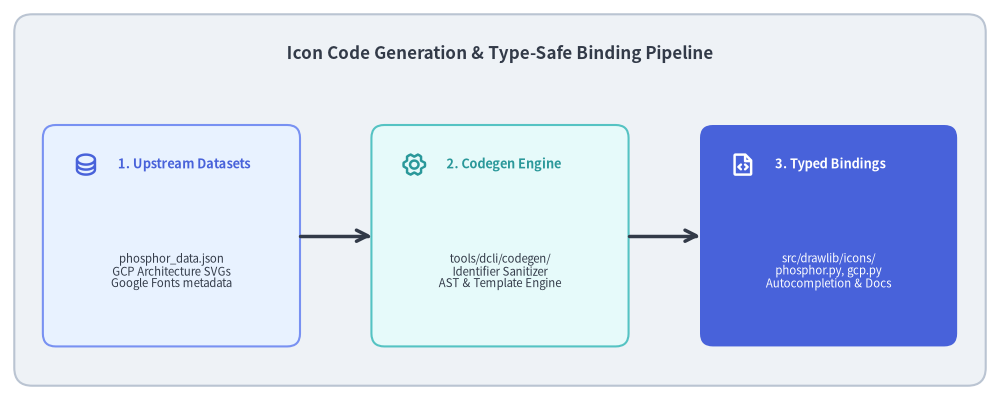
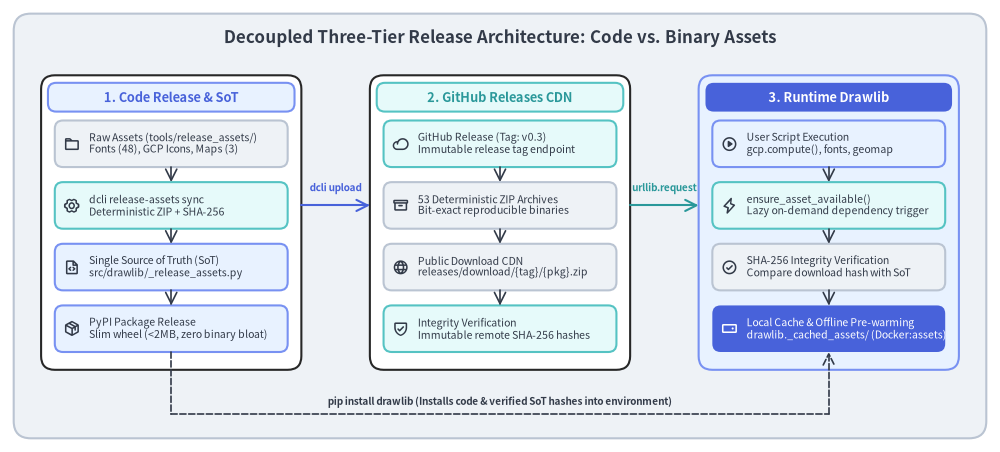

# Developer Tooling: Code Generation & Release Assets

Drawlib provides thousands of vector icons (Phosphor) and cloud architecture icons (Google Cloud Platform). Rather than maintaining thousands of function definitions manually, Drawlib uses automated code generation and external binary asset packaging.


<figure class="drawlib-image" style="text-align: center;">
  
  <figcaption class="drawlib-caption">Automated Icon Code Generation Pipeline</figcaption>
</figure>

<details class="drawlib-code-details">
<summary>Source Code</summary>

```python
from drawlib.canvas import save, setup
from drawlib.icons import phosphor
from drawlib.lines import line
from drawlib.shapes import rectangle
from drawlib.styles import Styles
from drawlib.text import text

setup(width=140, height=56)

rectangle((70, 28), width=136, height=52, style=Styles.Neutral.patch(shape_r=2.5))
text(
    (70, 48.5),
    "Icon Code Generation & Type-Safe Binding Pipeline",
    style=Styles.DarkBold.patch(text_size=12.2),
)

stages = [
    (24, "1. Upstream Datasets", "phosphor_data.json\nGCP Architecture SVGs\nGoogle Fonts metadata", phosphor.database, Styles.PrimaryNeutral, Styles.PrimaryBold),
    (70, "2. Codegen Engine", "tools/dcli/codegen/\nIdentifier Sanitizer\nAST & Template Engine", phosphor.gear_six, Styles.SecondaryNeutral, Styles.SecondaryBold),
    (116, "3. Typed Bindings", "src/drawlib/icons/\nphosphor.py, gcp.py\nAutocompletion & Docs", phosphor.file_code, Styles.PrimaryFlat, Styles.WhiteBold),
]

for x, title, desc, icon_func, card_style, icon_style in stages:
    rectangle((x, 23), width=36, height=31, style=card_style.patch(shape_r=1.8))
    icon_func((x - 12, 33), width=3.6, style=icon_style)
    text((x - 7.5, 33), title, style=icon_style.patch(halign="left", text_size=9.2))
    sub_style = Styles.White if card_style == Styles.PrimaryFlat else Styles.Dark
    text((x, 18), desc, style=sub_style.patch(text_size=8.2))

for i in range(2):
    x_from = stages[i][0] + 18.0
    x_to = stages[i + 1][0] - 18.0
    line((x_from, 23), (x_to, 23), arrow_head="->", style=Styles.DarkBold)

save()
```

</details>


---

## 1. Concept: Automated Generation vs. Manual Maintenance

A comprehensive technical diagramming library requires vast catalogs of standardized icons:
- **Phosphor Icons**: 1,200+ icons available across multiple visual weights (regular, bold, fill, thin, light, duotone).
- **Google Cloud Architecture Icons**: Hundreds of official product symbols across compute, storage, networking, database, AI, and security categories.

Manually writing Python functions and classes for thousands of icons is prone to identifier collisions, typo regressions, and immense maintenance overhead when upstream icon sets update.

Drawlib solves this by treating icons as **generated artifacts**:
1. Upstream icon datasets and SVGs are stored under `tools/original_assets/`.
2. Generator scripts in `tools/dcli/codegen/` parse upstream schemas, sanitize naming conventions (e.g. converting `cloud-sql` to valid Python identifier `cloud_sql`), and generate type-annotated facades.
3. Developers import clean, autocompleting functions with zero runtime schema parsing cost:
   ```python
   from drawlib.icons import phosphor, gcp
   phosphor.database((50, 50), width=10)
   gcp.compute_engine((20, 20), width=12)
   ```

---

## 2. Positioning: The Decoupled Three-Tier Release Architecture

To maintain a lightweight Python package while providing gigabytes of optional fonts, cloud icons, and geographic maps, Drawlib implements a **Decoupled Three-Tier Release Architecture**:


<figure class="drawlib-image" style="text-align: center;">
  
  <figcaption class="drawlib-caption">Decoupled Three-Tier Release Architecture: Code Release, GitHub Releases CDN, and Runtime Resolution</figcaption>
</figure>

<details class="drawlib-code-details">
<summary>Source Code</summary>

```python
from drawlib.canvas import save, setup
from drawlib.icons import phosphor
from drawlib.lines import line
from drawlib.shapes import rectangle
from drawlib.styles import Styles
from drawlib.text import text

setup(width=146, height=66)

# Canvas background card
rectangle((73, 33), width=142, height=62, style=Styles.Neutral.patch(shape_r=2.5))
text(
    (73, 60.5),
    "Decoupled Three-Tier Release Architecture: Code vs. Binary Assets",
    style=Styles.DarkBold.patch(text_size=12.2),
)

# 3 Big Columns
columns = [
    (25, "1. Code Release & SoT", Styles.PrimaryNeutral, Styles.PrimaryBold),
    (73, "2. GitHub Releases CDN", Styles.SecondaryNeutral, Styles.SecondaryBold),
    (121, "3. Runtime Drawlib", Styles.PrimaryFlat, Styles.WhiteBold),
]

for cx, col_title, col_style, title_style in columns:
    bg_style = Styles.White if col_style != Styles.PrimaryFlat else Styles.PrimaryNeutral
    rectangle((cx, 33.5), width=38, height=43, style=bg_style.patch(shape_r=2.0))
    rectangle((cx, 51.8), width=36, height=4.2, style=col_style.patch(shape_r=1.2))
    text((cx, 51.8), col_title, style=title_style.patch(text_size=9.2))

# --- Column 1: Code Release & SoT ---
c1_boxes = [
    (45, "Raw Assets (tools/release_assets/)\nFonts (48), GCP Icons, Maps (3)", phosphor.folder, Styles.Neutral),
    (36, "dcli release-assets sync\nDeterministic ZIP + SHA-256", phosphor.gear_six, Styles.SecondaryNeutral),
    (27, "Single Source of Truth (SoT)\nsrc/drawlib/_release_assets.py", phosphor.file_code, Styles.PrimaryNeutral),
    (18, "PyPI Package Release\nSlim wheel (<2MB, zero binary bloat)", phosphor.package, Styles.PrimaryNeutral),
]
for y, desc, icon_func, box_style in c1_boxes:
    rectangle((25, y), width=34, height=6.8, style=box_style.patch(shape_r=1.2))
    icon_func((10.5, y), width=2.4, style=Styles.DarkBold)
    text((13.0, y), desc, style=Styles.Dark.patch(halign="left", text_size=7.6))

for i in range(3):
    y_from = c1_boxes[i][0] - 3.4
    y_to = c1_boxes[i + 1][0] + 3.4
    line((25, y_from), (25, y_to), arrow_head="->", style=Styles.DarkBold.patch(line_width=1.2))

# --- Column 2: GitHub Releases CDN ---
c2_boxes = [
    (45, "GitHub Release (Tag: v0.3)\nImmutable release tag endpoint", phosphor.cloud, Styles.SecondaryNeutral),
    (36, "53 Deterministic ZIP Archives\nBit-exact reproducible binaries", phosphor.archive, Styles.Neutral),
    (27, "Public Download CDN\nreleases/download/{tag}/{pkg}.zip", phosphor.globe, Styles.Neutral),
    (18, "Integrity Verification\nImmutable remote SHA-256 hashes", phosphor.shield_check, Styles.SecondaryNeutral),
]
for y, desc, icon_func, box_style in c2_boxes:
    rectangle((73, y), width=34, height=6.8, style=box_style.patch(shape_r=1.2))
    icon_func((58.5, y), width=2.4, style=Styles.DarkBold)
    text((61.0, y), desc, style=Styles.Dark.patch(halign="left", text_size=7.6))

for i in range(3):
    y_from = c2_boxes[i][0] - 3.4
    y_to = c2_boxes[i + 1][0] + 3.4
    line((73, y_from), (73, y_to), arrow_head="->", style=Styles.DarkBold.patch(line_width=1.2))

# --- Column 3: Runtime Drawlib ---
c3_boxes = [
    (45, "User Script Execution\ngcp.compute(), fonts, geomap", phosphor.play_circle, Styles.PrimaryNeutral),
    (36, "ensure_asset_available()\nLazy on-demand dependency trigger", phosphor.lightning, Styles.SecondaryNeutral),
    (27, "SHA-256 Integrity Verification\nCompare download hash with SoT", phosphor.check_circle, Styles.Neutral),
    (18, "Local Cache & Offline Pre-warming\ndrawlib._cached_assets/ (Docker:assets)", phosphor.hard_drive, Styles.PrimaryFlat),
]
for y, desc, icon_func, box_style in c3_boxes:
    rectangle((121, y), width=34, height=6.8, style=box_style.patch(shape_r=1.2))
    i_style = Styles.WhiteBold if box_style == Styles.PrimaryFlat else Styles.DarkBold
    t_style = Styles.White if box_style == Styles.PrimaryFlat else Styles.Dark
    icon_func((106.5, y), width=2.4, style=i_style)
    text((109.0, y), desc, style=t_style.patch(halign="left", text_size=7.6))

for i in range(3):
    y_from = c3_boxes[i][0] - 3.4
    y_to = c3_boxes[i + 1][0] + 3.4
    line((121, y_from), (121, y_to), arrow_head="->", style=Styles.DarkBold.patch(line_width=1.2))

# Cross-column interconnect arrows
# Col 1 -> Col 2: dcli upload (x: 44.0 to 54.0)
line((44.0, 36.0), (54.0, 36.0), arrow_head="->", style=Styles.PrimaryBold.patch(line_width=1.5))
text((49.0, 38.5), "dcli upload", style=Styles.PrimaryBold.patch(text_size=7.2))

# Col 2 -> Col 3: HTTP GET on demand (x: 92.0 to 102.0)
line((92.0, 36.0), (102.0, 36.0), arrow_head="->", style=Styles.SecondaryBold.patch(line_width=1.5))
text((97.0, 38.5), "urllib.request", style=Styles.SecondaryBold.patch(text_size=7.2))

# Col 1 -> Col 3: pip install drawlib (routing around bottom)
line((25.0, 14.6), (25.0, 5.5), style=Styles.DarkBold.patch(line_style="dashed", line_width=1.2))
line((25.0, 5.5), (121.0, 5.5), style=Styles.DarkBold.patch(line_style="dashed", line_width=1.2))
line((121.0, 5.5), (121.0, 14.6), arrow_head="->", style=Styles.DarkBold.patch(line_style="dashed", line_width=1.2))
text((73.0, 7.3), "pip install drawlib (Installs code & verified SoT hashes into environment)", style=Styles.DarkBold.patch(text_size=7.2))

save()
```

</details>


---

## 3. Details: Codegen Engines and the Asset Release Lifecycle

### 3.1. Phosphor Code Generation (`./dcli codegen icon-phosphor`)
The Phosphor codegen engine (`tools/dcli/codegen/icon_phosphor.py`):
1. Reads `tools/dcli/codegen/phosphor_data.json`.
2. Sanitizes all icon names against Python reserved keywords (`import`, `class`, `def`, `from`, etc.).
3. Emits `src/drawlib/icons/phosphor.py`, producing:
   - An enum containing all icon identifiers.
   - Individual wrapper functions with explicit `@validate_call` decorators and typing.
   - Comprehensive docstrings containing tags, categories, and usage examples.

### 3.2. GCP Architecture Icon Generation (`./dcli codegen icon-gcp`)
The GCP codegen engine (`tools/dcli/codegen/icon_gcp.py`):
1. Scans raw GCP architecture icons in SVG and PNG formats.
2. Normalizes viewBox coordinates and standardizes filename slugs across GCP categories (Compute, Storage, Networking, Big Data, Security).
3. Generates high-level draw functions in `src/drawlib/icons/gcp.py`.

### 3.3. GeoMap Map Data Codegen (`./dcli codegen map`)
The GeoMap codegen pipeline downloads, normalizes, and packages geographic vector data:
1. **Download**: `map_download.py` fetches GeoJSON boundaries from Natural Earth.
2. **Normalize**: `map_normalize.py` simplifies polygons and normalizes coordinate topologies.
3. **Codegen**: `map_codegen.py` generates country code enums and coordinates for pure-vector rendering in `drawlib.smartarts`.

### 3.4. Phase 1: Code Release & SoT Synchronization (`./dcli release-assets sync`)
Drawlib separates lightweight Python source code from heavy binary assets (48 font families, 2 icon packs, 3 map GeoJSON packs) to keep PyPI wheels small (<2 MB) and `pip install drawlib` instantaneous.

The build process enforces deterministic byte reproducibility:
1. **Raw Asset Scans**: `tools/dcli/release_assets/sync.py` scans all package directories under `tools/release_assets/<tag>/`.
2. **Deterministic ZIP Archives**: `create_deterministic_zip_bytes()` normalizes file ordering, fixes timestamps to `2026-01-01 00:00:00`, and forces file permissions to `0o644`. Identical source files yield bit-for-bit identical ZIP archives regardless of operating system.
3. **Cryptographic SHA-256 Digest**: Each archive's exact SHA-256 hash is computed in-memory.
4. **Single Source of Truth (SoT)**: The generator script writes `src/drawlib/_release_assets.py`, embedding:
   - `DEFAULT_RELEASE_TAG = "v0.3"`
   - `ReleaseAssetPackageName` (StrEnum)
   - `RELEASE_ASSET_PACKAGES: Final[ReleaseAssetPackages]` mapping every package to its immutable `archive_sha256` and file manifest.
5. **Slim Wheel Publication**: When `./dcli pypi publish` executes, only Python source and the verified SoT hashes are packaged into the PyPI wheel. All heavy binary files are excluded.

### 3.5. Phase 2: Binary Asset CDN on GitHub Releases (`./dcli release-assets upload`)
Binary assets are published to GitHub Releases to serve as an immutable, globally distributed CDN:
1. **Archive Compilation**: `./dcli release-assets build` generates the 53 `.zip` archives into `tools/release_assets/<tag>/`.
2. **Automated Upload**: `./dcli release-assets upload` uses `GitHubReleaseClient` to upload the archives to the release tagged with `DEFAULT_RELEASE_TAG` (e.g. `v0.3`) via the GitHub REST API.
3. **Predictable CDN URLs**: Every package is retrievable at:
   ```text
   https://github.com/yuichi110/drawlib/releases/download/{tag}/{archive_name}
   ```
4. **Consistency Verification**: `./dcli release-assets sync --check` verifies that remote GitHub release assets match local SHA-256 checksums exactly.

### 3.6. Phase 3: Runtime Drawlib Lazy Resolution & Integrity Verification
At runtime, Drawlib downloads binary assets strictly on-demand:
1. **Lazy Trigger**: When a user's diagram script calls a function requiring an external asset (e.g., `gcp.compute_engine()`, `styles.patch_font()`, or `geomap()`):
   ```python
   ensure_asset_available(resource_path: str, tag: str = DEFAULT_RELEASE_TAG)
   ```
2. **Local Cache Inspection**: The method queries `pkg.is_downloaded()`, checking if all required files exist locally in `drawlib._cached_assets/<target_rel_path>`. If present, execution proceeds immediately with zero network overhead.
3. **Secure Download**: If missing, Drawlib downloads the `.zip` archive from GitHub Releases via `urllib.request`.
4. **Cryptographic Verification**: The downloaded bytes are hashed with SHA-256 and compared against `pkg.archive_sha256` recorded in the SoT (`_release_assets.py`). If the checksum fails, execution halts with a `RuntimeError`, preventing truncated downloads or man-in-the-middle tampering.
5. **Safe Extraction**: The verified archive is extracted directly into `drawlib._cached_assets/` via `zipfile.ZipFile`.

### 3.7. Offline Environments & Container Pre-warming
For air-gapped systems, CI runners, or environments without internet access, Drawlib provides upfront caching:
- **CLI Pre-warming**: Run `drawlib cache download --all` (or call `download_all_release_assets()`) to download and verify all 53 asset packages upfront.
- **Docker Images**: Pre-baked container images (`drawlib:assets` and `drawlib:full`) execute this pre-warming during `docker build`, ensuring that containerized workflows operate 100% offline with zero external network access.

Next, examine the publishing pipeline and Docker verification in **[Publishing & Docker](03_release_and_docker.md)**.


