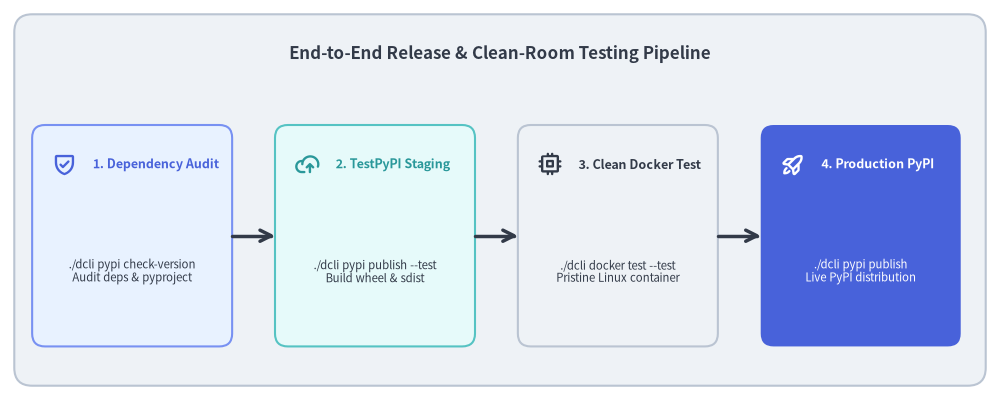
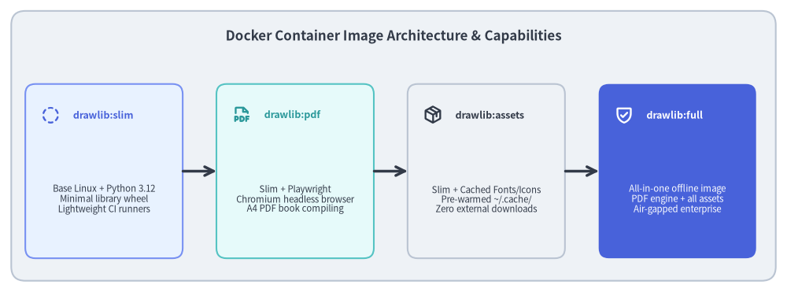

# Developer Tooling: Publishing & Clean-Room Testing

Releasing a production library requires rigorous verification to ensure that published packages install cleanly, lack hidden local dependencies, and function in completely isolated environments.


<figure class="drawlib-image" style="text-align: center;">
  
  <figcaption class="drawlib-caption">PyPI Release and Clean-Room Verification Lifecycle</figcaption>
</figure>

<details class="drawlib-code-details">
<summary>Source Code</summary>

```python
from drawlib.canvas import save, setup
from drawlib.icons import phosphor
from drawlib.lines import line
from drawlib.shapes import rectangle
from drawlib.styles import Styles
from drawlib.text import text

setup(width=140, height=56)

rectangle((70, 28), width=136, height=52, style=Styles.Neutral.patch(shape_r=2.5))
text(
    (70, 48.5),
    "End-to-End Release & Clean-Room Testing Pipeline",
    style=Styles.DarkBold.patch(text_size=12.2),
)

stages = [
    (18.5, "1. Dependency Audit", "./dcli pypi check-version\nAudit deps & pyproject", phosphor.shield_check, Styles.PrimaryNeutral, Styles.PrimaryBold),
    (52.5, "2. TestPyPI Staging", "./dcli pypi publish --test\nBuild wheel & sdist", phosphor.cloud_arrow_up, Styles.SecondaryNeutral, Styles.SecondaryBold),
    (86.5, "3. Clean Docker Test", "./dcli docker test --test\nPristine Linux container", phosphor.cpu, Styles.Neutral, Styles.DarkBold),
    (120.5, "4. Production PyPI", "./dcli pypi publish\nLive PyPI distribution", phosphor.rocket_launch, Styles.PrimaryFlat, Styles.WhiteBold),
]

for x, title, desc, icon_func, card_style, icon_style in stages:
    rectangle((x, 23), width=28, height=31, style=card_style.patch(shape_r=1.8))
    icon_func((x - 9.5, 33), width=3.4, style=icon_style)
    text((x - 5.5, 33), title, style=icon_style.patch(halign="left", text_size=9.0))
    sub_style = Styles.White if card_style == Styles.PrimaryFlat else Styles.Dark
    text((x, 18), desc, style=sub_style.patch(text_size=8.2))

for i in range(3):
    x_from = stages[i][0] + 14.0
    x_to = stages[i + 1][0] - 14.0
    line((x_from, 23), (x_to, 23), arrow_head="->", style=Styles.DarkBold)

save()
```

</details>


---

## 1. Concept: Clean-Room Release Verification

A notorious failure mode in Python library development is the "works on my machine" release:
- A developer accidentally relies on an uncommitted local file or unpinned global package.
- A package wheel is built and pushed to PyPI without verifying that it can be cleanly installed and run on a stock Linux machine.
- Version tags jump unpredictably (e.g. accidentally releasing `0.3.0` instead of `0.2.1`), breaking semantic version expectations.

Drawlib eliminates these risks through two foundational tooling modules:
1. **`pypi` Toolset (`tools/dcli/pypi/`)**: Audits dependency health, enforces monotonic version progression, synchronizes `README_PYPI.md`, and handles authenticated package publishing.
2. **`docker` Toolset (`tools/dcli/docker.py`)**: Spawns isolated clean-room Linux containers that download the newly staged package from TestPyPI, install it into a virgin Python virtualenv, and execute the entire test suite.

---

## 2. Positioning: The Release and Deployment Boundary

The release tooling acts as the quality firewall between local code repositories and public distribution channels:


<figure class="drawlib-image" style="text-align: center;">
  
  <figcaption class="drawlib-caption">Drawlib Docker Container Variants and Layering</figcaption>
</figure>

<details class="drawlib-code-details">
<summary>Source Code</summary>

```python
from drawlib.canvas import save, setup
from drawlib.icons import phosphor
from drawlib.lines import line
from drawlib.shapes import rectangle
from drawlib.styles import Styles
from drawlib.text import text

setup(width=140, height=52)

rectangle((70, 26), width=136, height=48, style=Styles.Neutral.patch(shape_r=2.5))
text(
    (70, 45.5),
    "Docker Container Image Architecture & Capabilities",
    style=Styles.DarkBold.patch(text_size=12.2),
)

variants = [
    (18.5, "drawlib:slim", "Base Linux + Python 3.12\nMinimal library wheel\nLightweight CI runners", phosphor.circle_dashed, Styles.PrimaryNeutral, Styles.PrimaryBold),
    (52.5, "drawlib:pdf", "Slim + Playwright\nChromium headless browser\nA4 PDF book compiling", phosphor.file_pdf, Styles.SecondaryNeutral, Styles.SecondaryBold),
    (86.5, "drawlib:assets", "Slim + Cached Fonts/Icons\nPre-warmed ~/.cache/\nZero external downloads", phosphor.package, Styles.Neutral, Styles.DarkBold),
    (120.5, "drawlib:full", "All-in-one offline image\nPDF engine + all assets\nAir-gapped enterprise", phosphor.shield_check, Styles.PrimaryFlat, Styles.WhiteBold),
]

for x, title, desc, icon_func, card_style, icon_style in variants:
    rectangle((x, 21.5), width=28, height=31, style=card_style.patch(shape_r=1.8))
    icon_func((x - 9.5, 31.5), width=3.4, style=icon_style)
    text((x - 5.5, 31.5), title, style=icon_style.patch(halign="left", text_size=9.0))
    sub_style = Styles.White if card_style == Styles.PrimaryFlat else Styles.Dark
    text((x, 16.5), desc, style=sub_style.patch(text_size=8.2))

for i in range(3):
    x_from = variants[i][0] + 14.0
    x_to = variants[i + 1][0] - 14.0
    line((x_from, 21.5), (x_to, 21.5), arrow_head="->", style=Styles.DarkBold)

save()
```

</details>


---

## 3. Details: Tooling Workflows and Docker Architecture

### 3.1. PyPI Release Workflow (`./dcli pypi`)
The release sequence follows a strict verification pipeline:
1. **Dependency Audit (`./dcli pypi deps`)**: Generates the runtime dependency tree, flagging outdated or incompatible transitive dependencies.
2. **Version Progression (`./dcli pypi check-version`)**: Queries PyPI to verify that the version declared in `pyproject.toml` is strictly greater than the latest published release and conforms to semantic versioning (preventing accidental minor/major jumps unless explicitly passed `--allow-jump`).
3. **Metadata Synchronization (`./dcli pypi update-pyproject`)**: Ensures that `README_PYPI.md`, license files, and project URLs are synchronized into `pyproject.toml`.
4. **Decoupled Asset Separation**: Binary fonts, icons, and maps are intentionally excluded from the wheel distribution to keep package sizes under 2 MB. Instead, their bit-exact SHA-256 hashes are compiled into `src/drawlib/_release_assets.py`, and the archives are hosted on GitHub Releases (see **[Code Generation & Assets](02_codegen_and_assets.md)**).
5. **Staging (`./dcli pypi publish --test-pypi`)**: Builds source distributions (`sdist`) and binary wheels (`bdist_wheel`), publishing them to TestPyPI.
6. **Production Publishing (`./dcli pypi publish`)**: After clean-room Docker container verification passes, published packages are deployed to live PyPI.

### 3.2. Clean-Room Docker Container Testing (`./dcli docker test`)
Before pushing to production PyPI, `./dcli docker test --test-pypi <VERSION>` executes:
- Spawns a clean `debian:bookworm-slim` or `python:3.12-slim` container with no access to local project files.
- Installs `drawlib==<VERSION>` directly from TestPyPI.
- Runs `pytest tests/drawlib/` inside the clean container.
- Verifies that all imports, asset caches, and drawing operations succeed without requiring development dependencies.

### 3.3. Production Container Variants
Drawlib provides 4 container configurations for different operational environments:
- **`drawlib:slim`**: Standard minimal image for diagram-rendering CLI containers.
- **`drawlib:pdf`**: Includes headless Chromium for automated PDF documentation pipelines.
- **`drawlib:assets`**: Pre-downloads and verifies all 53 font, icon, and map packages (`drawlib cache download --all`) at build time into `drawlib._cached_assets/`, eliminating external network requests during runtime execution.
- **`drawlib:full`**: Combines PDF export and pre-warmed assets for completely air-gapped enterprise deployments.

Next, explore Drawlib's testing architecture and verification methodologies in **[Test Architecture: Hierarchy & Strategy](../07_test_architecture/01_test_hierarchy_and_strategy.md)**.
