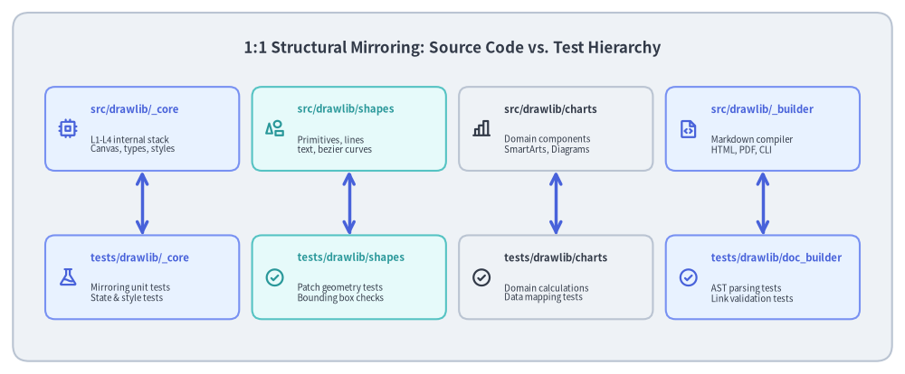
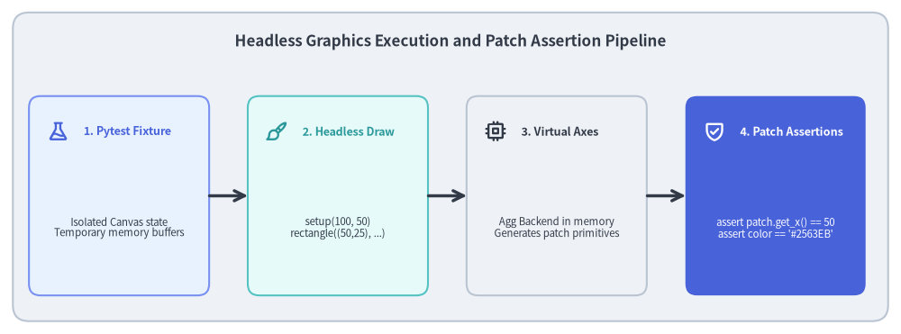

# Test Architecture: Hierarchy & Headless Verification

Testing a 2D drawing and documentation engine presents unique challenges: graphics must be thoroughly validated across operating systems without opening interactive windows, and without relying on fragile pixel-by-pixel bitmap comparisons.


<figure class="drawlib-image" style="text-align: center;">
  
  <figcaption class="drawlib-caption">1:1 Mirroring Test Suite Hierarchy</figcaption>
</figure>

<details class="drawlib-code-details">
<summary>Source Code</summary>

```python
from drawlib.canvas import save, setup
from drawlib.icons import phosphor
from drawlib.lines import line
from drawlib.shapes import rectangle
from drawlib.styles import Styles
from drawlib.text import text

setup(width=140, height=58)

rectangle((70, 29), width=136, height=54, style=Styles.Neutral.patch(shape_r=2.5))
text(
    (70, 50.5),
    "1:1 Structural Mirroring: Source Code vs. Test Hierarchy",
    style=Styles.DarkBold.patch(text_size=12.2),
)

# Source Layer
src_modules = [
    (22, "src/drawlib/_core", "L1-L4 internal stack\nCanvas, types, styles", phosphor.cpu, Styles.PrimaryNeutral, Styles.PrimaryBold),
    (54, "src/drawlib/shapes", "Primitives, lines\ntext, bezier curves", phosphor.shapes, Styles.SecondaryNeutral, Styles.SecondaryBold),
    (86, "src/drawlib/charts", "Domain components\nSmartArts, Diagrams", phosphor.chart_bar, Styles.Neutral, Styles.DarkBold),
    (118, "src/drawlib/_builder", "Markdown compiler\nHTML, PDF, CLI", phosphor.file_code, Styles.PrimaryNeutral, Styles.PrimaryBold),
]

for x, title, desc, icon_func, card_style, icon_style in src_modules:
    rectangle((x, 38), width=30, height=13, style=card_style.patch(shape_r=1.5))
    icon_func((x - 11.5, 38), width=3.2, style=icon_style)
    text((x - 8, 41), title, style=icon_style.patch(halign="left", text_size=8.2))
    text((x - 8, 35.5), desc, style=Styles.Dark.patch(halign="left", text_size=7.0))

# Test Layer
test_modules = [
    (22, "tests/drawlib/_core", "Mirroring unit tests\nState & style tests", phosphor.flask, Styles.PrimaryNeutral, Styles.PrimaryBold),
    (54, "tests/drawlib/shapes", "Patch geometry tests\nBounding box checks", phosphor.check_circle, Styles.SecondaryNeutral, Styles.SecondaryBold),
    (86, "tests/drawlib/charts", "Domain calculations\nData mapping tests", phosphor.check_circle, Styles.Neutral, Styles.DarkBold),
    (118, "tests/drawlib/doc_builder", "AST parsing tests\nLink validation tests", phosphor.check_circle, Styles.PrimaryNeutral, Styles.PrimaryBold),
]

for x, title, desc, icon_func, card_style, icon_style in test_modules:
    rectangle((x, 15), width=30, height=13, style=card_style.patch(shape_r=1.5))
    icon_func((x - 11.5, 15), width=3.2, style=icon_style)
    text((x - 8, 18), title, style=icon_style.patch(halign="left", text_size=8.2))
    text((x - 8, 12.5), desc, style=Styles.Dark.patch(halign="left", text_size=7.0))
    # Vertical mirroring connector
    line((x, 31.5), (x, 21.5), arrow_head="<->", style=Styles.PrimaryBold)

save()
```

</details>


---

## 1. Concept: The Dual-Verification Testing Strategy

Traditional graphical test suites suffer from severe dilemmas: relying strictly on bitmap comparisons leads to brittle tests and false positives across operating systems, while relying solely on property tests risks silent visual regressions (such as clipped labels or overlapping connectors).

Drawlib resolves this with a **Dual-Verification Architecture**:

```
                 [Drawing Function Under Test]
                               │
               ┌───────────────┴───────────────┐
               ▼                               ▼
       [Layer 1: Property]             [Layer 2: Visual]
    In-memory direct assertions     pytest_runtest_call hook
    • Bounding box math (x, y, w, h)• check_image_match()
    • Color hex / RGBA values       • PIL histogram diffing
    • Patch counts & stroke widths  • output_tests/ vs *_answers/
    • Fast, cross-platform unit     • @pytest.mark.image_threshold
```

1. **Layer 1 — Mathematical Geometry Assertions**: Fast in-memory unit tests that verify coordinate transforms, bounding boxes, patch counts, and style attributes without disk I/O.
2. **Layer 2 — Automated Image Regression Hook**: A custom `pytest_runtest_call` hook in `conftest.py` that intercepts test completion, comparing newly rendered output images in `output_tests/` against golden reference images in `*_answers/` using PIL histogram diffing (`check_image_match()`).
3. **Configurable Thresholds**: Tests calibrate tolerance via `@pytest.mark.image_threshold(0.99)`, accommodating sub-pixel rasterization variances across operating systems while immediately catching visual layout breakages.

---

## 2. Positioning: The Test Suite Architecture


The test suite is organized into two primary sub-packages, separated from the production distribution:


<figure class="drawlib-image" style="text-align: center;">
  
  <figcaption class="drawlib-caption">Headless Graphics Testing and Patch Assertion Mechanics</figcaption>
</figure>

<details class="drawlib-code-details">
<summary>Source Code</summary>

```python
from drawlib.canvas import save, setup
from drawlib.icons import phosphor
from drawlib.lines import line
from drawlib.shapes import rectangle
from drawlib.styles import Styles
from drawlib.text import text

setup(width=140, height=52)

rectangle((70, 26), width=136, height=48, style=Styles.Neutral.patch(shape_r=2.5))
text(
    (70, 45.5),
    "Headless Graphics Execution and Patch Assertion Pipeline",
    style=Styles.DarkBold.patch(text_size=12.2),
)

steps = [
    (18.5, "1. Pytest Fixture", "Isolated Canvas state\nTemporary memory buffers", phosphor.flask, Styles.PrimaryNeutral, Styles.PrimaryBold),
    (52.5, "2. Headless Draw", "setup(100, 50)\nrectangle((50,25), ...)", phosphor.paint_brush, Styles.SecondaryNeutral, Styles.SecondaryBold),
    (86.5, "3. Virtual Axes", "Agg Backend in memory\nGenerates patch primitives", phosphor.cpu, Styles.Neutral, Styles.DarkBold),
    (120.5, "4. Patch Assertions", "assert patch.get_x() == 50\nassert color == '#2563EB'", phosphor.shield_check, Styles.PrimaryFlat, Styles.WhiteBold),
]

for x, title, desc, icon_func, card_style, icon_style in steps:
    rectangle((x, 21.5), width=28, height=31, style=card_style.patch(shape_r=1.8))
    icon_func((x - 9.5, 31.5), width=3.4, style=icon_style)
    text((x - 5.5, 31.5), title, style=icon_style.patch(halign="left", text_size=9.0))
    sub_style = Styles.White if card_style == Styles.PrimaryFlat else Styles.Dark
    text((x, 16.5), desc, style=sub_style.patch(text_size=8.2))

for i in range(3):
    x_from = steps[i][0] + 14.0
    x_to = steps[i + 1][0] - 14.0
    line((x_from, 21.5), (x_to, 21.5), arrow_head="->", style=Styles.DarkBold)

save()
```

</details>


1. **`tests/drawlib/`**: Tests the core library package. Contains unit tests for L1–L4 layers, domain components (charts, diagrams, smartarts, graph), document builder engines, and CLI interfaces.
2. **`tests/dcli/`**: Tests internal development tools, CLI subcommands, release asset management scripts, and Docker orchestration.

---

## 3. Details: Test Fixtures and Targeted Execution

### 3.1. Pytest Fixtures & Canvas Isolation
`tests/conftest.py` provides shared test fixtures to ensure complete isolation between tests:
- **Canvas Reset**: Ensures the Canvas singleton state is cleared before and after each test function, preventing coordinate leakage or stale drawing buffers.
- **Filesystem Isolation**: Provides temporary sandbox directories for document builder compilation tests, preventing dirty artifacts from polluting the workspace.

### 3.2. Targeted Execution via `./dcli test`
Running the entire test suite on every change can slow down rapid iteration. `./dcli test` provides fast targeted shortcuts:

```bash
# Run tests by module shortcut
./dcli test target core          # Tests src/drawlib/_core/
./dcli test target charts        # Tests charts and quantitative models
./dcli test target diagrams      # Tests UML and architecture diagrams
./dcli test target graph         # Tests declarative DAG autolayout
./dcli test target doc-builder   # Tests Markdown compiler and link checker

# Run full test suite with parallel execution
./dcli test all --parallel
```

### 3.3. Parallelization & Code Coverage
- **pytest-xdist (`--parallel`)**: Spawns multiple worker processes, utilizing all CPU cores for sub-second test execution.
- **Coverage Auditing (`--cov-report`)**: Generates line and branch coverage metrics, ensuring critical geometric calculation paths and validation checks are verified.

Next, explore how repository dogfooding and static quality gates guarantee zero-defect releases in **[Dogfooding & Quality Gates](02_dogfooding_and_quality_gates.md)**.
