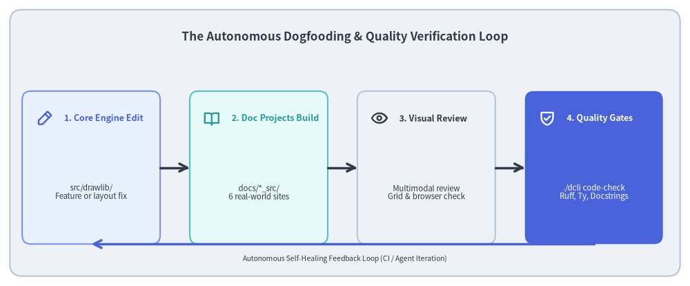
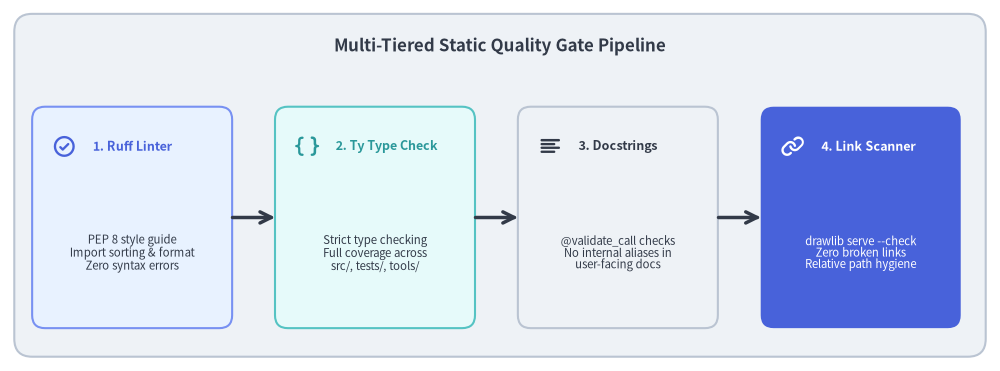

# Test Architecture: Dogfooding & Static Quality Gates

The most rigorous test of an "Illustration as Code" and "Illustrated Documentation as Code" library is using it to build its own production documentation. In the Drawlib repository, six independent documentation projects serve as a live, end-to-end integration test suite.


<figure class="drawlib-image" style="text-align: center;">
  
  <figcaption class="drawlib-caption">Repository Dogfooding and Continuous Quality Feedback Loop</figcaption>
</figure>

<details class="drawlib-code-details">
<summary>Source Code</summary>

```python
from drawlib.canvas import save, setup
from drawlib.icons import phosphor
from drawlib.lines import line
from drawlib.shapes import rectangle
from drawlib.styles import Styles
from drawlib.text import text

setup(width=140, height=58)

rectangle((70, 29), width=136, height=54, style=Styles.Neutral.patch(shape_r=2.5))
text(
    (70, 50.5),
    "The Autonomous Dogfooding & Quality Verification Loop",
    style=Styles.DarkBold.patch(text_size=12.2),
)

loop_nodes = [
    (18.5, "1. Core Engine Edit", "src/drawlib/\nFeature or layout fix", phosphor.pencil_simple, Styles.PrimaryNeutral, Styles.PrimaryBold),
    (52.5, "2. Doc Projects Build", "docs/*_src/\n6 real-world sites", phosphor.book_open, Styles.SecondaryNeutral, Styles.SecondaryBold),
    (86.5, "3. Visual Review", "Multimodal review\nGrid & browser check", phosphor.eye, Styles.Neutral, Styles.DarkBold),
    (120.5, "4. Quality Gates", "./dcli code-check\nRuff, Ty, Docstrings", phosphor.shield_check, Styles.PrimaryFlat, Styles.WhiteBold),
]

for x, title, desc, icon_func, card_style, icon_style in loop_nodes:
    rectangle((x, 24), width=28, height=31, style=card_style.patch(shape_r=1.8))
    icon_func((x - 9.5, 34), width=3.4, style=icon_style)
    text((x - 5.5, 34), title, style=icon_style.patch(halign="left", text_size=9.0))
    sub_style = Styles.White if card_style == Styles.PrimaryFlat else Styles.Dark
    text((x, 19), desc, style=sub_style.patch(text_size=8.2))

for i in range(3):
    x_from = loop_nodes[i][0] + 14.0
    x_to = loop_nodes[i + 1][0] - 14.0
    line((x_from, 24), (x_to, 24), arrow_head="->", style=Styles.DarkBold)

# Return loop
line((120.5, 8.5), (18.5, 8.5), arrow_head="->", style=Styles.PrimaryBold)
text((70, 5.5), "Autonomous Self-Healing Feedback Loop (CI / Agent Iteration)", style=Styles.Dark.patch(text_size=7.5))

save()
```

</details>


---

## 1. Concept: Live Repository Dogfooding

Unit tests verify that code behaves according to isolated assertions. However, unit tests alone cannot confirm:
- Whether a newly introduced chart styling renders legibly alongside prose.
- Whether a documentation compiler generates valid HTML, PDF, and Markdown across complex page structures.
- Whether real-world diagrams with dozens of interacting nodes suffer from text clipping or visual crowding.

Drawlib solves this through **Repository Dogfooding**:
The repository hosts six production documentation suites built entirely with `drawlib`. Whenever a core drawing primitive, geometry algorithm, or style token changes, all documentation projects compile against the modified library code. If any layout breaks or any link becomes invalid, the build fails immediately.

---

## 2. Positioning: The Six Dogfooding Archetypes

The documentation projects in `docs/` cover the four primary architectural archetypes of Drawlib:

| Project Directory | Archetype | Target Output | Architectural Purpose |
| :--- | :--- | :--- | :--- |
| **`docs/docs_src/`** | `site` | HTML website | Full user guide, API documentation, and AI case studies. |
| **`docs/quickstart_src/`** | `doc` | HTML & A4 PDF | Concise linear onboarding guide and vector PDF book export. |
| **`docs/drawlib-dogfooding_src/`** | `doc` | HTML & A4 PDF | In-depth architectural whitepaper in Japanese. |
| **`docs/drawlib-dogfooding-en_src/`**| `doc` | HTML & A4 PDF | In-depth architectural whitepaper in English. |
| **`docs/slide_about_drawlib_src/`**| `slide` | 16:9 Presentation | Slide deck with presenter view and widescreen graphics. |
| **`docs/architecture_src/`** | `site` | HTML website | This comprehensive software architecture specification. |

---

## 3. Details: Multi-Tiered Static Quality Gates

Before any code is committed or published, the repository enforces a strict static quality pipeline via `./dcli code-check all`:


<figure class="drawlib-image" style="text-align: center;">
  
  <figcaption class="drawlib-caption">Multi-Tiered Static Quality Gate Pipeline</figcaption>
</figure>

<details class="drawlib-code-details">
<summary>Source Code</summary>

```python
from drawlib.canvas import save, setup
from drawlib.icons import phosphor
from drawlib.lines import line
from drawlib.shapes import rectangle
from drawlib.styles import Styles
from drawlib.text import text

setup(width=140, height=52)

rectangle((70, 26), width=136, height=48, style=Styles.Neutral.patch(shape_r=2.5))
text(
    (70, 45.5),
    "Multi-Tiered Static Quality Gate Pipeline",
    style=Styles.DarkBold.patch(text_size=12.2),
)

gates = [
    (18.5, "1. Ruff Linter", "PEP 8 style guide\nImport sorting & format\nZero syntax errors", phosphor.check_circle, Styles.PrimaryNeutral, Styles.PrimaryBold),
    (52.5, "2. Ty Type Check", "Strict type checking\nFull coverage across\nsrc/, tests/, tools/", phosphor.brackets_curly, Styles.SecondaryNeutral, Styles.SecondaryBold),
    (86.5, "3. Docstrings", "@validate_call checks\nNo internal aliases in\nuser-facing docs", phosphor.text_align_left, Styles.Neutral, Styles.DarkBold),
    (120.5, "4. Link Scanner", "drawlib serve --check\nZero broken links\nRelative path hygiene", phosphor.link, Styles.PrimaryFlat, Styles.WhiteBold),
]

for x, title, desc, icon_func, card_style, icon_style in gates:
    rectangle((x, 21.5), width=28, height=31, style=card_style.patch(shape_r=1.8))
    icon_func((x - 9.5, 31.5), width=3.4, style=icon_style)
    text((x - 5.5, 31.5), title, style=icon_style.patch(halign="left", text_size=9.0))
    sub_style = Styles.White if card_style == Styles.PrimaryFlat else Styles.Dark
    text((x, 16.5), desc, style=sub_style.patch(text_size=8.2))

for i in range(3):
    x_from = gates[i][0] + 14.0
    x_to = gates[i + 1][0] - 14.0
    line((x_from, 21.5), (x_to, 21.5), arrow_head="->", style=Styles.DarkBold)

save()
```

</details>


### 3.1. Ruff Lint & Format (`./dcli code-check lint`)
Enforces modern Python 3.11+ syntax, PEP 8 conventions, strict import order, and automatic formatting across all source code, unit tests, and tooling scripts.

### 3.2. Ty Static Type Checking (`./dcli code-check type`)
Performs deep static type checking across `src/drawlib/`, `tests/`, and `tools/`. Every public function signature, style patch argument, and internal data model is statically checked to eliminate `None` dereferences and runtime `AttributeError` bugs.

### 3.3. Docstring Contract Validation (`./dcli code-check docstring`)
Drawlib uses Pydantic's `@validate_call` for runtime argument validation. However, internal type aliases (such as `_AngleType`, `_Point2D`, or internal Pydantic constrained types) should never leak into public docstrings. 

`find_docstring_violations` uses Python's standard `ast` module to parse every public function across `src/drawlib/`, scanning docstrings against a registry of 32 forbidden internal type aliases. It guarantees that user-facing documentation only documents standard Python types (`float`, `tuple[float, float]`), ensuring pristine IDE autocompletion and hover documentation.

### 3.4. Link & Image Integrity (`drawlib serve --check`)
The preflight HTML crawler crawls all compiled pages, testing every relative link, image source, and anchor reference. Broken links or forbidden local filesystem absolute paths (`/home/...`, `file:///...`) immediately fail the build.


---

## 4. Conclusion: The Complete Architecture as Code Loop

Through the combination of:
1. **Unidirectional Layer Architecture** (`l1_core` -> `l2_types` -> `l3_*` -> `l4_canvas` -> Domain modules).
2. **Headless In-Process Compilation** (Virtual canvas and cryptographic SQLite AST caching).
3. **Unified Developer Tooling** (`./dcli` orchestrating 7 toolsets).
4. **Deterministic Testing & Live Dogfooding** (Property assertion and multi-project doc compilation).

Drawlib establishes **Illustration as Code** and **Illustrated Documentation as Code** as a first-class engineering discipline.
