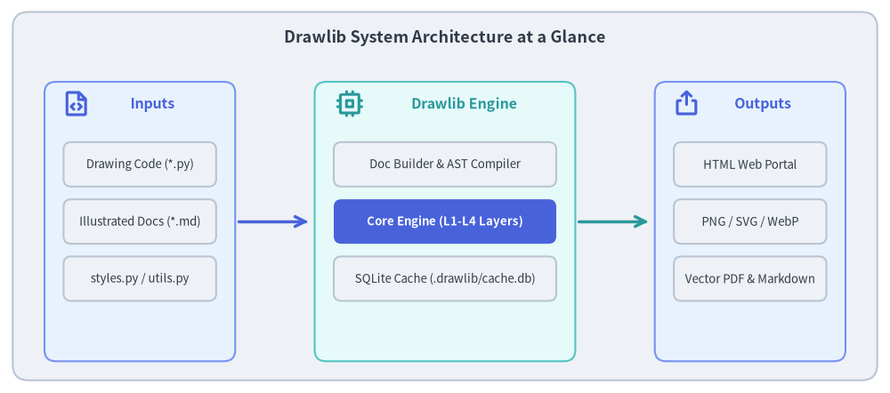
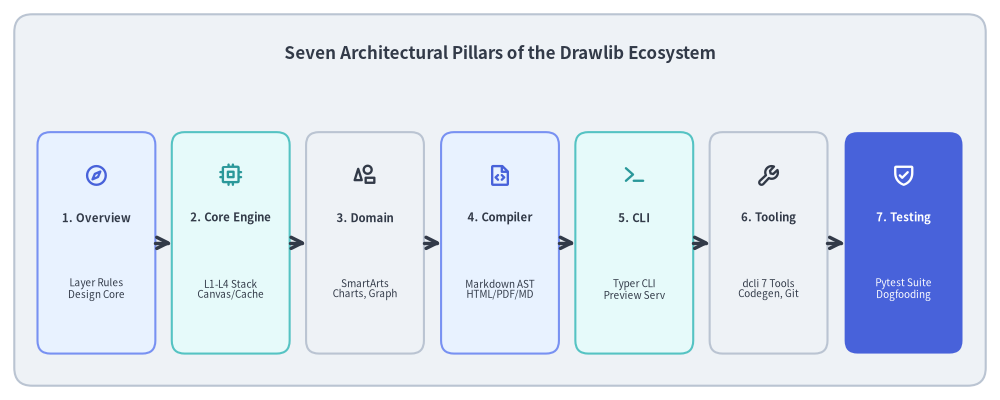

# Drawlib Architecture Specification

Drawlib is a pure-Python library and toolset designed for **"Illustration as Code"** and **"Illustrated Documentation as Code"**. Unlike traditional graphical diagramming tools or complex plotting packages, Drawlib provides a declarative, headless drawing engine that lives directly alongside software source code in Git repositories.

This specification document provides a comprehensive technical breakdown of Drawlib's internal architecture, package design, layered drawing subsystems, compiler pipeline, and runtime tooling.


<figure class="drawlib-image" style="text-align: center;">
  
  <figcaption class="drawlib-caption">Drawlib System Architecture at a Glance</figcaption>
</figure>

<details class="drawlib-code-details">
<summary>Source Code</summary>

```python
from drawlib.canvas import save, setup
from drawlib.icons import phosphor
from drawlib.lines import line
from drawlib.shapes import rectangle
from drawlib.styles import Styles
from drawlib.text import text

setup(width=140, height=62)

# Outer container
rectangle((70, 31), width=136, height=58, style=Styles.Neutral.patch(shape_r=2.5))
text(
    (70, 56),
    "Drawlib System Architecture at a Glance",
    style=Styles.DarkBold.patch(text_size=13.0),
)

# 1. Inputs Column (X: 22)
rectangle((22, 27), width=30, height=44, style=Styles.PrimaryNeutral.patch(shape_r=1.8))
phosphor.file_code((12, 45.5), width=4.5, style=Styles.PrimaryBold)
text((24, 45.5), "Inputs", style=Styles.PrimaryBold.patch(text_size=11.5))

rectangle((22, 36), width=24, height=7, style=Styles.Neutral.patch(shape_r=1.2))
text((22, 36), "Drawing Code (*.py)", style=Styles.Dark.patch(text_size=9.5))

rectangle((22, 27), width=24, height=7, style=Styles.Neutral.patch(shape_r=1.2))
text((22, 27), "Illustrated Docs (*.md)", style=Styles.Dark.patch(text_size=9.5))

rectangle((22, 18), width=24, height=7, style=Styles.Neutral.patch(shape_r=1.2))
text((22, 18), "styles.py / utils.py", style=Styles.Dark.patch(text_size=9.5))

line((37.5, 27), (48.5, 27), arrow_head="->", style=Styles.PrimaryBold)

# 2. Drawlib Engine Core (X: 70)
rectangle((70, 27), width=41, height=44, style=Styles.SecondaryNeutral.patch(shape_r=1.8))
phosphor.cpu((55, 45.5), width=4.5, style=Styles.SecondaryBold)
text((73, 45.5), "Drawlib Engine", style=Styles.SecondaryBold.patch(text_size=11.5))

rectangle((70, 36), width=35, height=7, style=Styles.Neutral.patch(shape_r=1.2))
text((70, 36), "Doc Builder & AST Compiler", style=Styles.Dark.patch(text_size=9.5))

rectangle((70, 27), width=35, height=7, style=Styles.PrimaryFlat.patch(shape_r=1.2))
text((70, 27), "Core Engine (L1-L4 Layers)", style=Styles.WhiteBold.patch(text_size=9.5))

rectangle((70, 18), width=35, height=7, style=Styles.Neutral.patch(shape_r=1.2))
text((70, 18), "SQLite Cache (.drawlib/cache.db)", style=Styles.Dark.patch(text_size=9.5))

line((91, 27), (102, 27), arrow_head="->", style=Styles.SecondaryBold)

# 3. Target Outputs (X: 118)
rectangle((118, 27), width=30, height=44, style=Styles.PrimaryNeutral.patch(shape_r=1.8))
phosphor.export((108, 45.5), width=4.5, style=Styles.PrimaryBold)
text((120, 45.5), "Outputs", style=Styles.PrimaryBold.patch(text_size=11.5))

rectangle((118, 36), width=24, height=7, style=Styles.Neutral.patch(shape_r=1.2))
text((118, 36), "HTML Web Portal", style=Styles.Dark.patch(text_size=9.5))

rectangle((118, 27), width=24, height=7, style=Styles.Neutral.patch(shape_r=1.2))
text((118, 27), "PNG / SVG / WebP", style=Styles.Dark.patch(text_size=9.5))

rectangle((118, 18), width=24, height=7, style=Styles.Neutral.patch(shape_r=1.2))
text((118, 18), "Vector PDF & Markdown", style=Styles.Dark.patch(text_size=9.5))

save()
```

</details>


---

## 1. Concept: Architecture as Code & Zero Documentation Drift

Traditional software architecture diagrams suffer from chronic fragmentation. Engineers design systems in external GUI editors (Visio, draw.io, Miro) and manually paste static bitmap screenshots into wikis or slide decks. Over time, as code evolves, the documentation inevitably drifts out of sync, becoming misleading and obsolete.

Drawlib solves this architectural challenge through three foundational tenets:
- **Pure Python as the Authoring Medium**: Every diagram is an executable Python script. Visual components, colors, and layout mathematics are expressed as code, version-controlled in Git, and reviewed in standard pull requests.
- **Headless In-Memory Execution**: The drawing engine operates headlessly across Linux, macOS, and Windows without requiring a windowing server (X11/Wayland), external binary rendering services (e.g. Graphviz, Java, Node.js), or GUI interactions.
- **Zero-Drift Single Source of Truth**: Documentation Markdown files embed live Python drawing code fences (````drawlib````). When built, code blocks are executed in-process, visual outputs are verified, and HTML, vector PDF, and Markdown are generated in a single pass.

---

## 2. Positioning: The Seven Architectural Pillars

Drawlib's codebase (`src/drawlib/`) and engineering environment are structured into seven distinct architectural pillars, decoupling low-level graphics backends from high-level diagram abstractions, document compilers, developer toolsets, and continuous quality verification:


<figure class="drawlib-image" style="text-align: center;">
  
  <figcaption class="drawlib-caption">The Seven Architectural Pillars of the Drawlib Ecosystem</figcaption>
</figure>

<details class="drawlib-code-details">
<summary>Source Code</summary>

```python
from drawlib.canvas import save, setup
from drawlib.icons import phosphor
from drawlib.lines import line
from drawlib.shapes import rectangle
from drawlib.styles import Styles
from drawlib.text import text

setup(width=140, height=56)

rectangle((70, 28), width=136, height=52, style=Styles.Neutral.patch(shape_r=2.5))
text(
    (70, 48.5),
    "Seven Architectural Pillars of the Drawlib Ecosystem",
    style=Styles.DarkBold.patch(text_size=12.2),
)

pillars = [
    (13.5, "1. Overview", "Layer Rules\nDesign Core", phosphor.compass, Styles.PrimaryNeutral, Styles.PrimaryBold),
    (32.3, "2. Core Engine", "L1-L4 Stack\nCanvas/Cache", phosphor.cpu, Styles.SecondaryNeutral, Styles.SecondaryBold),
    (51.1, "3. Domain", "SmartArts\nCharts, Graph", phosphor.shapes, Styles.Neutral, Styles.DarkBold),
    (70.0, "4. Compiler", "Markdown AST\nHTML/PDF/MD", phosphor.file_code, Styles.PrimaryNeutral, Styles.PrimaryBold),
    (88.8, "5. CLI", "Typer CLI\nPreview Serv", phosphor.terminal, Styles.SecondaryNeutral, Styles.SecondaryBold),
    (107.6, "6. Tooling", "dcli 7 Tools\nCodegen, Git", phosphor.wrench, Styles.Neutral, Styles.DarkBold),
    (126.5, "7. Testing", "Pytest Suite\nDogfooding", phosphor.shield_check, Styles.PrimaryFlat, Styles.WhiteBold),
]

for x, title, desc, icon_func, card_style, icon_style in pillars:
    rectangle((x, 22), width=16.5, height=31, style=card_style.patch(shape_r=1.8))
    icon_func((x, 31.5), width=3.4, style=icon_style)
    title_style = Styles.WhiteBold if card_style == Styles.PrimaryFlat else Styles.DarkBold
    desc_style = Styles.White if card_style == Styles.PrimaryFlat else Styles.Dark
    text((x, 25.5), title, style=title_style.patch(text_size=8.2))
    text((x, 15.5), desc, style=desc_style.patch(text_size=7.2))

for i in range(6):
    x_from = pillars[i][0] + 8.25
    x_to = pillars[i + 1][0] - 8.25
    line((x_from, 22), (x_to, 22), arrow_head="->", style=Styles.DarkBold)

save()
```

</details>


1. **[Overview & Architecture](01_overview/01_system_architecture.md)**: System goals, architectural vision, and strict unidirectional layer hierarchy (`l1_core` through `l4_canvas` to Domain modules).
2. **[Core Engine](02_core_engine/01_canvas_and_geometry.md)**: Virtual coordinate system, Canvas lifecycle state machine, strong type models, and cryptographic AST hash caching (`.drawlib/cache.db`).
3. **[Domain Subsystems](03_domain_subsystems/01_primitives_and_backends.md)**: Vectorized primitives, SmartArts auto-layout, quantitative charts, UML diagram models, and the declarative `drawlib.graph` engine.
4. **[Doc Builder & Compiler](04_doc_builder_and_compiler/01_compilation_pipeline.md)**: In-process Markdown-it compilation, multi-target exporters (HTML, vector PDF, Markdown), and preflight link validation.
5. **[CLI & Runtime](05_cli_and_runtime/01_cli_architecture.md)**: Typer CLI command dispatching, zero-dependency preview server, and release asset management.
6. **[Developer Tooling](06_developer_tooling/01_dcli_orchestrator.md)**: The `./dcli` unified orchestrator, Phosphor/GCP icon code generation, asset packaging, and clean-room Docker testing.
7. **[Test Architecture & Quality Assurance](07_test_architecture/01_test_hierarchy_and_strategy.md)**: Headless graphics testing, 1:1 test suite mirroring, live repository dogfooding, and static quality gates.

---

## 3. Details: Structure & Navigation

Each subsequent chapter in this specification follows a rigorous 3-step technical format:

- **1. Concept**: High-level motivation, theoretical mental model, and design trade-offs.
- **2. Positioning in Architecture**: Explicit placement within the L1–L4 / Domain / Builder layers, dependency boundaries, and upstream/downstream interfaces.
- **3. Implementation Details**: Deep dive into internal modules, data models, state transitions, algorithms, and code paths.

To begin exploring, navigate to **[System Architecture](01_overview/01_system_architecture.md)** or review the **[Layer Hierarchy](01_overview/02_layer_hierarchy.md)**.
